# Architecture

This document describes the internal structure, dependency rules, and runtime data flows of `platform-events`.

`platform-events` is a **private Go shared library** (`github.com/BCBP-SOLUTIONS-FZC-LLC/platform-events`, Go 1.26) — never deployed on its own. It is linked into every platform service that publishes or consumes domain events and owns the **messaging boundary** of the platform: the canonical `Envelope[T]` wire format, the SNS publisher, the SQS consumer loop, the transactional outbox (`outbox_events` / `outbox_dead_letters`), consumer-side deduplication (`processed_events`), explicit dead-letter forwarding to a queue's SQS DLQ, HMAC helpers, and the `events_*` / `outbox_*` / `sqs_*` metrics and OTel spans around all of it. Consuming services never import the SNS/SQS SDK directly — depguard rules in service repositories forbid it — so every transport concern a service needs is an API here.

> **Design intent:** this library centralises event publishing, consumption, and guaranteed delivery at the messaging boundary — ensuring uniform envelope format, tenant propagation, and observability across all consuming services without requiring each service to reimplement these concerns.

The wire format is shared with the Python sibling library `platform-eventcommon`: both publish to and consume from the same topics and queues, and the `interop` CI job (`platform-interop-tests`) checks `Envelope` JSON and HMAC canonicalisation byte-for-byte on every build.

**Does not own:** topic / queue / subscription / filter-policy / DLQ provisioning (Terraform/CDK); SQS `RedrivePolicy` values; reading, replaying or redriving the SQS DLQ (SQS console, `StartMessageMoveTask`); event type naming and payload schemas ([EVENT_SCHEMA_GOVERNANCE.md](EVENT_SCHEMA_GOVERNANCE.md)); schema-registry clients (services implement `Codec`); HMAC key storage/rotation; the business transaction itself (`pgcommon.RunInTx` in the caller); OTel providers and Prometheus exporters (initialised by the service).

---

## Layer model

The library is organised in concentric Clean Architecture layers. Inner layers have **zero knowledge** of outer layers; dependencies always point inward.

> Source: [`docs/architecture/mermaid/layer-model.mmd`](docs/architecture/mermaid/layer-model.mmd)

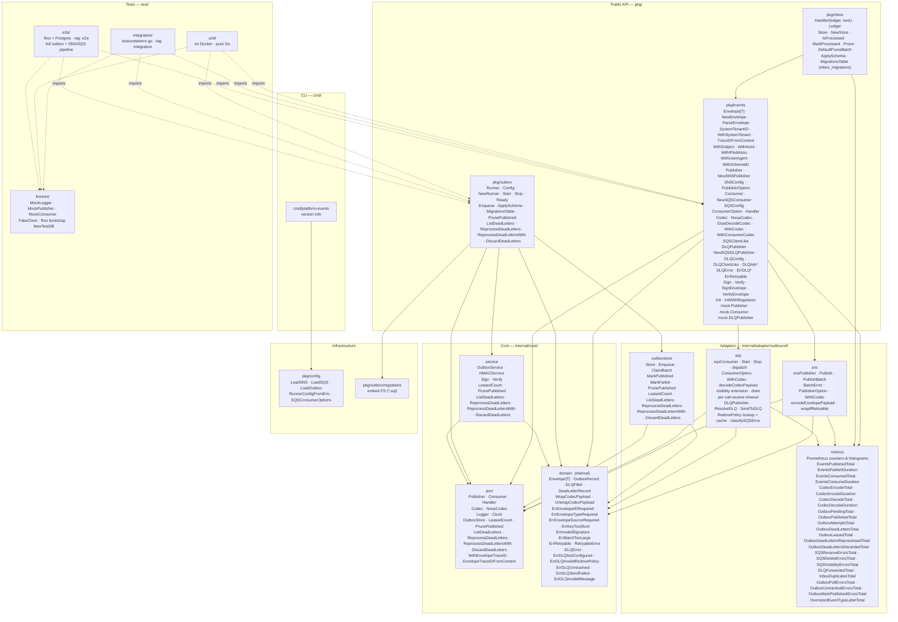

**Rule:** `domain` ← `port` ← `service` ← `adapter` ← `pkg`. The `domain` package imports nothing from this module. `port` imports only `domain`. Packages in `pkg/` depend on `core/` but never on `adapter/` directly. Tests (dashed arrows) consume the public API but are not part of the dependency chain.

---

## Package dependency graph

Arrows represent Go `import` relationships (module-internal only).

> Source: [`docs/architecture/mermaid/package-dependencies.mmd`](docs/architecture/mermaid/package-dependencies.mmd)

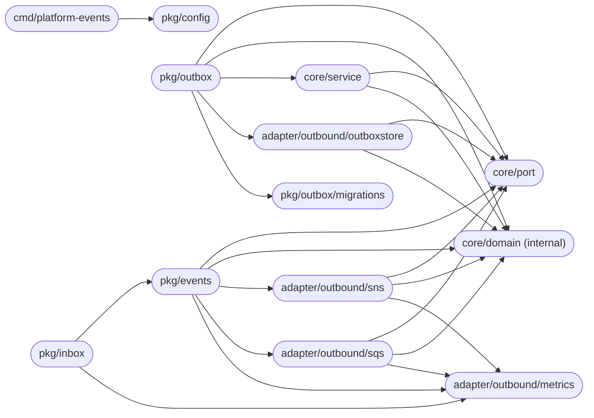

`core/domain` and `core/port` are dependency sinks — they import nothing from this module. `pkg/config` depends only on `pkg/events`, `pkg/outbox`, and `platform-pgcommon`.

---

## Public API packages

### pkg/events

| Symbol | Description |
|--------|-------------|
| `Envelope[T any]` | Typed event wrapper: `ID` (UUID v7), `Type`, `Source`, `SchemaVersion`, `TenantID`, `TraceID`, `CorrelationID`, `Subject`, `Actor`, `IPAddress`, `UserAgent`, `SchemaID`, `Timestamp`, `Payload T` |
| `NewEnvelope[T](type, source, payload, opts...)` | Generates `ID` (UUID v7), sets `Timestamp = time.Now().UTC()`. Options: `WithTenantID`, `WithTraceID`, `WithCorrelationID`, `WithSystemTenant`, `WithSchemaVersion`, `WithSubject`, `WithActor`, `WithIPAddress`, `WithUserAgent`, `WithSchemaID` |
| `WithSchemaVersion(v)` | Sets `SchemaVersion` on the envelope. Use `"1"` at inception; increment on additive-only field additions. See [EVENT_SCHEMA_GOVERNANCE.md](EVENT_SCHEMA_GOVERNANCE.md). |
| `SystemTenantID` | String constant `"system"` — use for background jobs that publish across tenants |
| `WithSystemTenant()` | `EnvelopeOpt` that sets `TenantID = "system"`; use for scheduled tasks and cross-tenant background jobs |
| `TraceIDFromContext(ctx)` | Returns the envelope `TraceID` stored in the handler context by `NewSQSConsumer`; wraps `port.EnvelopeTraceIDFromContext` |
| `Envelope.JSON()` | Canonical JSON serialisation |
| `ParseEnvelope[T](data)` | Deserialise and validate required fields (`id`, `type`, `source`) |
| `Publisher` | Interface: `Publish(ctx, Envelope[json.RawMessage]) error`; `PublishBatch(ctx, []Envelope[json.RawMessage]) error` |
| `NewSNSPublisher(cfg, opts...)` | Constructs the SNS implementation; returns error on empty `TopicARN` |
| `SNSConfig` | `TopicARN` (required), `Region`, `EndpointURL`, `Logger` |
| `PublisherOption` | `WithMessageGroupID(fn)`, `WithMessageDeduplicationID(fn)`, `WithAttributes(map)`, `WithCodec(codec)` |
| `Consumer` | Interface: `Start(ctx) error`; `Stop() error` |
| `Handler` | `func(ctx context.Context, env Envelope[json.RawMessage]) error` |
| `NewSQSConsumer(cfg, handler, opts...)` | Constructs the SQS long-poll loop; returns error on empty `QueueURL` or `VisibilityTimeout > 12h` |
| `SQSConfig` | `QueueURL` (required), `Region`, `EndpointURL`, `MaxMessages`, `WaitSeconds`, `Logger` |
| `ConsumerOption` | `WithConcurrency(n)`, `WithVisibilityTimeout(d)`, `WithDeadLetterHandler(fn)`, `WithMaxReceiveCount(n)`, `WithDrainTimeout(d)`, `WithConsumerCodec(codec)` |
| `SQSClientLike` | Interface mirroring the SQS client API — inject in tests via `NewSQSConsumerWithClient` without importing internal packages |
| `DLQPublisher` | Interface: `SendToDLQ(ctx, sourceQueueURL, body, attrs, reason) error`; `ResolveDLQ(ctx, sourceQueueURL) (string, error)` — forwards to the source queue's `RedrivePolicy` DLQ |
| `NewSQSDLQPublisher(cfg)` / `NewSQSDLQPublisherWithClient(cfg, client)` | Construct the SQS implementation; the latter takes a `DLQClientLike` (`GetQueueAttributes`, `GetQueueUrl`, `SendMessage`) for tests |
| `DLQConfig` | `Region`, `EndpointURL`, `ConsumerName` (stamped on every forwarded message), `Logger` |
| `DLQAttrEventType` · `DLQAttrReason` · `DLQAttrOriginalQueue` · `DLQAttrConsumerName` · `DLQAttrFailedAt` | Names of the standard attributes added to forwarded messages (`EventType`, `DLQReason`, `OriginalQueue`, `ConsumerName`, `FailedAt`) |
| `DLQError` | Error type returned by `DLQPublisher`: `Kind` (one `ErrDLQ*` sentinel), `SourceQueue`, `Cause` |
| `ErrDLQNotConfigured` · `ErrDLQInvalidRedrivePolicy` · `ErrDLQUnresolved` · `ErrDLQSendFailed` · `ErrDLQInvalidMessage` | `DLQError` kinds — see [Consumer-side DLQ forwarding](#consumer-side-dlq-forwarding) |
| `ErrRetryable` | Matches errors caused by a transient AWS failure; currently returned (wrapped) by `DLQPublisher` |
| `Codec` | Interface: `Encode(ctx, eventType, payload) (encoded []byte, schemaID string, err error)`; `Decode(ctx, schemaID, encoded) (payload json.RawMessage, err error)`. Ships as an interface only — no concrete implementation or schema-registry SDK dependency. |
| `NoopCodec` | Identity reference `Codec`: `Encode` returns the payload unchanged with an empty `schemaID`; `Decode` returns its input unchanged |
| `Sign(key, payload)` | Hex-encoded HMAC-SHA256 signature |
| `Verify(key, payload, sig)` | Constant-time comparison; returns `false` on any error |
| `SignEnvelope(key, env)` | Signs canonical JSON of envelope |
| `VerifyEnvelope(key, env, sig)` | Deserialises and verifies; safe for webhook receipt handlers |
| `Init(service, version)` | Registers Prometheus metrics once (`sync.Once`) |
| `InitWithRegisterer(service, version, reg)` | Registers against a custom `prometheus.Registerer` (use in tests) |
| `mock.Publisher` | In-memory, thread-safe; `Published()`, `SetError()`, `Reset()` |
| `mock.Consumer` | In-memory queue; `Inject(env)` delivers synchronously |
| `mock.DLQPublisher` | In-memory, thread-safe; `Sent() []DLQMessage`, `SetError()`, `Reset()`; `ResolveDLQ` returns `DLQURL` (default `mock://dlq`) |

### pkg/outbox

| Symbol | Description |
|--------|-------------|
| `Config` | `Pool *pgcommon.Pool`, `Publisher`, `Logger`, `PollInterval` (5s), `BatchSize` (50), `MaxAttempts` (5), `ClaimLeaseDuration` (10 min), `PublishConcurrency` (1 — SNS `PublishBatch` path; `> 1` parallel per-record `Publish`), `PublishTimeout` (10s), `DrainTimeout` (30s), `StartupJitter` (0) |
| `NewRunner(cfg) (*Runner, error)` | Constructs the outbox runner; applies defaults; returns an error if `ClaimLeaseDuration` is too short for the configured `BatchSize × PublishTimeout`; panics if `Publisher` nil or both `Pool` and `Store` nil (programming errors) |
| `Runner.Start(ctx)` | Starts the poll loop (immediate first poll, then per `PollInterval`); exponential backoff (1s→30s) on poll-cycle failure; blocks until `ctx` is cancelled |
| `Runner.Stop()` | Graceful drain; waits up to `DrainTimeout` for the in-flight batch, then returns a non-nil error if it did not finish |
| `Runner.Ready() <-chan struct{}` | Returns a channel closed after the first successful poll cycle; use to gate Kubernetes readiness probes — a closed channel confirms the DB connection is healthy and the outbox schema exists |
| `Runner.ListDeadLetters(ctx, filter, limit)` | Returns up to `limit` dead-letter records matching `DLQFilter` (optional `EventType`, `TenantID`, `FailedBefore`), ordered oldest-first; returns an empty slice when no records match — safe to call repeatedly as an inspection step before replay or discard |
| `Runner.ReprocessDeadLetters(ctx, limit)` | Moves up to `limit` records from `outbox_dead_letters` back to `outbox_events`, resetting attempt counters for redelivery; returns the count requeued |
| `Runner.ReprocessDeadLettersWith(ctx, filter, limit)` | Same as `ReprocessDeadLetters` but restricts to records matching `DLQFilter`; use for targeted replay after fixing a root cause without replaying unrelated failures |
| `Runner.DiscardDeadLetters(ctx, filter, limit)` | Permanently deletes up to `limit` dead-letter records matching `DLQFilter`; use for poison-pill records that can never succeed; returns `(int64, error)` — always call `ListDeadLetters` first to confirm the selection |
| `Runner.PrunePublished(ctx, olderThan, limit)` | Deletes published records older than `olderThan` from `outbox_events` (batched to `limit` rows). Call periodically (e.g. daily) to prevent unbounded table growth; choose `olderThan ≥` the longest consumer idempotency window (minimum 7 days is safe for most workloads) |
| `Enqueue(ctx, tx pgcommon.Tx, env)` | Inserts serialised envelope into `outbox_events` within caller's transaction; validates non-empty `ID`/`Type`/`Source`, non-zero `Timestamp`, and absence of null bytes in string fields; rejects payloads > 240 KB |
| `ApplySchema(ctx, runner *migrate.Runner)` | Applies embedded migrations `001`–`008` (outbox tables, indexes, dead-letter indexes, dead-letter `created_at` default, prune index, DLQ filter index) using an isolated tracking table (`outbox_migrations`) so the caller's domain migrations remain unaffected |
| `MigrationsTable` | Exported constant (`"outbox_migrations"`) — the golang-migrate tracking table used by `ApplySchema`; isolated from the consuming service's `schema_migrations` to prevent version-number collisions |

### pkg/inbox

| Symbol | Description |
|--------|-------------|
| `Handler(ledger, next)` | Wraps an `events.Handler`: rejects a non-UUID envelope ID, acknowledges an already-recorded ID without calling `next` (`events_inbox_duplicates_total{consumer}`), otherwise runs `next` and records the ID only if it returned `nil` — see [Idempotency](#idempotency) for the check-then-act caveat |
| `Ledger` | Interface `Handler` needs: `IsProcessed`, `MarkProcessed`, `Consumer` — satisfied by `*Store`, fakeable in tests |
| `NewStore(pool, consumer)` | `processed_events` ledger on a `*pgcommon.Pool`, scoped to one consumer name |
| `Store.Prune(ctx, retention, batch)` | Batched delete of rows older than `retention` (`DefaultPruneBatch` = 5000); keep retention above the 7-day SQS message lifetime |
| `ApplySchema(ctx, runner)` / `MigrationsTable` | Embedded migration `001`, tracked in `inbox_migrations` |

---

## SNS publish flow

> Source: [`docs/architecture/mermaid/sns-publish-flow.mmd`](docs/architecture/mermaid/sns-publish-flow.mmd)

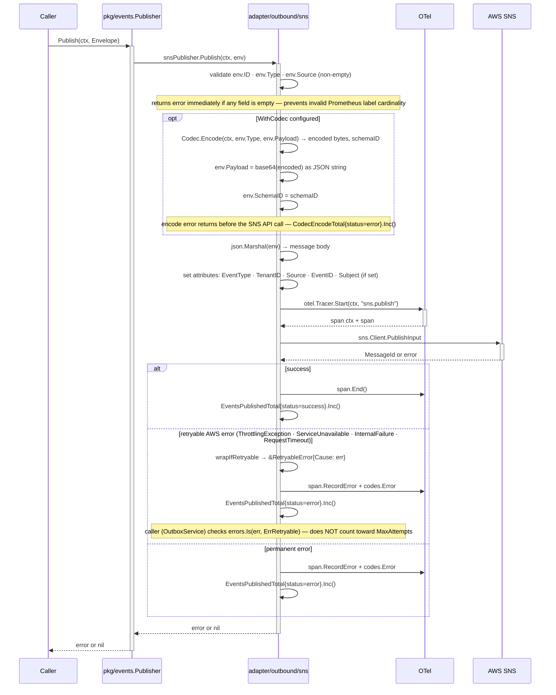

---

## Write flow and transactional outbox

Every domain event tied to a database write is **enqueued, not published**: `outbox.Enqueue` inserts the serialised envelope into `outbox_events` inside the caller's own `pgcommon.RunInTx`, so the business row and the event commit or roll back together — no event without state, no committed state without an event. No SNS call ever happens inside the caller's transaction; the `outbox.Runner` publishes later, independently, and retries until the record is published or dead-lettered.

> Source: [`docs/architecture/mermaid/write-flow.mmd`](docs/architecture/mermaid/write-flow.mmd)

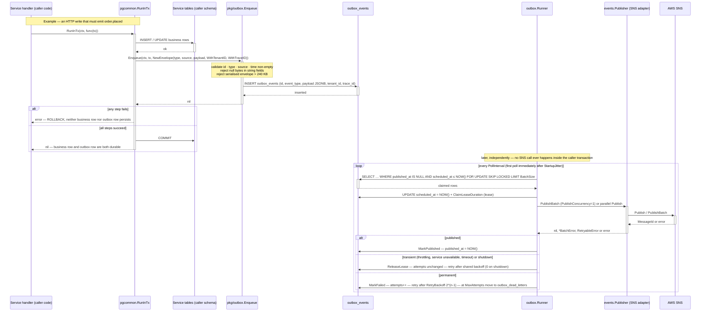

A numbered walkthrough of what happens between a domain mutation and a processed event — useful as a mental model before reading the detailed diagrams.

### Publish path (with outbox)


1. **HTTP handler receives request** — gin middleware extracts `RequestContext` (TenantID, TraceID) from validated gateway headers.
2. **Handler begins business transaction** via `pgcommon.RunInTx`.
3. **Domain entity written** to the database inside the transaction.
4. **`outbox.Enqueue` called** inside the same transaction — inserts a serialised `Envelope` into `outbox_events`. No SNS call happens here.
5. **Transaction commits** — both the domain write and the outbox row are durable. If the transaction rolls back, neither persists.
6. **Outbox runner polls** `outbox_events` — immediately on startup, then every `PollInterval`. Claims a batch with `SELECT … FOR UPDATE SKIP LOCKED WHERE scheduled_at <= NOW()` and extends `scheduled_at` as a claim lease so concurrent runners do not re-claim the same records.
7. **`Publisher.Publish` called** — SNS receives the event, sets `EventType`, `TenantID`, `Source`, `EventID`, and `Subject` (when non-empty) as message attributes for filter-policy routing.
8. **Row marked published** (`published_at = NOW()`). On a permanent failure, `attempts` is incremented and `scheduled_at = NOW() + RetryBackoff·2^(attempts-1)` (capped at `MaxRetryBackoff`, jittered); after `MaxAttempts` the row moves to `outbox_dead_letters`. Transient failures and shutdown release the lease without counting an attempt.

> **Ordering:** no global ordering is guaranteed. Ordering is only preserved within the same SQS message group (FIFO queues with `WithMessageGroupID`). All other delivery is best-effort ordering.

> **⚠️ Publishing rule (mandatory):** all domain events tied to a database write **must** go through `outbox.Enqueue` inside a `pgcommon.RunInTx` callback. Calling `publisher.Publish` directly for transactional events introduces an unrecoverable crash window — the DB write commits but the event is silently lost if the process dies before the SNS call. `publisher.Publish` is only valid for best-effort, non-transactional notifications where event loss is explicitly acceptable. See [Publishing guide § Publishing rules](docs/guides/publishing.md#publishing-rules) for the full decision table and crash-window diagram.

### Outbox poll cycle

> Source: [`docs/architecture/mermaid/outbox-poll-cycle.mmd`](docs/architecture/mermaid/outbox-poll-cycle.mmd)

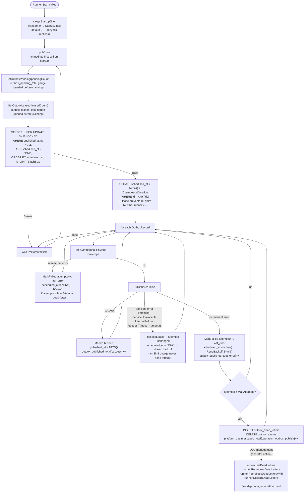

If `PublishConcurrency > 1`, events from the same batch may be published out of order — use FIFO topics to guarantee order where required.

---

## SQS consume flow

The SQS consumer long-polls, dispatches each message to a bounded pool of handler goroutines, and decides delete-vs-retry from the handler's return value alone.

### Consume path


1. **SQS consumer long-polls** the queue (`ReceiveMessage` with `WaitSeconds=20`).
2. **Message body unmarshalled** into `Envelope[json.RawMessage]`.
3. **Context enriched** — `pgcommon.WithGUCSet(ctx, GUCSet{TenantID: env.TenantID})` injected so all downstream pool calls enforce the event's tenant via RLS.
4. **OTel span started** (`sqs.receive`) linked to the publisher's trace via `Envelope.TraceID`.
5. **Handler called** with the enriched context. If it returns `nil`, the message is deleted. If it returns an error, the message stays visible for retry.
6. **Metrics recorded** — `platform_messages_received_total`, then `platform_messages_processed_total` / `platform_messages_failed_total{reason}` / `platform_dlq_messages_total`, `platform_message_processing_duration_seconds`, `platform_event_propagation_seconds` (legacy `events_consumed_total` / `events_consume_duration_seconds` in parallel).

> **Idempotency requirement:** handlers must be idempotent. SQS delivers messages at least once — a handler may be called more than once for the same `Envelope.ID` due to network retries, visibility timeout expiry, or consumer restarts. Use `Envelope.ID` (UUID v7) as the idempotency key. The recommended implementation is a `processed_events` Postgres table with `ON CONFLICT DO NOTHING` inside the same transaction as the side-effect write — see [Consuming guide § Implementing idempotency](docs/guides/consuming.md#implementing-idempotency) for full patterns and the common-mistakes table.

> Source: [`docs/architecture/mermaid/sqs-consume-flow.mmd`](docs/architecture/mermaid/sqs-consume-flow.mmd)

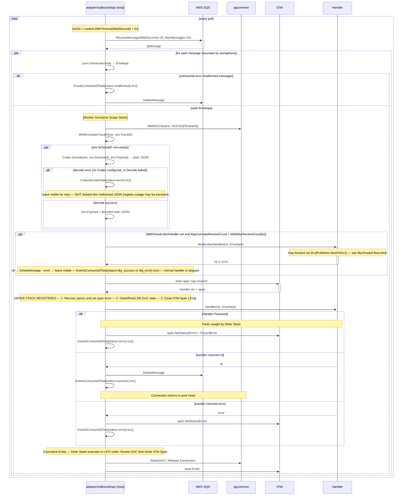

Ensure `VisibilityTimeout` exceeds worst-case handler duration, or messages may be re-delivered while still processing.

---

## Data model

The library owns three tables and two migration-tracking tables in the **consuming service's** database — it has no database of its own. `outbox.ApplySchema` / `inbox.ApplySchema` apply embedded migrations through the caller's `platform-pgcommon` `migrate.Runner`, each with an isolated tracking table (`outbox_migrations`, `inbox_migrations`) so version numbers can never collide with the service's own `schema_migrations`. All DDL is `CREATE … IF NOT EXISTS`, so an identically-shaped pre-existing table is adopted rather than rejected.

> Source: [`docs/architecture/mermaid/data-model.mmd`](docs/architecture/mermaid/data-model.mmd)

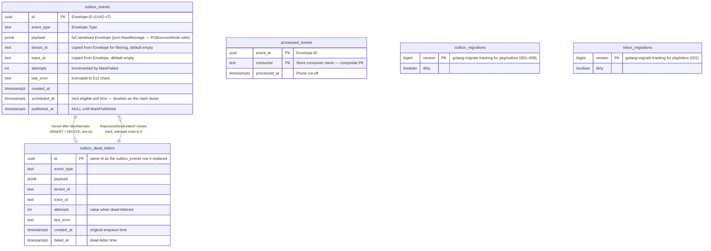

| Index | Table | Serves |
|---|---|---|
| `idx_outbox_events_pending (scheduled_at, id) WHERE published_at IS NULL` | `outbox_events` | `ClaimBatch` — the poll query's `ORDER BY scheduled_at, id` (migration 003) |
| `idx_outbox_events_published_at WHERE published_at IS NOT NULL` | `outbox_events` | `PrunePublished` (migration 007) |
| `idx_outbox_dead_letters_failed_at (failed_at DESC)` | `outbox_dead_letters` | Retention queries (migration 004) |
| `idx_outbox_dead_letters_created_at (created_at ASC)` | `outbox_dead_letters` | `ListDeadLetters` ordering (migration 005) |
| `idx_outbox_dead_letters_event_type_tenant_id` | `outbox_dead_letters` | `DLQFilter` on `EventType` / `TenantID` (migration 008) |
| `idx_processed_events_processed_at` | `processed_events` | `Store.Prune` |

**Notes that matter operationally:**

- **`payload` is the whole envelope, as JSONB.** `OutboxRecord.Payload` is `json.RawMessage`, not `[]byte`, so pgx binds it with its JSON codec — required under `platform-pgcommon`'s `PGBouncerMode` (simple protocol), where a `[]byte` would bind as `bytea` and fail with `SQLSTATE 22P02` (fixed in v1.3.1).
- **None of these tables has row-level security.** They are written inside the caller's transaction (so a tenant GUC may be bound), but the runner claims across all tenants by design. Grant the service's app role access to them explicitly if its schema uses `FORCE ROW LEVEL SECURITY` elsewhere.
- **`scheduled_at` doubles as the claim lease.** Claiming sets it to `NOW() + ClaimLeaseDuration`; a failed publish resets it to `NOW()`. A crashed runner's records become claimable again when the lease expires.
- **`processed_events` is keyed `(event_id, consumer)`,** so several consumers in one database dedup independently. Retention must exceed the 7-day SQS maximum message lifetime.

---

## Failure lifecycle

The platform has **two independent retry systems** — one for publish failures and one for consumption failures. They have no interaction with each other. Confusing them is the most common operational mistake when debugging message delivery issues.

### The two systems at a glance

| Dimension | Producer-side (outbox) | Consumer-side (SQS) |
|-----------|------------------------|---------------------|
| **What fails** | SNS publish call | Handler logic (`return err`) |
| **Where tracked** | `outbox_events.attempts` column | SQS `ApproximateReceiveCount` attribute |
| **Retry trigger** | Next outbox runner poll cycle | SQS visibility timeout expiry |
| **Retry interval** | `PollInterval` (default 5 s) | `VisibilityTimeout` (default 30 s, library-managed) |
| **Retry limit** | `MaxAttempts` (default 5) | `MaxReceiveCount` (SQS queue setting, **not** a library config) |
| **Terminal state** | Postgres `outbox_dead_letters` table | SQS Dead-Letter Queue (separate SQS queue) |
| **Recovery action** | `runner.ReprocessDeadLetters(ctx, n)` or SQL `UPDATE` | SQS redrive policy or manual `ChangeMessageVisibility` |
| **Explicit dead-lettering** | n/a — the runner dead-letters automatically after `MaxAttempts` | `events.DLQPublisher.SendToDLQ` — forward a poison message to the queue's configured DLQ immediately, without waiting for `MaxReceiveCount` |
| **Who owns recovery** | Platform team (SQL access) | Service team (SQS console / redrive) |
| **Observable signal** | `platform_dlq_messages_total{operation="outbox_publish"}` counter · `outbox_published_total{status=error}` | `ApproximateNumberOfMessagesNotVisible` CloudWatch · consumer `events_consumed_total{status=error}` · `events_dlq_forwarded_total` |

### Producer-side failure timeline

```
t=0   outbox.Enqueue — row written inside business transaction
      outbox_events: { id, published_at: NULL, attempts: 0 }

t=5s  Outbox runner polls. Calls Publisher.Publish (SNS).

      ── SNS permanent error (invalid ARN, auth failure) ──────────────────
      attempts++ → outbox_events: { attempts: 1, last_error: "..." }
      scheduled_at = NOW() + ~1s (RetryBackoff·2^(attempts-1), jittered,
      capped at MaxRetryBackoff)

      ── SNS transient error (ThrottlingException, ServiceUnavailable, timeout) ──
      ReleaseLease: attempts unchanged, retried after a backoff shared by all
      records (1s, 2s, 4s … 5m) that resets on the next successful publish.
      NOT progressing toward dead-letter: a full SNS outage builds a backlog
      (PlatformEventsOutboxBacklog) instead of dead-lettering it.

t=10s Runner polls again; the ~1s backoff has expired, so it retries.
      Each retry waits for the first poll after its backoff (1s, 2s, 4s, 8s …
      doubling up to MaxRetryBackoff), so later retries spread out.
t≈25s attempts reaches MaxAttempts (default 5) on permanent errors:
      → INSERT outbox_dead_letters (id, event_type, payload, tenant_id,
                                    trace_id, attempts, last_error, failed_at)
      → DELETE outbox_events
      → platform_dlq_messages_total{operation=outbox_publish}.Inc()

      ── Recovery ─────────────────────────────────────────────────────────
      Step 1 — Inspect:
        runner.ListDeadLetters(ctx, outbox.DLQFilter{TenantID: "acme"}, 50)
        → returns []outbox.DeadLetterRecord  (ID, EventType, TenantID,
                                              Attempts, LastError, FailedAt)

      Step 2a — Replay all:
        runner.ReprocessDeadLetters(ctx, 50)
        → moves all records back to outbox_events; resets attempts to 0

      Step 2b — Selective replay:
        runner.ReprocessDeadLettersWith(ctx, outbox.DLQFilter{
            EventType:    "billing.invoice.settled",
            TenantID:     "acme",
            FailedBefore: incidentEnd,
        }, 100)
        → only moves records matching ALL supplied filter fields

      Step 2c — Discard poison pills:
        runner.DiscardDeadLetters(ctx, outbox.DLQFilter{
            EventType: "legacy.sync.requested",   // decommissioned type
        }, 1000)
        → permanently deletes; ALWAYS call ListDeadLetters first to verify

      Option D: Raw SQL — for migrations or bulk corrections:
        UPDATE outbox_dead_letters SET ... →
          INSERT outbox_events → DELETE outbox_dead_letters
```

**Key producer-side invariants:**
- Retryable SNS errors never advance `attempts` — SNS throttles cannot dead-letter healthy records.
- Context cancellation (rolling restart) also does not advance `attempts` — it releases the lease.
- `last_error` is truncated to 512 chars; full errors are in structured logs tagged with `event_id`.

### Consumer-side failure timeline

```
t=0   SQS delivers message. VisibilityTimeout = 30s.
      Consumer dispatches to handler goroutine.

      ── Handler returns non-nil error ────────────────────────────────────
      Library does NOT call DeleteMessage.
      Message becomes visible again after VisibilityTimeout (30s).
      ApproximateReceiveCount++

      ── Handler panics ────────────────────────────────────────────────────
      Library recovers the panic; logs stack trace.
      Message left visible (same as non-nil error path).

      ── Malformed envelope (json.Unmarshal fails) ──────────────────────────
      Library calls DeleteMessage immediately.
      platform_messages_failed_total{reason=malformed}.Inc()
      No retry — a malformed message will never unmarshal correctly.

t=30s SQS makes message visible. Consumer receives it again.
      ApproximateReceiveCount = 2

      ... (repeats until MaxReceiveCount is reached — configured on the SQS queue, not in this library)

t=N   ApproximateReceiveCount > MaxReceiveCount:
      SQS automatically moves message to the configured Dead-Letter Queue (SQS DLQ).
      The library's WithDeadLetterHandler(fn) intercepts messages where
      ApproximateReceiveCount > WithMaxReceiveCount(n) BEFORE the SQS DLQ receives them,
      giving the handler a final chance to log, alert, archive, or forward the message
      to the SQS DLQ itself with DLQPublisher.SendToDLQ before deletion.
      n MUST be lower than the queue's RedrivePolicy maxReceiveCount — SQS stops
      delivering the message once the count exceeds maxReceiveCount, so with
      n ≥ maxReceiveCount the dead-letter handler never runs.

      ── Recovery ─────────────────────────────────────────────────────────
      Fix the handler bug. Then either:
      Option A: SQS redrive policy — move messages from DLQ back to source queue.
      Option B: Re-publish the envelope from the originating service.
      The library forwards messages INTO the SQS DLQ (DLQPublisher) but has no
      API for reading, replaying, or redriving them — use SQS redrive for that.
```

**Key consumer-side invariants:**
- The library does not implement consumer-side retry backoff. SQS visibility timeout IS the backoff.
- `MaxReceiveCount` is a **queue configuration**, not a library config. Set it in your Terraform/CDK alongside your SQS resource.
- The outbox runner has no knowledge of consumer failures. A handler error never touches `outbox_events`.
- Increasing `VisibilityTimeout` gives handlers more time between retry attempts. The SQS maximum is 12 h (enforced at construction by `NewSQSConsumer`).
- `WithMaxReceiveCount(n)` must be **strictly lower** than the queue's `RedrivePolicy.maxReceiveCount`; otherwise SQS moves the message before the dead-letter handler sees it.

### The dead-letter naming collision

Both systems use the term "dead letter" but they refer to entirely different storage and recovery paths:

| Term | What it is | How to query | How to recover |
|------|-----------|--------------|---------------|
| **Outbox dead letters** | Postgres rows in `outbox_dead_letters` — publish failures that exhausted `MaxAttempts` | `runner.ListDeadLetters(ctx, filter, n)` or `SELECT * FROM outbox_dead_letters WHERE tenant_id = 'acme'` | `runner.ReprocessDeadLettersWith(ctx, filter, n)` · `runner.ReprocessDeadLetters(ctx, n)` · `runner.DiscardDeadLetters(ctx, filter, n)` |
| **SQS DLQ** | A separate SQS queue — consumer failures that exhausted `MaxReceiveCount`, **plus** messages a consumer forwarded explicitly with `DLQPublisher.SendToDLQ` (identifiable by the `DLQReason`, `OriginalQueue`, `FailedAt` and `ConsumerName` message attributes) | SQS console or `aws sqs receive-message --queue-url $DLQ_URL --message-attribute-names All` | SQS redrive policy (SQS console → Start DLQ redrive) |

When an on-call alert fires on `platform_dlq_messages_total{operation="outbox_publish"}`, the fix is on the **publisher side** (SNS connectivity, payload validity, queue subscription). When the alert is on a high `ApproximateNumberOfMessagesNotVisible` or a growing SQS DLQ depth, the fix is on the **consumer handler side** (logic bug, downstream dependency failure, missing idempotency).

`DLQPublisher` writes to the **SQS DLQ**, never to `outbox_dead_letters` — the `outbox.Runner` DLQ API (`ListDeadLetters`, `ReprocessDeadLetters*`, `DiscardDeadLetters`) does not see messages it forwards.

### Consumer-side DLQ forwarding

Consumer services may not import `github.com/aws/aws-sdk-go-v2/service/sqs` (depguard), so `platform-events` owns the one SQS call path a consumer needs to dead-letter a message explicitly: `events.DLQPublisher`. It forwards to the DLQ **already configured** on the source queue's `RedrivePolicy` — it does not provision queues, replay, or redrive.

Resolution: `GetQueueAttributes(RedrivePolicy)` → `deadLetterTargetArn` → parse `arn:<partition>:sqs:<region>:<account>:<name>` → `GetQueueUrl(name, account)`. The result is cached per source queue for the life of the publisher; failed lookups are not cached. A `RedrivePolicy` retargeted to a different DLQ is picked up on restart.

Error model — every error is a `*events.DLQError` whose `Kind` is one sentinel:

| Kind | Meaning | Retryable? |
|------|---------|-----------|
| `ErrDLQInvalidMessage` | Caller error: empty source URL/body/reason, invalid UTF-8, > 10 attributes | Never — no AWS call made |
| `ErrDLQNotConfigured` | Source queue has no `RedrivePolicy` | Never — queue configuration |
| `ErrDLQInvalidRedrivePolicy` | Policy is not JSON, lacks `deadLetterTargetArn`, or the ARN is not an SQS ARN | Never — queue configuration |
| `ErrDLQUnresolved` | `GetQueueAttributes` / `GetQueueUrl` failed (access denied, queue missing, throttled) | Matches `events.ErrRetryable` when the AWS cause is transient |
| `ErrDLQSendFailed` | `SendMessage` failed | Matches `events.ErrRetryable` when the AWS cause is transient |

Transient = SQS error codes `Throttling`, `ThrottlingException`, `RequestThrottled`, `KmsThrottled`, `RequestTimeout`, `ServiceUnavailable`, `InternalFailure`, `InternalError`, or a `net.Error` timeout.

> Source: [`docs/architecture/mermaid/dlq-forward-flow.mmd`](docs/architecture/mermaid/dlq-forward-flow.mmd)

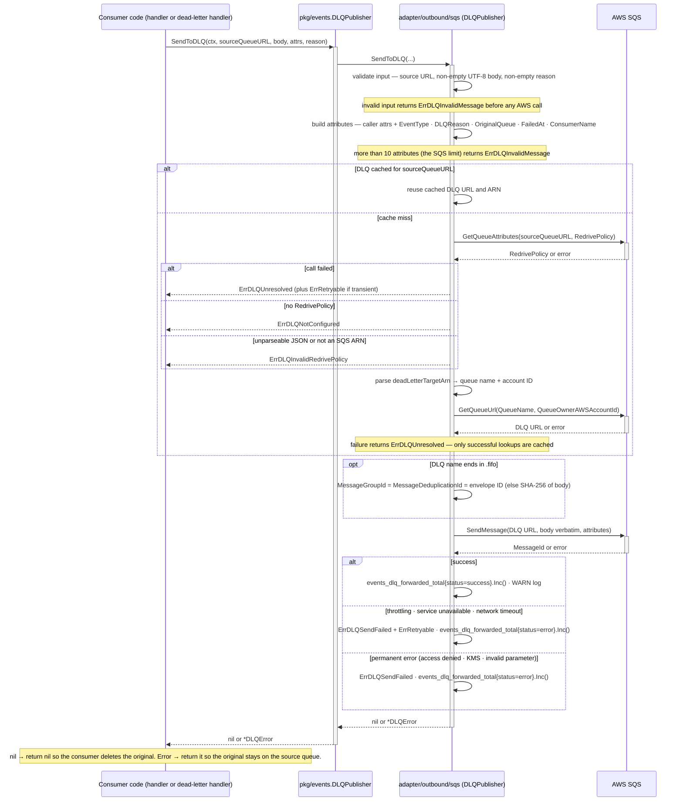

### DLQ management flow

> Source: [`docs/architecture/mermaid/dlq-management-flow.mmd`](docs/architecture/mermaid/dlq-management-flow.mmd)

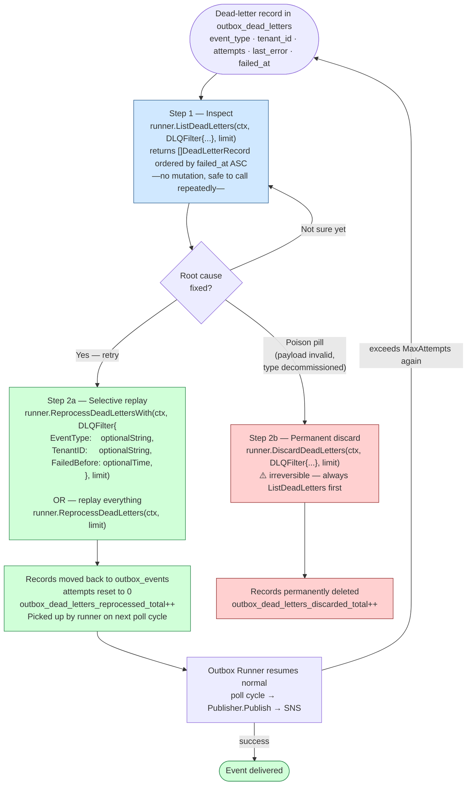

### Operational runbook

| Symptom | Likely cause | Where to look | Fix |
|---------|-------------|---------------|-----|
| `platform_dlq_messages_total{operation="outbox_publish"}` rate > 0 | SNS publish failure or invalid payload | `outbox_dead_letters.last_error` | Fix root cause; call `ListDeadLetters` to inspect, then `ReprocessDeadLettersWith` (selective) or `ReprocessDeadLetters` (all); call `DiscardDeadLetters` for poison pills |
| `outbox_mark_published_errors_total` > 0 | DB write failed after SNS delivery succeeded — record will be re-published on next poll | `outbox_events.last_error`; DB connectivity | Investigate DB health; note: consumer **must be idempotent** — duplicate delivery is actively occurring |
| `outbox_pending_total` growing, `outbox_published_total` flat | SNS throttling or outbox runner stopped | `outbox_events.last_error`; outbox runner logs | Check SNS quotas; ensure runner is running; retryable errors auto-recover |
| `platform_messages_failed_total{reason="handler_error"}` growing | Handler returning errors repeatedly | Handler logs; downstream service health | Fix handler bug; SQS redrive once fixed |
| `platform_messages_failed_total{reason="malformed"}` > 0 | Producer publishing invalid JSON or wrong topic/queue pair | Dead-lettered messages in SQS DLQ | Check producer serialisation; verify SQS filter policies |
| SQS DLQ depth growing | Handler consistently failing after `MaxReceiveCount` retries | SQS DLQ message bodies; handler logs | Fix handler; redrive DLQ |
| `events_dlq_forwarded_total{status="success"}` rising | Consumers explicitly dead-lettering poison messages | `DLQReason` / `ConsumerName` attributes on DLQ messages; `sqs: message forwarded to DLQ` WARN logs | Fix the producer or handler; redrive once fixed |
| `platform_messages_failed_total{reason="dead_letter_error"}` > 0 | DLQ forward failed — the original stays on the source queue and is retried | `sqs: failed to forward message to DLQ` ERROR logs; `errors.Is(err, events.ErrDLQNotConfigured)` etc. | Add or fix the source queue's `RedrivePolicy`; grant `sqs:GetQueueAttributes` / `sqs:GetQueueUrl` / `sqs:SendMessage`; transient errors self-heal |

### `outbox_events` table pruning

Published records are marked with `published_at` but **never deleted automatically**. Without periodic pruning, `outbox_events` grows unboundedly. Use `Runner.PrunePublished`:

```go
// Prune published records older than 7 days in batches of 1000.
// Call daily from a maintenance goroutine or scheduled job.
n, err := runner.PrunePublished(ctx, 7*24*time.Hour, 1000)
```

Choose `olderThan` to exceed the longest consumer idempotency deduplication window. 7 days is a safe default for most workloads. Loop until 0 rows are returned to fully drain accumulated records on first install.

### Migration 003 — production upgrade runbook

Migration 003 (`003_optimize_outbox_index.up.sql`) creates a composite index on `(scheduled_at, id) WHERE published_at IS NULL`. The migrate runner executes inside a transaction, so `CREATE INDEX CONCURRENTLY` cannot be used. On a table with many rows this acquires an `ACCESS EXCLUSIVE` lock and blocks all reads/writes for the duration of the index build.

**Before upgrading past v1.1.0 on a non-empty table:**
1. Run manually outside a transaction (non-blocking):
   ```sql
   CREATE INDEX CONCURRENTLY IF NOT EXISTS idx_outbox_events_scheduled_at_id
       ON outbox_events (scheduled_at, id) WHERE published_at IS NULL;
   ```
2. Then run `outbox.ApplySchema` — the runner will skip migration 003 because the index already exists.

If `outbox_events` is empty at upgrade time (e.g. new service), the normal `ApplySchema` call is safe with no manual steps.

### Dead-letter table retention

`outbox_dead_letters` has no automatic TTL — it grows unbounded until cleared. Services must schedule periodic cleanup to prevent table bloat. Recommended strategies:

**Periodic SQL purge (simplest — add to a maintenance cron job):**
```sql
-- Purge dead letters older than 90 days; adjust retention to your audit requirements.
DELETE FROM outbox_dead_letters WHERE created_at < NOW() - INTERVAL '90 days';
```

**Reprocess then purge (for recoverable failures):**
```go
// Reprocess up to 100 records; call again until 0 is returned.
requeued, err := runner.ReprocessDeadLetters(ctx, 100)
```
After fixing the root cause (SNS error, payload bug), call `ReprocessDeadLetters` to drain the table back into `outbox_events` for redelivery, then purge any remaining un-recoverable records with the SQL above.

**Alert threshold:** set a Prometheus alert on `platform_dlq_messages_total{operation="outbox_publish"}` rate > 0 for more than 15 minutes — persistent dead-lettering signals a publish failure that requires operator action, not just transient SNS throttling.

---

## Observability stack

The library emits three signal types and initialises none of the backends: Prometheus metrics (registered by `events.InitMetrics` on the default or a supplied registerer), OpenTelemetry spans (through the global `otel` tracer and propagator — no-ops until the service registers a provider), and structured logs through `port.Logger`.

Metrics follow the **Enterprise Platform Observability Standard** ([docs/observability](docs/observability/README.md)):
- **Tier 1 only.** platform-events is a cross-domain platform library, so every metric is Tier 1 `platform_*`. Tier 2 and Tier 3 metrics belong to the services.
- **Required labels.** `domain`, `service` and `environment` are injected centrally as const labels from one `MetricsIdentity`.
- **Registry.** Each metric has a registry entry (`internal/adapter/outbound/metrics/registry.go`) with status Canonical, Proposed (shadow-emitted until ratified) or Deprecated. The inventory is generated into [metrics-registry.md](docs/observability/metrics-registry.md).
- **Compatibility period.** The pre-standard `events_*` / `outbox_*` / `sqs_*` metrics are emitted in parallel until `WithoutLegacyMetrics()`.
- **Fail-soft registration.** A Tier 1 metric whose name another component already registered with a different shape is disabled and reported as a `RegistrationWarning`.
- **Bounded label values.** `queue` / `topic` label values are names, never URLs or ARNs. `event_type` values are capped at 128 bytes (`__oversized__` otherwise, counted in `platform_telemetry_label_overflow_total`), so a misbehaving producer cannot explode label cardinality.
- **CI enforcement.** `make metrics-lint` checks tiers, naming, required labels, label vocabulary, registry parity and the reference rule files. `make rules-check` runs promtool on the rules.

> Source: [`docs/architecture/mermaid/observability-stack.mmd`](docs/architecture/mermaid/observability-stack.mmd)

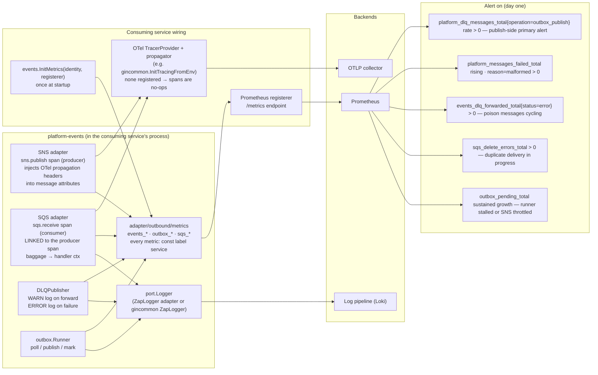

**Tracing model.** The publisher starts an `sns.publish` producer span and injects the configured propagator's headers (W3C `traceparent`, baggage) into SNS message attributes. The consumer requests all message attributes, extracts them into a clean context, and starts a **new** `sqs.receive` trace root with a **link** to the producer span — async consumers do not inherit the remote span as a parent. Baggage is copied into the handler context. `Envelope.TraceID` is separately available to handlers via `events.TraceIDFromContext`.

**Log fields.** Every library log line on a message path carries `message_id`, `event_type`, and (where known) `event_id`, `tenant_id`, `queue`; DLQ forwards add `source_queue`, `dlq_url`, `dlq_arn`, `reason`. Handlers should bind the same correlation set — see [Logging correlation](docs/guides/observability.md#logging-correlation).

---

## Tenant propagation and RLS

The library carries tenant context end to end but enforces isolation only where it runs consumer code:

1. **Publish** — `Envelope.TenantID` is set by the producer (`WithTenantID(rc.TenantID)` from the request context, or `WithSystemTenant()` for genuinely cross-tenant jobs) and forwarded as the `TenantID` SNS message attribute for filter policies.
2. **Consume** — before a handler runs, `dispatch` wraps the context with `pgcommon.WithGUCSet(ctx, GUCSet{TenantID: env.TenantID})`. Any `platform-pgcommon` pool call the handler makes binds `app.tenant_id` for that tenant, so the service's RLS policies apply to event processing exactly as they do to HTTP requests.
3. **Dead-letter handler** — gets the same `GUCSet`-enriched context as the normal handler.

**What this does not protect against:** a producer that sets the wrong `TenantID` (the consumer faithfully applies the producer's claim), and `WithSystemTenant()` misuse on a tenant-scoped event — both are correctness bugs in the producer, called out in the [system invariants](README.md#system-invariants). The outbox tables themselves are not RLS-scoped (see [Data model](#data-model)).

---

## Concurrency model

`sqsConsumer` dispatches messages with a bounded semaphore (`WithConcurrency`). The semaphore limits concurrent handler goroutines; the receive loop is never blocked by slow handlers — it simply does not dispatch new goroutines when the semaphore is full until a slot frees up.

**Example — 10 messages received, `WithConcurrency(3)`:**

```
ReceiveMessage → 10 messages

→ goroutine 1: handle message A  (acquires slot)
→ goroutine 2: handle message B  (acquires slot)
→ goroutine 3: handle message C  (acquires slot)
→ messages D–J: sem ← struct{}{} blocks until a slot is released

When goroutine 1 finishes:
→ message D acquires the freed slot
→ message E remains blocked

… and so on until all 10 are dispatched.
```

**Observable signals:**

| Signal | Metric | Meaning |
|---|---|---|
| Slow handlers | `events_consume_duration_seconds` p99 rising | Reduce concurrency or investigate handler latency |
| Handler errors | `platform_messages_failed_total{reason="handler_error"}` growing | Messages being retried; check handler logic |
| Outbox backlog | `outbox_pending_total` growing | Publisher slow or SNS throttling; raise `PublishConcurrency` or check `outbox_published_total` |
| Leased records | `outbox_leased_total` high | Many records in-flight; if combined with stalled `outbox_pending_total`, a runner may have crashed mid-batch — wait for `ClaimLeaseDuration` expiry or restart the runner |
| Publish failures | `outbox_published_total{status=error}` | Check SNS connectivity and the `outbox_dead_letters` table |
| DLQ forwards | `events_dlq_forwarded_total{status}` | `success` — consumers are dead-lettering poison messages · `error` — forward failed, original left on the source queue |
| Dead letters | `platform_dlq_messages_total{operation="outbox_publish"}` rate > 0 | Records exhausted `MaxAttempts` — inspect `outbox_dead_letters` and replay via `Runner.ReprocessDeadLetters`; **primary publish-side alert** |

**Logging correlation:** metrics and spans identify *that* something failed; structured log fields identify *which* message delivery and *which* tenant. Always include `event_id`, `event_type`, `trace_id`, and `tenant_id` on every log line inside a handler or publisher. See [Observability guide § Logging correlation](docs/guides/observability.md#logging-correlation) for patterns and Loki query examples.

### Outbox claiming and locking

- **Claim** — `SELECT … FOR UPDATE SKIP LOCKED` over pending rows, then a lease `UPDATE scheduled_at = NOW() + ClaimLeaseDuration` in the same transaction. Concurrent runners claim disjoint batches with no distributed lock. `NewRunner` rejects a `ClaimLeaseDuration` too short for `BatchSize × PublishTimeout`, so a lease cannot expire while its batch is still publishing.
- **`MarkFailed`** — reads `attempts` with `SELECT … FOR UPDATE` (deliberately **not** `SKIP LOCKED`: a second runner that re-claimed after lease expiry must block, not skip) so attempts can never be double-incremented and a record can never be dead-lettered early.
- **Shutdown** — records stranded by context cancellation are released with `ReleaseLease` (claimable immediately, no attempt counted), so rolling restarts never push a record towards the dead-letter table.

### Idempotency

The inbox is **check-then-act, not transactional with the handler**: `inbox.Handler` calls `IsProcessed`, then `next`, then `MarkProcessed` only if `next` returned `nil`. Two consequences follow, and handlers must tolerate both:

- A crash (or a `MarkProcessed` failure) after `next` succeeds leaves the ID unrecorded — SQS redelivers and `next` runs again.
- Two concurrent deliveries of the same message (visibility timeout expiry while the first is still running) can both pass `IsProcessed` before either records.

The inbox therefore reduces duplicate work; it does not make side effects exactly-once. For side effects that must not repeat, record the event ID in the **same transaction** as the side effect (`INSERT INTO processed_events … ON CONFLICT DO NOTHING`, then check `RowsAffected`) — see [Implementing idempotency](docs/guides/consuming.md#implementing-idempotency).

---

## Failure domains

**Consistency invariants:**
- **Atomic enqueue** — business write and outbox row commit in one caller transaction; a rollback leaves neither (`TestOutbox_RollbackDoesNotPublish`).
- **At-least-once, never at-most-once, on the outbox path** — a record leaves `outbox_events` only by `MarkPublished` (after SNS accepted it) or by moving to `outbox_dead_letters`. `MarkPublished` failing after a successful publish means a **duplicate** publish on the next poll, never a lost one (`outbox_mark_published_errors_total`).
- **Consumer-side delete only on success** — a message is deleted only after the handler (or dead-letter handler) returns `nil`, a malformed body is detected, or a `DLQPublisher` forward the caller acknowledged. Everything else is left visible.

**Failure invariants:**
- **Transient AWS failures never exhaust retry budgets** — SNS throttling / service-unavailable / internal-failure / request-timeout and network timeouts are wrapped in `domain.RetryableError`; the outbox releases the lease for them without counting an attempt, behind a backoff shared across records that resets on the next successful publish. The same classification is surfaced to DLQ callers as `events.ErrRetryable`.
- **A stalled dependency degrades throughput, not correctness** — receive errors back off 1 s → 30 s with jitter; outbox poll errors back off 1 s → 30 s; per-call timeouts bound `ReceiveMessage` (`WaitSeconds + 5 s`), `DeleteMessage` (10 s) and each publish (`PublishTimeout`).
- **Poison messages cannot wedge a queue** — malformed JSON is counted and deleted (after being forwarded to the SQS DLQ when `WithDLQForwarding` is set); semantically poisoned messages are routed by `WithDeadLetterHandler` (and optionally forwarded by `DLQPublisher`) or redriven by SQS after `maxReceiveCount`.

**Dependency degradation matrix:**

| Failure | Where felt | Behaviour | Signal |
|---|---|---|---|
| Postgres unavailable during `Enqueue` | Caller transaction | Caller's `RunInTx` fails — no business write, no event | Caller's own error handling |
| Postgres unavailable during poll | `outbox.Runner` | Poll backs off 1 s → 30 s; nothing is published until it recovers; nothing is lost | `outbox_poll_errors_total` |
| SNS throttled / unavailable | `outbox.Runner` | Retryable — record retried every poll without consuming `MaxAttempts` | `outbox_published_total{status="error"}`, `outbox_pending_total` growth |
| SNS permanent error (bad ARN, access denied) | `outbox.Runner` | `attempts++`; dead-lettered at `MaxAttempts` | `platform_dlq_messages_total{operation="outbox_publish"}` |
| Schema registry down (`Codec.Encode` fails) | `outbox.Runner` | Treated as a **permanent** publish failure — counts toward `MaxAttempts`; an outage longer than `MaxAttempts × PollInterval` dead-letters records (replayable with `ReprocessDeadLettersWith`) | `events_codec_encode_total{status="error"}`, `platform_dlq_messages_total{operation="outbox_publish"}` |
| Schema registry down (`Codec.Decode` fails) | SQS consumer | Message left visible — retried, then redriven by SQS; **not** deleted like malformed JSON | `events_codec_decode_total{status="error"}` |
| SQS `ReceiveMessage` fails | SQS consumer | Backoff 1 s → 30 s with jitter | `sqs_receive_errors_total` (Tier 1: `platform_dependency_request_seconds{dependency="sqs",operation="receive_message",outcome="error"}`, Proposed) |
| SQS `DeleteMessage` fails | SQS consumer | Logged; the message is redelivered — **duplicate processing** | `sqs_delete_errors_total` |
| SQS `ChangeMessageVisibility` fails | SQS consumer | Logged; a long handler may see its message redelivered concurrently | `sqs_visibility_extension_errors_total` |
| Inbox ledger read/write fails | `inbox.Handler` | Error returned → message redelivered | Handler error metrics |
| DLQ forward fails | `DLQPublisher` caller | Error returned (typed; `ErrRetryable` if transient) → caller keeps the original on the source queue | `platform_messages_failed_total{reason="dead_letter_error"}` |
| Handler panics | SQS consumer | Recovered, stack logged, span marked error, message left visible | `platform_messages_failed_total{reason="handler_error"}` |

---

## Key invariants

| Invariant | Where enforced |
|-----------|---------------|
| Envelope ID uniqueness | UUID v7 generated at `NewEnvelope` time |
| At-least-once delivery | Outbox runner retries until `MaxAttempts` |
| No dual-write | `outbox.Enqueue` runs inside the caller's `pgcommon.Tx`; no SNS call on enqueue |
| Atomic enqueue | If the business transaction rolls back, the outbox row is never committed |
| Tenant isolation (consumer) | `pgcommon.WithGUCSet` injected per message before handler is called |
| Constant-time HMAC | `hmac.Equal` in `service.Verify` — string `==` is never used |
| Key length enforced | `Sign` returns `ErrKeyTooShort` for keys < 32 bytes; empty sig is rejected by `Verify` |
| No SNS/SQS import in domain/port | Enforced by layered package structure |
| TopicARN validated at construction | `NewSNSPublisher` returns an error on an empty or invalid `TopicARN` (must have prefix `arn:aws:sns:`, `arn:aws-cn:sns:`, or `arn:aws-us-gov:sns:`) to prevent invalid Prometheus label cardinality |
| Idempotent metrics registration | `Init` is guarded by `sync.Once`; `InitWithRegisterer` bypasses it for test isolation |
| OTel initialised by consuming service | `platform-events` calls `otel.Tracer(...)` — no-op if no provider registered; no double-init |
| Graceful consumer shutdown | `Stop()` waits `DrainTimeout` (30 s) for in-flight handlers before returning |
| Graceful runner shutdown | `Runner.Stop()` waits up to `DrainTimeout` (30 s) for the in-flight batch, then returns a non-nil error; set Helm `terminationGracePeriodSeconds` > `DrainTimeout` |
| Poll-failure backoff | On a failed poll cycle the runner backs off exponentially (1s→30s) instead of retrying every `PollInterval` |
| Parallel publish bounded | `PublishConcurrency` caps concurrent publishes per batch (default 1 uses SNS `PublishBatch`, up to 10 per API call); values `> 1` use per-record `Publish` in parallel goroutines; per-record `PublishTimeout` (10s) prevents one hung call stalling the batch |
| Shutdown ≠ dead-letter | Records stranded by context cancellation are released with `ReleaseLease` — no attempt counted — so rolling restarts never dead-letter a record |
| `last_error` bounded | Error strings stored in `outbox_events`/`outbox_dead_letters` are truncated to 512 chars to prevent table bloat |
| Envelope size bounded | `Enqueue` rejects serialised payloads > 240 KB (under the SNS 256 KB hard limit) |
| `MarkFailed` serialized | The attempts read uses `SELECT … FOR UPDATE` so a lease-expiry re-claim cannot double-increment or dead-letter early |
| Retryable errors don't exhaust attempts | SNS throttling/transient errors (`ThrottlingException`, `ServiceUnavailable`, `InternalFailure`, `RequestTimeout`) are wrapped in `domain.RetryableError`; `OutboxService` releases the lease without counting an attempt (shared backoff), so SNS throttling or an outage cannot dead-letter healthy records |
| VisibilityTimeout bounded at 12h | `NewSQSConsumer` rejects `VisibilityTimeout > 12h` at construction — SQS API hard limit; prevents silent extension failures |
| No SQS SDK import in consumer services | `events.DLQPublisher` is the only DLQ path; `mock.DLQPublisher` covers tests — services never need `aws-sdk-go-v2/service/sqs` |
| DLQ forward never loses the original | `SendToDLQ` returns an error on any failure; callers return it so the source message stays visible. Invalid input is rejected before any AWS call |
| DLQ lookup cached, failures not | `RedrivePolicy` is resolved once per source queue per publisher; a failed lookup is retried on the next call |
| Standard DLQ attributes are authoritative | `DLQReason`, `OriginalQueue`, `FailedAt`, `ConsumerName` override caller-supplied values; `EventType` comes from the envelope body when parseable; `DLQReason` truncated to 1 KiB on a rune boundary |
| Malformed messages deleted and counted | SQS messages that cannot be unmarshalled to `Envelope` are counted as `platform_messages_failed_total{reason="malformed"}` and deleted — immediately, or after a successful forward to the SQS DLQ with `WithDLQForwarding` — preventing poison-pill messages from blocking the queue |
| SKIP LOCKED for horizontal scale | Multiple outbox runner instances claim disjoint batches; no distributed lock required |
| Dead letters are queryable & observable | `outbox_dead_letters` is a Postgres table (retryable from SQL); `platform_dlq_messages_total{operation="outbox_publish"}` counter enables alerting |
| Batch split at 10 | `PublishBatch` splits silently; partial failures return `BatchError` per message |
| Sequential batch transport errors | When `PublishConcurrency=1`, a non-`BatchError` from SNS marks all records in the claimed batch failed — safe at-least-once, may over-count attempts if SNS partially succeeded |
| Handlers must be idempotent | SQS delivers at least once; use `Envelope.ID` as the idempotency key. Recommended: `INSERT INTO processed_events (event_id) VALUES ($1) ON CONFLICT DO NOTHING` inside the same transaction — see [Consuming guide § Implementing idempotency](docs/guides/consuming.md#implementing-idempotency) |
| No global ordering guaranteed | Ordering is preserved only within a FIFO message group (`WithMessageGroupID`); standard queues offer best-effort ordering |
| Event types are immutable once published | Breaking payload changes require a new versioned type (`iam.user.created.v2`); additive `omitempty` fields are the only safe in-place evolution — see [EVENT_SCHEMA_GOVERNANCE.md § Event versioning](EVENT_SCHEMA_GOVERNANCE.md#event-versioning) |
| Outbox required for transactional events | Direct `publisher.Publish` bypasses the transaction boundary and has no retry — event is silently lost on process crash. Domain events that drive downstream state **must** go through `outbox.Enqueue` inside `pgcommon.RunInTx`. See [Publishing guide § Publishing rules](docs/guides/publishing.md#publishing-rules). |

---

## Distribution and service wiring

`platform-events` has no production deployment, Helm chart or service image — it is a Go module that consuming services pin by tag (`go get …@vX.Y.Z`). `cmd/platform-events` is a reference CLI that loads and validates configuration (`-strict` exits non-zero when it is incomplete) and prints version information.

The CLI is also built into a digest-pinned distroless image (`Dockerfile`, ~6 MB). The image is a **CI artefact, not a runtime**: it lets the org's reference pipeline (mirrored from `iam-org-membership`) Trivy-scan the compiled binary — every linked module and the Go standard library — and smoke-test it, the same way consuming services ship the library inside their own binaries.

| Stage | Where | What it proves |
|---|---|---|
| `Validate / Test` | `validate-test.yml` | unit + integration + e2e with `-race`; merged coverage ≥ 97% |
| `Validate / Quality` | `validate-quality.yml` | fmt, tidy, vet + lint (incl. tagged tests), govulncheck, RLS-6 grep, Dockerfile digest pinning |
| `Build image (cache)` → `Trivy CVE scan` / `Smoke tests` | `ci.yml` | Hadolint; no fixable CRITICAL/HIGH/UNKNOWN CVE in the image; the binary starts, validates config, stamps its version |
| `Cross-language compatibility` | `ci.yml` → `platform-interop-tests` | Go ↔ Python envelope JSON and HMAC byte-for-byte |
| `Push image → GHCR` | `ci.yml`, push to `main` | Signed (Cosign keyless), SBOM + provenance attested |
| Release | `release.yml`, `v*.*.*` tag | **Same job graph as `ci.yml`** at the tag: tag = checkout and `CHANGELOG.md` has the version (fail fast), then every CI gate above; the image is pushed only after all gates pass, as a cache hit of the scanned image, then signed with provenance; GitHub Release with binaries, checksums, SBOM, provenance |

SemVer rules: [VERSIONING.md](VERSIONING.md).

**Migrations ride with the service.** Each service applies `outbox.ApplySchema` / `inbox.ApplySchema` from its own startup or migration job, with a direct (non-PgBouncer) connection — the migration runner's advisory lock is session-scoped. New migrations are additive and `IF NOT EXISTS`; see [Migration 003 — production upgrade runbook](#migration-003--production-upgrade-runbook) for the one index rebuild that needs care on large tables.

### Consuming service wiring

A typical service bootstrap wires `platform-events` alongside `platform-gincommon` and `platform-pgcommon`.

> Source: [`docs/architecture/mermaid/consuming-service-wiring.mmd`](docs/architecture/mermaid/consuming-service-wiring.mmd)

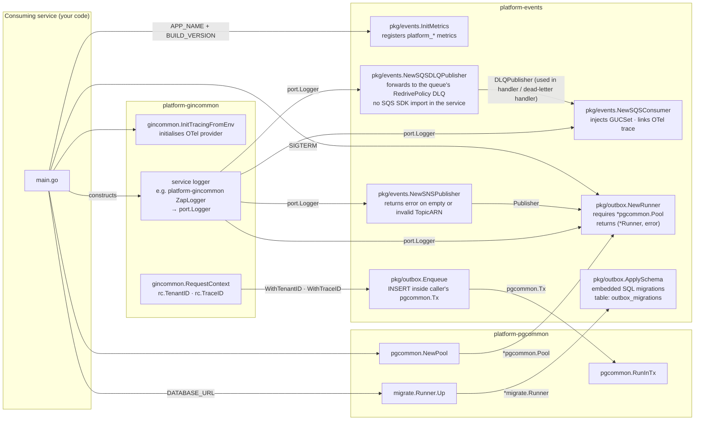

---

## Testing strategy

- **Unit** (`test/unit/`, no Docker) — one package per concern: `envelope`, `hmac`, `domain`, `port`, `clock`, `config`, `logger`, `metrics`, `mock`, `publisher` / `sns` (attribute building, batch split, retryable classification, codec encode), `sqs` (consumer loop: retry-vs-delete, visibility extension, drain, dead-letter routing on `ApproximateReceiveCount > n`; and the DLQ publisher: `RedrivePolicy` parsing, ARN resolution, caching, error classification, attribute limits, FIFO identity), `outbox` / `runner` / `enqueue` (claim, mark, backoff, shutdown release), `inbox`, `glue`. White-box tests for `internal/core/service` live beside the source.
- **Integration** (`test/integration/`, `-tags=integration`, testcontainers-go — real floci SNS/SQS + Postgres) — `sns_test.go` / `sqs_test.go` (round trips), `outboxstore_test.go` / `outboxstore_errors_test.go` (claiming, attempt counting, dead-lettering, error paths), `outbox_test.go`, `inbox_test.go`, `codec_test.go`, `dlq_test.go` (a real `RedrivePolicy` resolved and a message forwarded to it).
- **E2E** (`test/e2e/`, `-tags=e2e`) — the full pipeline Postgres → runner → SNS → SQS → consumer, including `TestOutbox_RollbackDoesNotPublish`.
- **Smoke** (`test/smoke/`, `-tags=smoke`, live AWS) — manual only, before the first deploy to a new AWS account; excluded from CI and from lint.
- **Interop** — `platform-interop-tests` (CI job `interop`) runs Go and Python probes against shared fixtures and compares envelope JSON and HMAC output byte-for-byte.

`make test-ci` runs unit, integration and e2e in parallel with `-race`, each writing its own profile to `.coverage/`, merged by `scripts/merge_coverage.py` (max-count) into `coverage.out`. Coverage is measured over `./internal/...` + `./pkg/...` with `-coverpkg` (tests live in the separate `test/` module). CI fails below **97%**; the merged total is **99.1%** (verified 2026-10-01). `make vet` and `make lint` run a second pass with `-tags=integration,e2e`, so tagged test files are vetted and linted too.

---

## Consumer conformance checklist

Before a service (Go via this library, or Python via `platform-eventcommon`) consumes events published through `platform-events`, verify:

**Delivery**
- [ ] The SNS→SQS subscription uses `RawMessageDelivery=true` — without it the body is an SNS notification wrapper and the consumer deletes every message as malformed.
- [ ] The queue has a `RedrivePolicy` DLQ; if the service uses `WithDeadLetterHandler`, `WithMaxReceiveCount(n)` is **strictly lower** than the policy's `maxReceiveCount`.
- [ ] The queue's resource policy restricts `sqs:SendMessage` to the expected topic ARN (`aws:SourceArn`).

**Decoding**
- [ ] If producers use a schema-registry codec (the envelope carries `dataschema`), the consumer wires `WithConsumerCodec` — for AWS Glue, `events.GlueDecodeCodec{}` suffices (no registry client). Without it, every encoded message fails decode and ends in the DLQ.
- [ ] Unknown `type` values are logged and acknowledged (`return nil`), not errored — new event types appear without notice.
- [ ] Unknown JSON fields are ignored — never decode payloads with `DisallowUnknownFields()`.

**Envelope**
- [ ] `id`, `type`, `source`, `time` and `data` are required; `envelope.tenant_id` is authoritative — never a `tenant_id` inside `data`.
- [ ] `subject`, `actor`, `ip_address`, `user_agent`, `correlation_id`, `dataschema` are present-when-applicable. See [Envelope compatibility guarantees](#envelope-compatibility-guarantees) for stability classes.

**Idempotency and ordering**
- [ ] Every handler is idempotent on `Envelope.ID` — `inbox.Handler` for duplicate suppression, plus same-transaction recording for side effects that must not repeat ([Idempotency](#idempotency)).
- [ ] No handler assumes delivery order; projections are upsert-style.

**Observability**
- [ ] Alert on `platform_messages_failed_total` (by `reason`), `platform_messages_failed_total{reason="dead_letter_error"}`, and SQS DLQ depth (CloudWatch).
- [ ] Every handler log line binds `event_id`, `event_type`, `trace_id`, `tenant_id`.

---

## Envelope compatibility guarantees

This section defines what the library guarantees about the `Envelope` wire format across version bumps. It answers: *"if I write a consumer today, which fields can I depend on never changing?"*

These guarantees apply to the envelope wrapper. Payload field stability is a separate concern governed by each publishing service — see [EVENT_SCHEMA_GOVERNANCE.md § Event versioning](EVENT_SCHEMA_GOVERNANCE.md#event-versioning).

### Field stability classes

| Field | Class | Guarantee |
|-------|-------|-----------|
| `id` | **Stable** | Always present. UUID v7 string format. `ParseEnvelope` rejects envelopes missing this field. Will never be removed, renamed, or change format within `v1.x`. |
| `type` | **Stable** | Always present. Dot-separated lowercase string. `ParseEnvelope` rejects envelopes missing this field. Will never be removed or renamed. The naming convention (including `.v<N>` suffix) is additive — existing type strings are valid forever. |
| `source` | **Stable** | Always present. Opaque string identifying the emitting service. `ParseEnvelope` rejects envelopes missing this field. Will never be removed or renamed. |
| `time` | **Stable** | Always present. RFC3339Nano UTC string. CloudEvents `time` attribute. `ParseEnvelope` rejects envelopes with a zero value. Will never be removed or change format. |
| `tenant_id` | **Contextual** | Present when set. Opaque string identifying the tenant scope, or the `"system"` sentinel from `WithSystemTenant()`. Empty string means no tenant context. Will never be removed. |
| `trace_id` | **Contextual** | Present when set. Hex-encoded OTel trace ID (32 chars) when populated from a live trace. Empty string means no trace context. Will never be removed. |
| `correlation_id` | **Contextual** | Present when set. Opaque string — no format constraint. Consumers must store and forward it as-is without interpretation. Will never be removed. |
| `specversion` | **Contextual** | Present when set. Positive integer string (`"1"`, `"2"`, …) — the payload schema version. Aligns with CloudEvents `specversion` attribute name. Absent means treat as `"1"` — this backward-compatibility rule is permanent. Will never be removed. |
| `subject` | **Contextual** | Present when set via `WithSubject`. Opaque resource URI or identifier the event is about (e.g. `"users/01926e4f-..."`). Also forwarded as an SNS message attribute (`Subject`) to enable SQS subscription filter policies without body parsing. Will never be removed. |
| `actor` | **Contextual** | Present when set via `WithActor`. Opaque identity string of the user or service that caused the event (e.g. a user UUID, a service-account name). Audit trail field — not forwarded as an SNS attribute. Will never be removed. |
| `ip_address` | **Contextual** | Present when set via `WithIPAddress`. Client IP at the time the event was triggered. Pass `r.RemoteAddr` or a validated `X-Forwarded-For` value from the HTTP handler. Omit for background/system events. Audit trail field — not forwarded as an SNS attribute. Will never be removed. |
| `user_agent` | **Contextual** | Present when set via `WithUserAgent`. HTTP `User-Agent` header value from the request that triggered the event. Omit for background/system events. Audit trail field — not forwarded as an SNS attribute. Will never be removed. |
| `dataschema` | **Contextual** | Present when set via `WithSchemaID`, or automatically by the SNS publisher when `WithCodec` is configured (the publisher's value wins if both are set). Aligns with CloudEvents `dataschema` attribute. Opaque schema registry version identifier — typically the Glue Schema Registry UUID returned by the codec's `Encode` call. Distinct from `specversion`: `dataschema` is the technical registry pointer used by the codec for Avro/JSON deserialization; `specversion` is the human-readable semantic version consumers use to gate business logic. Also doubles as the consumer-side signal for whether `data` is codec-encoded (see below). Not forwarded as an SNS attribute. Will never be removed. |
| `data` | **Externally governed** | Always present. Valid JSON (object, array, or scalar). CloudEvents `data` attribute. Shape is defined by the publisher and governed per [EVENT_SCHEMA_GOVERNANCE.md](EVENT_SCHEMA_GOVERNANCE.md). The library only validates it is well-formed JSON. **When `WithCodec` is configured on the publisher and `dataschema` is non-empty**, `data` is a base64-encoded JSON *string* (the codec's encoded bytes), not the inline payload object — `NewSQSConsumer` with `WithConsumerCodec` decodes it back to plain JSON before the handler sees it; a consumer without a matching `Codec` receiving a `dataschema`-tagged message will not be able to interpret `data` directly. |

### Stability definitions

**Stable** means:
- The field will never be removed from the wire format.
- The field's JSON key name will never change.
- The field's JSON type (string, number, etc.) will never change.
- The field's presence rule (required vs optional) will never become more restrictive.
- Any format change (e.g. a new UUID version) would be a MAJOR library bump and documented in `CHANGELOG.md`.

**Contextual** means:
- The field will never be removed from the wire format.
- The field's JSON key name will never change.
- The field's JSON type will never change.
- The field may be absent in valid envelopes — consumers must handle both present and absent values.
- The field's semantics (what an empty value means) are stable and documented above.

**Externally governed** means:
- The envelope wraps it; the library does not constrain its schema.
- The producer owns the payload contract.

### What the library reserves

Within `v1.x`, the library may add new **optional** envelope fields in a MINOR release. Any new field will:
- Be tagged `json:",omitempty"` — absent from JSON when not set.
- Have no effect on `ParseEnvelope` — it will never reject an envelope for missing a new field.
- Have a corresponding `With*` option function in `pkg/events`.
- Be documented in `CHANGELOG.md` as an addition.

Consumers that do not deserialise into `Envelope[T]` directly (e.g. they parse raw JSON) must not reject messages containing unrecognised envelope fields.

**The library will never, within `v1.x`:**
- Remove or rename any existing envelope field.
- Change a currently-optional field to required.
- Change the JSON type of any existing field.
- Change the format of `id` (UUID v7) or `time` (RFC3339Nano UTC).
- Re-introduce empty `tenant_id` as a valid wire value — use `"system"` via `WithSystemTenant()` instead.
- Change the meaning of `tenant_id = "system"`.
- Change the backward-compatibility rule that `specversion = ""` means `"1"`.

Any violation of these guarantees constitutes a MAJOR version bump (`v2.0.0`).

### Consumer guidance

Write consumer payload structs to be forward-compatible:

```go
// ✅ Correct — tolerates new optional envelope fields from future library versions
var env events.Envelope[json.RawMessage]
if err := json.Unmarshal(data, &env); err != nil {
    return err
}

// ❌ Wrong — rejects envelopes containing fields added in future library versions
dec := json.NewDecoder(bytes.NewReader(data))
dec.DisallowUnknownFields()
var env events.Envelope[json.RawMessage]
```

For the payload, apply the same rule: `DisallowUnknownFields` must never be used. See [Consuming guide § Implementing idempotency](docs/guides/consuming.md#implementing-idempotency) for handler patterns and [EVENT_SCHEMA_GOVERNANCE.md § Event versioning](EVENT_SCHEMA_GOVERNANCE.md#event-versioning) for payload evolution rules.

---

## Threat model

STRIDE analysis of `platform-events` as linked into a consuming service. Every row is grounded in a mechanism in this repository; controls the library cannot provide are marked as the service's or the platform's.

| STRIDE | Threat | Component | Mitigation |
|--------|--------|-----------|------------|
| **Spoofing** | A principal with `sns:Publish` on a topic injects a forged event that consumers act on | SNS topic → consumers | Topic and queue resource policies (platform); `aws:SourceArn` on queue policies (conformance checklist). The library does not sign bus messages — HMAC is for external ingress, not the SNS/SQS path |
| **Spoofing** | A webhook caller forges a payload at an HTTP ingress | Service ingress using `Verify` / `VerifyEnvelope` | HMAC-SHA256 with keys ≥ 32 bytes (`ErrKeyTooShort`), constant-time `hmac.Equal`, `Verify` returns `false` on any decode error |
| **Tampering** | Outbox rows are modified between enqueue and publish | `outbox_events` | Rows live in the service's own database under its access controls; the runner publishes the stored envelope verbatim |
| **Tampering** | A DLQ forward overwrites diagnostic metadata with caller-supplied values | `DLQPublisher` | `DLQReason`, `OriginalQueue`, `FailedAt`, `ConsumerName` always override caller attributes of the same name |
| **Repudiation** | An event with no attributable origin | Envelope | `source`, `actor`, `ip_address`, `user_agent`, `trace_id`, `correlation_id` carried on every envelope; `outbox_dead_letters.last_error` and DLQ attributes record why a message failed |
| **Information Disclosure** | Event handling reads another tenant's rows | SQS consumer → service DB | `pgcommon.GUCSet{TenantID}` injected per message before the handler runs, so the service's RLS applies |
| **Information Disclosure** | Message bodies leak into logs | SQS consumer | Only malformed bodies are logged, truncated to 512 bytes; `last_error` truncated to 512 chars. Services should still avoid PII in payloads, and must not forward PII to DLQs/audit topics without checking the destination's controls |
| **Denial of Service** | A poison message is retried forever and starves the queue | SQS consumer | Malformed JSON deleted immediately; dead-letter routing on `ApproximateReceiveCount`; SQS redrive; optional explicit `DLQPublisher` forward |
| **Denial of Service** | A producer floods unique `event_type` values to explode metric cardinality | Metrics adapter | `event_type` labels capped at 128 bytes → `__oversized__`, counted in `events_oversized_event_type_label_total` |
| **Denial of Service** | A hung SNS/SQS call holds a runner or consumer slot indefinitely | Adapters | Per-call timeouts (`PublishTimeout`, `WaitSeconds + 5 s` receive, 10 s delete); bounded handler concurrency; drain timeout on `Stop()` |
| **Denial of Service** | Oversized payloads fail at SNS after being committed | `outbox.Enqueue` | Rejects serialised envelopes > 240 KB at enqueue time, inside the caller's transaction |
| **Elevation of Privilege** | A tenant-scoped event published with `WithSystemTenant()` bypasses tenant scoping downstream | Producer code | Documented as a correctness bug (system invariants, adoption checklist); reviewers check every `WithSystemTenant()` call site |
| **Elevation of Privilege** | A service imports the SQS/SNS SDK directly and bypasses the library's safeguards | Consuming services | Depguard rules in service repos; `DLQPublisher` removes the last legitimate reason to import the SQS SDK |

**Out of scope (platform controls):** AWS account IAM, VPC endpoints, KMS key policies, and SNS/SQS resource policies — owned by platform infrastructure. Transport encryption — the AWS SDK uses TLS for every call.

### HMAC signing flow

> Source: [`docs/architecture/mermaid/hmac-flow.mmd`](docs/architecture/mermaid/hmac-flow.mmd)


---

## Developer tools

| Tool | How | Purpose |
|---|---|---|
| Package docs | `make godoc` → http://localhost:8080 | Every exported symbol is documented; pkgsite renders the `doc.go` package overviews |
| Diagrams | `docs/architecture/mermaid/*.mmd` | Render on GitHub, in a Mermaid-aware IDE, or at [mermaid.live](https://mermaid.live) — see [docs/README.md](docs/README.md) |
| Local AWS | `make docker-up` | floci (SNS + SQS, demo topology provisioned) on :4574, floci-ui on :4505 and Postgres on :5538 for manual testing — walkthrough in [README § Testing events locally](README.md#testing-events-locally) |
| Test doubles | `pkg/events/mock` | `Publisher`, `Consumer`, `DLQPublisher` for consuming-service unit tests |
| Loop-level fakes | `NewSQSConsumerWithClient`, `NewSQSDLQPublisherWithClient` | Inject a fake SQS client to test consumer-loop or DLQ-resolution behaviour without AWS |
| Reference CLI | `make build` → `bin/platform-events` | Prints version info — proves the module builds as a binary |
| Interop harness | `platform-interop-tests` | Go/Python wire-format comparison, run by the `interop` CI job |

---

## Design decisions

Judgment calls where the requirements left an internals-only detail open. Each is also documented at its point of impact in the code.

1. **DLQ resolution calls `GetQueueUrl` instead of building the URL from the ARN.** The DLQ is named by `RedrivePolicy.deadLetterTargetArn`, and a queue URL could be derived from the source queue's host plus the ARN's account and name — but URL shapes differ between AWS regions/partitions and emulator endpoints (floci returns `http://localhost:4566/000000000000/q`, or its `FLOCI_HOSTNAME` host). One extra IAM permission (`sqs:GetQueueUrl`) buys a resolution that is correct on every endpoint.
2. **The DLQ lookup cache stores successes only and never expires.** A queue whose `RedrivePolicy` is added after a failed lookup is picked up on the next call; a policy retargeted to a *different* DLQ is picked up on restart. Concurrent cold-cache lookups may duplicate the two attribute calls — harmless, and it avoids holding a lock across network I/O.
3. **One error type with a `Kind`, not one type per failure.** `*DLQError` unwraps to both its `Kind` sentinel and its AWS cause (`Unwrap() []error`), so callers branch with `errors.Is(err, events.ErrDLQNotConfigured)` and `errors.Is(err, events.ErrRetryable)` independently, and still reach the SDK error with `errors.As`. `ErrRetryable` was exported for this; it had been internal.
4. **Too many message attributes is rejected, not truncated.** SQS allows 10; the DLQ publisher reserves 4–5. Silently dropping caller attributes would lose diagnostics without anyone noticing, so the call fails with `ErrDLQInvalidMessage` before any AWS request — the caller still holds the original message.
5. **FIFO DLQ identity is the envelope ID.** `MessageGroupId` and `MessageDeduplicationId` are both set to `Envelope.ID` (SHA-256 of the body when the body isn't an envelope). Per-message groups maximise DLQ consumer parallelism; ordering inside a DLQ has no value.
6. **`WithMaxReceiveCount(n) < maxReceiveCount` is documented, not enforced.** The consumer could read the queue's `RedrivePolicy` at startup and reject a misconfigured `n`, but that adds an IAM permission and a startup AWS call to every consumer. It is called out in the README, the guides, `.env-example` and this document instead; enforcing it is a candidate follow-up.
7. **Codec decode failures are retried, malformed JSON is not.** Unparseable JSON will never parse, so it is deleted; a decode failure may be a registry outage, so the message is left visible for SQS's own redrive to handle.
8. **The inbox is check-then-act.** The ledger cannot join the handler's transaction because the library does not own it. The trade-off and the stronger same-transaction pattern are documented under [Idempotency](#idempotency).
9. **Tagged test files are vetted and linted.** `make vet` / `make lint` run a second pass with `-tags=integration,e2e`; the first run found one latent `staticcheck` issue in `test/e2e/outbox_test.go`.

---

## Performance characteristics

| Operation | Overhead | Notes |
|---|---|---|
| `NewEnvelope` | < 1 µs | UUID v7 + `time.Now()` + struct init |
| `publisher.Publish` (happy path) | Network RTT to SNS | OTel span + Prometheus counter: < 2 µs on top |
| `outbox.Enqueue` | One `INSERT` in the caller's tx | No SNS call; adds one row to the running transaction |
| Outbox runner poll (empty) | One `SELECT` + `time.Sleep` | Negligible; one connection for the full poll interval |
| Outbox runner poll (full batch) | `ceil(BatchSize / 10)` SNS `PublishBatch` calls when `PublishConcurrency=1`; `ceil(BatchSize / PublishConcurrency) × Publish` when `> 1` | Tune `PublishConcurrency`, `BatchSize`, and `PollInterval` together |
| `sqs.ReceiveMessage` | Network RTT to SQS | Long-poll (20 s) returns when messages arrive or timeout elapses |
| Handler dispatch overhead | < 1 µs | Semaphore acquire + goroutine start |
| `Verify` (HMAC) | < 1 µs | Two HMAC computations + constant-time compare |

**Total overhead on the critical path is dominated by SNS/SQS network latency.** The library adds sub-microsecond overhead for envelope creation, metrics recording, and span creation. The outbox pattern adds one `INSERT` to the business transaction and one `SELECT … FOR UPDATE` per poll cycle; at typical Postgres LAN latencies these are negligible compared to the business logic.

---

## Documentation assets

Every public package ships documentation artefacts alongside its source code.

| Artefact | Location | Purpose |
|----------|----------|---------|
| `doc.go` | `pkg/<name>/doc.go` | Package overview prose rendered by `pkgsite` (`make godoc`) |
| Exported symbol comments | Every `pkg/**/*.go` | Per-symbol godoc |

Architecture diagrams live as standalone Mermaid source files under `docs/architecture/mermaid/` and are embedded into this document as fenced code blocks. Each section carries a `> Source:` link to the originating `.mmd` file.

Run `make godoc` to render the full package documentation locally using `pkgsite`:

```
make godoc   # → http://localhost:8080
```

> Source: [`docs/architecture/mermaid/documentation-assets.mmd`](docs/architecture/mermaid/documentation-assets.mmd)

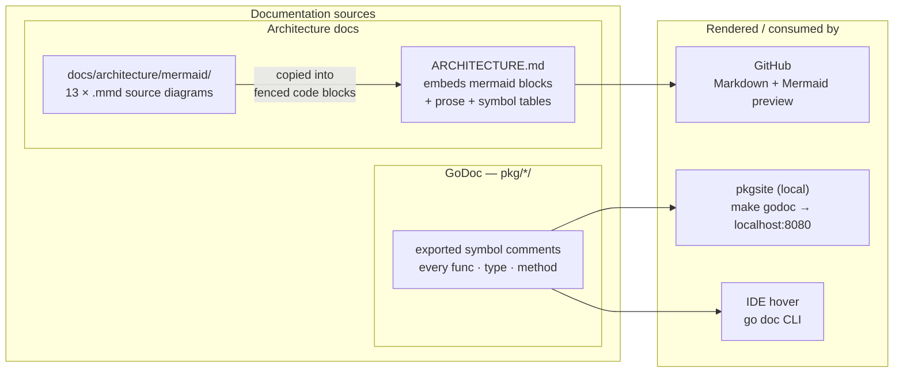

---

This architecture provides a consistent, enforceable boundary for all event-driven interactions — ensuring at-least-once delivery, tenant isolation, and uniform observability without requiring application-level discipline in each consuming service.

| Document | Description |
|----------|-------------|
| [`README.md`](README.md) | Mental model, API overview, integration steps, local development, CI |
| [`docs/guides/`](docs/README.md#guides-docsguides) | Detailed guides — envelope, publishing, consuming, outbox, codec, HMAC, observability, operations, testing |
| [`docs/README.md`](docs/README.md) | Index of the 13 standalone `.mmd` diagrams embedded above |
| [`EVENT_SCHEMA_GOVERNANCE.md`](EVENT_SCHEMA_GOVERNANCE.md) | Event naming, payload evolution, consumer compatibility contract |
| [`VERSIONING.md`](VERSIONING.md) · [`CHANGELOG.md`](CHANGELOG.md) | Release policy · per-version changes |
| [`.claude/CLAUDE.md`](.claude/CLAUDE.md) | Guidance for Claude Code working in this repo |

Render a diagram locally: open any `.mmd` file in a Mermaid-aware IDE (VS Code + Mermaid Preview, IntelliJ + Mermaid plugin) or paste into [mermaid.live](https://mermaid.live).

---

This architecture provides a consistent, enforceable boundary for all event-driven interactions — ensuring at-least-once delivery, tenant isolation, and uniform observability without requiring application-level discipline in each consuming service.
