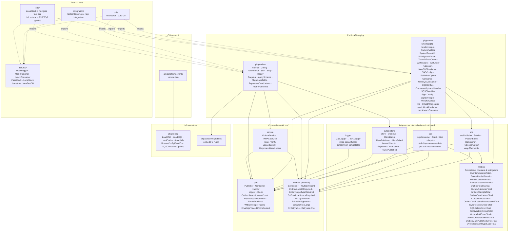
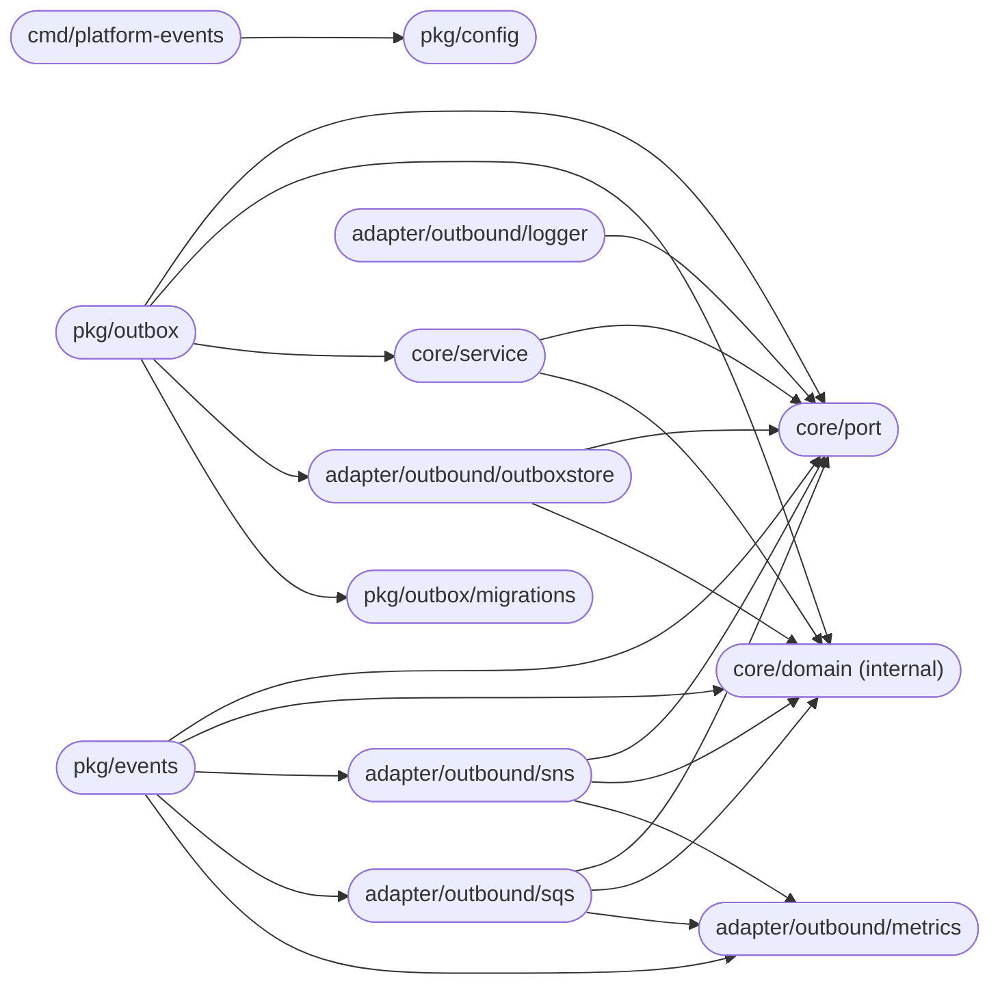
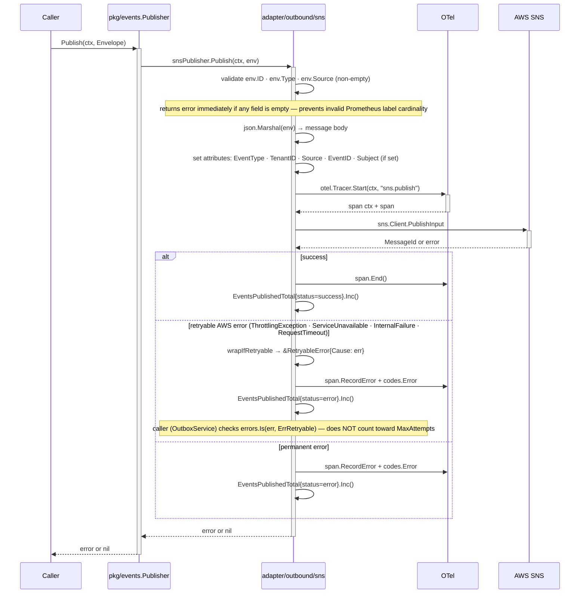
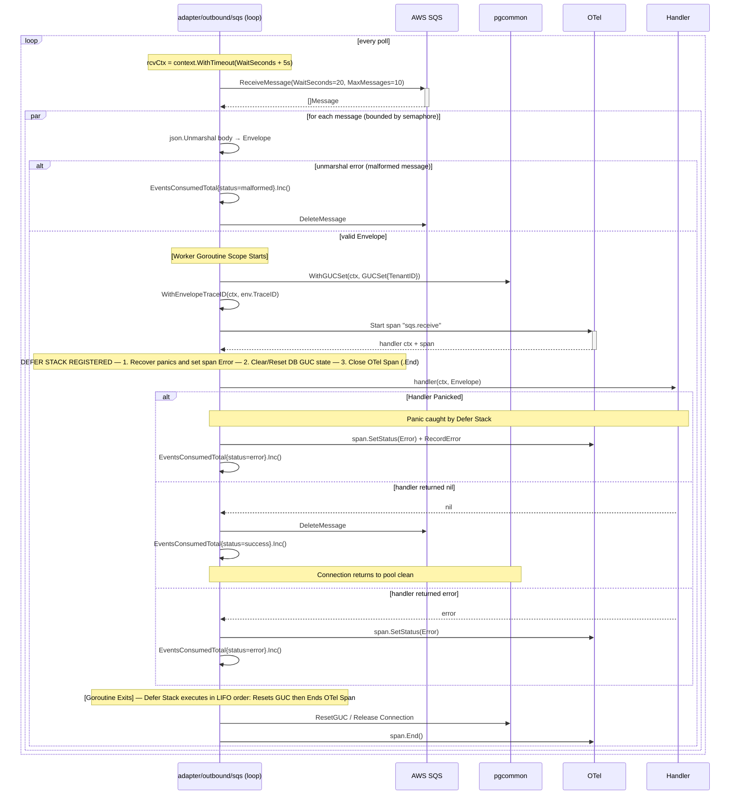
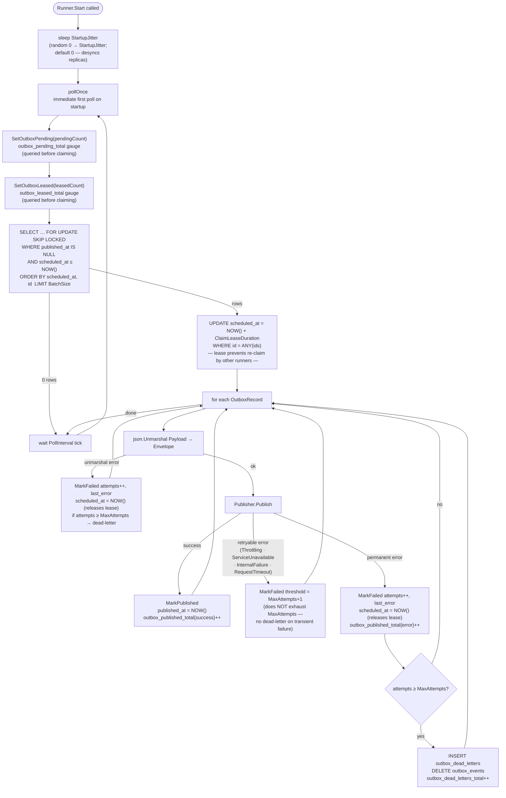
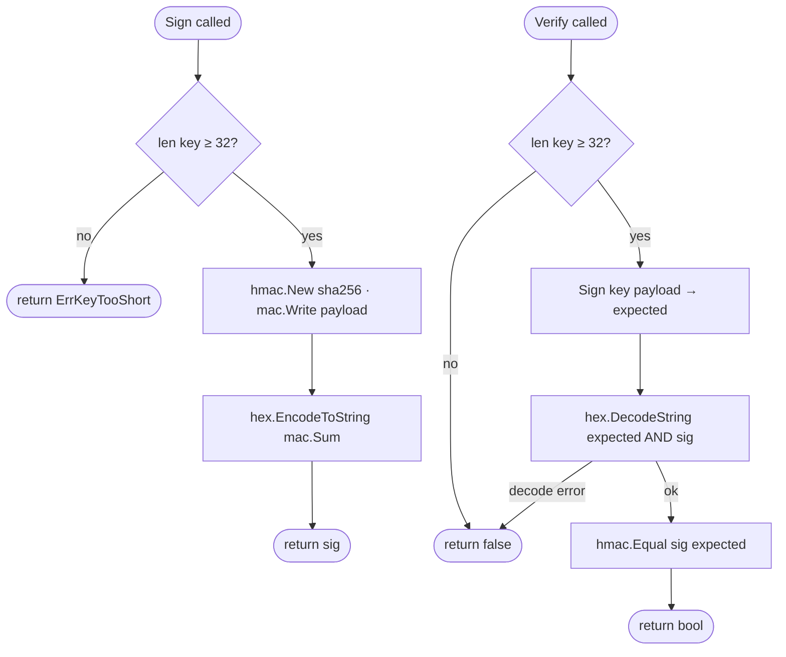
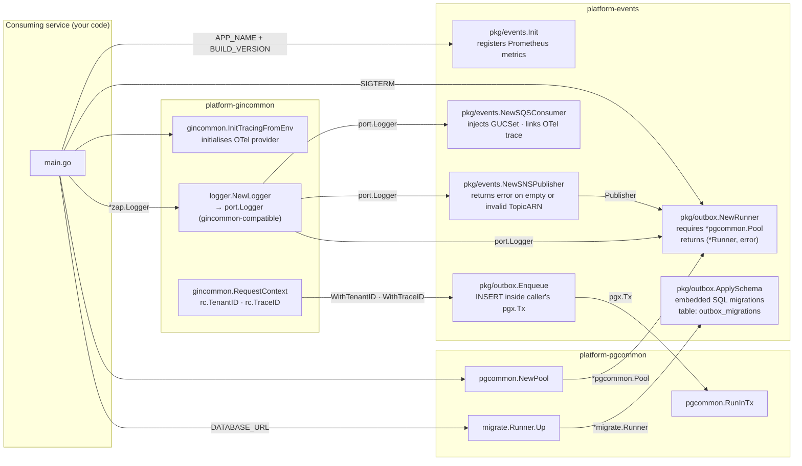
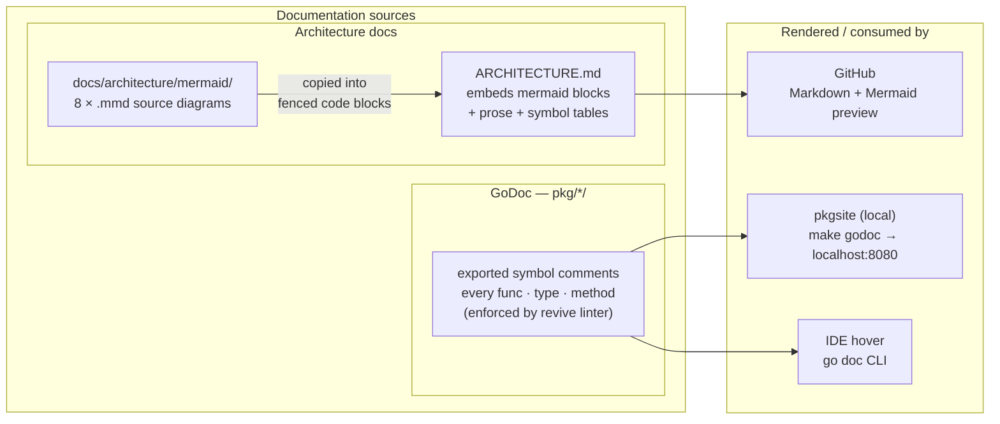

# Architecture

This document describes the internal structure, dependency rules, and runtime data flows of `platform-events`.

> **Design intent:** this library centralises event publishing, consumption, and guaranteed delivery at the messaging boundary — ensuring uniform envelope format, tenant propagation, and observability across all consuming services without requiring each service to reimplement these concerns.

---

## End-to-end event lifecycle

A numbered walkthrough of what happens between a domain mutation and a processed event — useful as a mental model before reading the detailed diagrams.

### Publish path (with outbox)

1. **HTTP handler receives request** — gin middleware extracts `RequestContext` (TenantID, TraceID) from validated gateway headers.
2. **Handler begins business transaction** via `pgcommon.RunInTx`.
3. **Domain entity written** to the database inside the transaction.
4. **`outbox.Enqueue` called** inside the same transaction — inserts a serialised `Envelope` into `outbox_events`. No SNS call happens here.
5. **Transaction commits** — both the domain write and the outbox row are durable. If the transaction rolls back, neither persists.
6. **Outbox runner polls** `outbox_events` — immediately on startup, then every `PollInterval`. Claims a batch with `SELECT … FOR UPDATE SKIP LOCKED WHERE scheduled_at <= NOW()` and extends `scheduled_at` as a claim lease so concurrent runners do not re-claim the same records.
7. **`Publisher.Publish` called** — SNS receives the event, sets `EventType`, `TenantID`, `Source`, `EventID`, and `Subject` (when non-empty) as message attributes for filter-policy routing.
8. **Row marked published** (`published_at = NOW()`). On failure, `attempts` is incremented and `scheduled_at = NOW()` (releases the lease for next poll cycle retry); after `MaxAttempts` the row moves to `outbox_dead_letters`.

> **Ordering:** no global ordering is guaranteed. Ordering is only preserved within the same SQS message group (FIFO queues with `WithMessageGroupID`). All other delivery is best-effort ordering.

> **⚠️ Publishing rule (mandatory):** all domain events tied to a database write **must** go through `outbox.Enqueue` inside a `pgcommon.RunInTx` callback. Calling `publisher.Publish` directly for transactional events introduces an unrecoverable crash window — the DB write commits but the event is silently lost if the process dies before the SNS call. `publisher.Publish` is only valid for best-effort, non-transactional notifications where event loss is explicitly acceptable. See [README § Publishing rules](../README.md#publishing-rules) for the full decision table and crash-window diagram.

### Consume path

1. **SQS consumer long-polls** the queue (`ReceiveMessage` with `WaitSeconds=20`).
2. **Message body unmarshalled** into `Envelope[json.RawMessage]`.
3. **Context enriched** — `pgcommon.WithGUCSet(ctx, GUCSet{TenantID: env.TenantID})` injected so all downstream pool calls enforce the event's tenant via RLS.
4. **OTel span started** (`sqs.receive`) linked to the publisher's trace via `Envelope.TraceID`.
5. **Handler called** with the enriched context. If it returns `nil`, the message is deleted. If it returns an error, the message stays visible for retry.
6. **Metrics recorded** — `events_consumed_total`, `events_consume_duration_seconds`.

> **Idempotency requirement:** handlers must be idempotent. SQS delivers messages at least once — a handler may be called more than once for the same `Envelope.ID` due to network retries, visibility timeout expiry, or consumer restarts. Use `Envelope.ID` (UUID v7) as the idempotency key. The recommended implementation is a `processed_events` Postgres table with `ON CONFLICT DO NOTHING` inside the same transaction as the side-effect write — see [README § Implementing idempotency](../README.md#implementing-idempotency) for full patterns and the common-mistakes table.

---

## Failure lifecycle

The platform has **two independent retry systems** — one for publish failures and one for consumption failures. They have no interaction with each other. Confusing them is the most common operational mistake when debugging message delivery issues.

### The two systems at a glance

| Dimension | Producer-side (outbox) | Consumer-side (SQS) |
|-----------|------------------------|---------------------|
| **What fails** | SNS publish call | Handler logic (`return err`) |
| **Where tracked** | `outbox_events.attempts` column | SQS `ApproximateReceiveCount` attribute |
| **Retry trigger** | Next outbox runner poll cycle | SQS visibility timeout expiry |
| **Retry interval** | `PollInterval` (default 5 s) | `VisibilityTimeout` (default 30 s, library-managed) |
| **Retry limit** | `MaxAttempts` (default 5) | `MaxReceiveCount` (SQS queue setting, **not** a library config) |
| **Terminal state** | Postgres `outbox_dead_letters` table | SQS Dead-Letter Queue (separate SQS queue) |
| **Recovery action** | `runner.ReprocessDeadLetters(ctx, n)` or SQL `UPDATE` | SQS redrive policy or manual `ChangeMessageVisibility` |
| **Who owns recovery** | Platform team (SQL access) | Service team (SQS console / redrive) |
| **Observable signal** | `outbox_dead_letters_total` counter · `outbox_published_total{status=error}` | `ApproximateNumberOfMessagesNotVisible` CloudWatch · consumer `events_consumed_total{status=error}` |

### Producer-side failure timeline

```
t=0   outbox.Enqueue — row written inside business transaction
      outbox_events: { id, published_at: NULL, attempts: 0 }

t=5s  Outbox runner polls. Calls Publisher.Publish (SNS).

      ── SNS permanent error (invalid ARN, auth failure) ──────────────────
      attempts++ → outbox_events: { attempts: 1, last_error: "..." }
      scheduled_at = NOW() (lease released; eligible next poll cycle)

      ── SNS retryable error (ThrottlingException, ServiceUnavailable) ─────
      attempts unchanged → threshold = MaxAttempts+1
      Record rescheduled; NOT progressing toward dead-letter.
      (A full SNS outage cannot dead-letter healthy records.)

t=10s Runner polls again. Retries the record.
t=15s ...
t=30s attempts reaches MaxAttempts (default 5):
      → INSERT outbox_dead_letters (id, event_type, payload, tenant_id,
                                    trace_id, attempts, last_error, failed_at)
      → DELETE outbox_events
      → outbox_dead_letters_total.Inc()

      ── Recovery ─────────────────────────────────────────────────────────
      Option A: runner.ReprocessDeadLetters(ctx, 50)
                Moves records back to outbox_events; resets attempts to 0.
      Option B: SQL — fix root cause, then:
                UPDATE outbox_dead_letters SET ... → INSERT outbox_events → DELETE outbox_dead_letters
```

**Key producer-side invariants:**
- Retryable SNS errors never advance `attempts` — SNS throttles cannot dead-letter healthy records.
- Context cancellation (rolling restart) also does not advance `attempts` — it releases the lease.
- `last_error` is truncated to 512 chars; full errors are in structured logs tagged with `event_id`.

### Consumer-side failure timeline

```
t=0   SQS delivers message. VisibilityTimeout = 30s.
      Consumer dispatches to handler goroutine.

      ── Handler returns non-nil error ────────────────────────────────────
      Library does NOT call DeleteMessage.
      Message becomes visible again after VisibilityTimeout (30s).
      ApproximateReceiveCount++

      ── Handler panics ────────────────────────────────────────────────────
      Library recovers the panic; logs stack trace.
      Message left visible (same as non-nil error path).

      ── Malformed envelope (json.Unmarshal fails) ──────────────────────────
      Library calls DeleteMessage immediately.
      events_consumed_total{status=malformed}.Inc()
      No retry — a malformed message will never unmarshal correctly.

t=30s SQS makes message visible. Consumer receives it again.
      ApproximateReceiveCount = 2

      ... (repeats until MaxReceiveCount is reached — configured on the SQS queue, not in this library)

t=N   ApproximateReceiveCount > MaxReceiveCount:
      SQS automatically moves message to the configured Dead-Letter Queue (SQS DLQ).
      The library's WithDeadLetterHandler(fn) intercepts messages where
      ApproximateReceiveCount > WithMaxReceiveCount(n) BEFORE the SQS DLQ receives them,
      giving the handler a final chance to log, alert, or archive before deletion.

      ── Recovery ─────────────────────────────────────────────────────────
      Fix the handler bug. Then either:
      Option A: SQS redrive policy — move messages from DLQ back to source queue.
      Option B: Re-publish the envelope from the originating service.
      There is no library API for consumer-side DLQ management.
```

**Key consumer-side invariants:**
- The library does not implement consumer-side retry backoff. SQS visibility timeout IS the backoff.
- `MaxReceiveCount` is a **queue configuration**, not a library config. Set it in your Terraform/CDK alongside your SQS resource.
- The outbox runner has no knowledge of consumer failures. A handler error never touches `outbox_events`.
- Increasing `VisibilityTimeout` gives handlers more time between retry attempts. The SQS maximum is 12 h (enforced at construction by `NewSQSConsumer`).

### The dead-letter naming collision

Both systems use the term "dead letter" but they refer to entirely different storage and recovery paths:

| Term | What it is | How to query | How to recover |
|------|-----------|--------------|---------------|
| **Outbox dead letters** | Postgres rows in `outbox_dead_letters` — publish failures that exhausted `MaxAttempts` | `SELECT * FROM outbox_dead_letters WHERE tenant_id = 'acme'` | `runner.ReprocessDeadLetters(ctx, n)` |
| **SQS DLQ** | A separate SQS queue — consumer failures that exhausted `MaxReceiveCount` | SQS console or `aws sqs receive-message --queue-url $DLQ_URL` | SQS redrive policy (SQS console → Start DLQ redrive) |

When an on-call alert fires on `outbox_dead_letters_total`, the fix is on the **publisher side** (SNS connectivity, payload validity, queue subscription). When the alert is on a high `ApproximateNumberOfMessagesNotVisible` or a growing SQS DLQ depth, the fix is on the **consumer handler side** (logic bug, downstream dependency failure, missing idempotency).

### Operational runbook

| Symptom | Likely cause | Where to look | Fix |
|---------|-------------|---------------|-----|
| `outbox_dead_letters_total` rate > 0 | SNS publish failure or invalid payload | `outbox_dead_letters.last_error` | Fix root cause; call `ReprocessDeadLetters` |
| `outbox_mark_published_errors_total` > 0 | DB write failed after SNS delivery succeeded — record will be re-published on next poll | `outbox_events.last_error`; DB connectivity | Investigate DB health; note: consumer **must be idempotent** — duplicate delivery is actively occurring |
| `outbox_pending_total` growing, `outbox_published_total` flat | SNS throttling or outbox runner stopped | `outbox_events.last_error`; outbox runner logs | Check SNS quotas; ensure runner is running; retryable errors auto-recover |
| `events_consumed_total{status=error}` growing | Handler returning errors repeatedly | Handler logs; downstream service health | Fix handler bug; SQS redrive once fixed |
| `events_consumed_total{status=malformed}` > 0 | Producer publishing invalid JSON or wrong topic/queue pair | Dead-lettered messages in SQS DLQ | Check producer serialisation; verify SQS filter policies |
| SQS DLQ depth growing | Handler consistently failing after `MaxReceiveCount` retries | SQS DLQ message bodies; handler logs | Fix handler; redrive DLQ |

### `outbox_events` table pruning

Published records are marked with `published_at` but **never deleted automatically**. Without periodic pruning, `outbox_events` grows unboundedly. Use `Runner.PrunePublished`:

```go
// Prune published records older than 7 days in batches of 1000.
// Call daily from a maintenance goroutine or scheduled job.
n, err := runner.PrunePublished(ctx, 7*24*time.Hour, 1000)
```

Choose `olderThan` to exceed the longest consumer idempotency deduplication window. 7 days is a safe default for most workloads. Loop until 0 rows are returned to fully drain accumulated records on first install.

### Migration 003 — production upgrade runbook

Migration 003 (`003_optimize_outbox_index.up.sql`) creates a composite index on `(scheduled_at, id) WHERE published_at IS NULL`. The migrate runner executes inside a transaction, so `CREATE INDEX CONCURRENTLY` cannot be used. On a table with many rows this acquires an `ACCESS EXCLUSIVE` lock and blocks all reads/writes for the duration of the index build.

**Before upgrading past v1.1.0 on a non-empty table:**
1. Run manually outside a transaction (non-blocking):
   ```sql
   CREATE INDEX CONCURRENTLY IF NOT EXISTS idx_outbox_events_scheduled_at_id
       ON outbox_events (scheduled_at, id) WHERE published_at IS NULL;
   ```
2. Then run `outbox.ApplySchema` — the runner will skip migration 003 because the index already exists.

If `outbox_events` is empty at upgrade time (e.g. new service), the normal `ApplySchema` call is safe with no manual steps.

### Dead-letter table retention

`outbox_dead_letters` has no automatic TTL — it grows unbounded until cleared. Services must schedule periodic cleanup to prevent table bloat. Recommended strategies:

**Periodic SQL purge (simplest — add to a maintenance cron job):**
```sql
-- Purge dead letters older than 90 days; adjust retention to your audit requirements.
DELETE FROM outbox_dead_letters WHERE created_at < NOW() - INTERVAL '90 days';
```

**Reprocess then purge (for recoverable failures):**
```go
// Reprocess up to 100 records; call again until 0 is returned.
requeued, err := runner.ReprocessDeadLetters(ctx, 100)
```
After fixing the root cause (SNS error, payload bug), call `ReprocessDeadLetters` to drain the table back into `outbox_events` for redelivery, then purge any remaining un-recoverable records with the SQL above.

**Alert threshold:** set a Prometheus alert on `outbox_dead_letters_total` rate > 0 for more than 15 minutes — persistent dead-lettering signals a publish failure that requires operator action, not just transient SNS throttling.

---

## Layer model

The library is organised in concentric Clean Architecture layers. Inner layers have **zero knowledge** of outer layers; dependencies always point inward.

> Source: [`docs/architecture/mermaid/layer-model.mmd`](docs/architecture/mermaid/layer-model.mmd)



**Rule:** `domain` ← `port` ← `service` ← `adapter` ← `pkg`. The `domain` package imports nothing from this module. `port` imports only `domain`. Packages in `pkg/` depend on `core/` but never on `adapter/` directly. Tests (dashed arrows) consume the public API but are not part of the dependency chain.

---

## Package dependency graph

Arrows represent Go `import` relationships (module-internal only).

> Source: [`docs/architecture/mermaid/package-dependencies.mmd`](docs/architecture/mermaid/package-dependencies.mmd)



`core/domain` and `core/port` are dependency sinks — they import nothing from this module. `pkg/config` depends only on `pkg/events`, `pkg/outbox`, and `platform-pgcommon`.

---

## Public API packages

### pkg/events

| Symbol | Description |
|--------|-------------|
| `Envelope[T any]` | Typed event wrapper: `ID` (UUID v7), `Type`, `Source`, `SchemaVersion`, `TenantID`, `TraceID`, `CorrelationID`, `Subject`, `Actor`, `Timestamp`, `Payload T` |
| `NewEnvelope[T](type, source, payload, opts...)` | Generates `ID` (UUID v7), sets `Timestamp = time.Now().UTC()`. Options: `WithTenantID`, `WithTraceID`, `WithCorrelationID`, `WithSystemTenant`, `WithSchemaVersion`, `WithSubject`, `WithActor` |
| `WithSchemaVersion(v)` | Sets `SchemaVersion` on the envelope. Use `"1"` at inception; increment on additive-only field additions. See [EVENT_SCHEMA_GOVERNANCE.md](../EVENT_SCHEMA_GOVERNANCE.md). |
| `SystemTenantID` | String constant `"system"` — use for background jobs that publish across tenants |
| `WithSystemTenant()` | `EnvelopeOpt` that sets `TenantID = "system"`; use for scheduled tasks and cross-tenant background jobs |
| `TraceIDFromContext(ctx)` | Returns the envelope `TraceID` stored in the handler context by `NewSQSConsumer`; wraps `port.EnvelopeTraceIDFromContext` |
| `Envelope.JSON()` | Canonical JSON serialisation |
| `ParseEnvelope[T](data)` | Deserialise and validate required fields (`id`, `type`, `source`) |
| `Publisher` | Interface: `Publish(ctx, Envelope[json.RawMessage]) error`; `PublishBatch(ctx, []Envelope[json.RawMessage]) error` |
| `NewSNSPublisher(cfg, opts...)` | Constructs the SNS implementation; returns error on empty `TopicARN` |
| `SNSConfig` | `TopicARN` (required), `Region`, `EndpointURL`, `Logger` |
| `PublisherOption` | `WithMessageGroupID(fn)`, `WithMessageDeduplicationID(fn)`, `WithAttributes(map)` |
| `Consumer` | Interface: `Start(ctx) error`; `Stop() error` |
| `Handler` | `func(ctx context.Context, env Envelope[json.RawMessage]) error` |
| `NewSQSConsumer(cfg, handler, opts...)` | Constructs the SQS long-poll loop; returns error on empty `QueueURL` or `VisibilityTimeout > 12h` |
| `SQSConfig` | `QueueURL` (required), `Region`, `EndpointURL`, `MaxMessages`, `WaitSeconds`, `Logger` |
| `ConsumerOption` | `WithConcurrency(n)`, `WithVisibilityTimeout(d)`, `WithDeadLetterHandler(fn)`, `WithMaxReceiveCount(n)`, `WithDrainTimeout(d)` |
| `SQSClientLike` | Interface mirroring the SQS client API — inject in tests via `NewSQSConsumerWithClient` without importing internal packages |
| `Sign(key, payload)` | Hex-encoded HMAC-SHA256 signature |
| `Verify(key, payload, sig)` | Constant-time comparison; returns `false` on any error |
| `SignEnvelope(key, env)` | Signs canonical JSON of envelope |
| `VerifyEnvelope(key, env, sig)` | Deserialises and verifies; safe for webhook receipt handlers |
| `Init(service, version)` | Registers Prometheus metrics once (`sync.Once`) |
| `InitWithRegisterer(service, version, reg)` | Registers against a custom `prometheus.Registerer` (use in tests) |
| `mock.MockPublisher` | In-memory, thread-safe; `Published()`, `SetError()`, `Reset()` |
| `mock.MockConsumer` | In-memory queue; `Inject(env)` delivers synchronously |

### pkg/outbox

| Symbol | Description |
|--------|-------------|
| `Config` | `Pool *pgcommon.Pool`, `Publisher`, `Logger`, `PollInterval` (5s), `BatchSize` (50), `MaxAttempts` (5), `ClaimLeaseDuration` (10 min), `PublishConcurrency` (1 — SNS `PublishBatch` path; `> 1` parallel per-record `Publish`), `PublishTimeout` (10s), `DrainTimeout` (30s), `StartupJitter` (0) |
| `NewRunner(cfg) (*Runner, error)` | Constructs the outbox runner; applies defaults; returns an error if `ClaimLeaseDuration` is too short for the configured `BatchSize × PublishTimeout`; panics if `Publisher` nil or both `Pool` and `Store` nil (programming errors) |
| `Runner.Start(ctx)` | Starts the poll loop (immediate first poll, then per `PollInterval`); exponential backoff (1s→30s) on poll-cycle failure; blocks until `ctx` is cancelled |
| `Runner.Stop()` | Graceful drain; waits up to `DrainTimeout` for the in-flight batch, then returns a non-nil error if it did not finish |
| `Runner.Ready() <-chan struct{}` | Returns a channel closed after the first successful poll cycle; use to gate Kubernetes readiness probes — a closed channel confirms the DB connection is healthy and the outbox schema exists |
| `Runner.ReprocessDeadLetters(ctx, limit)` | Moves up to `limit` records from `outbox_dead_letters` back to `outbox_events`, resetting attempt counters for redelivery; returns the count requeued |
| `Runner.PrunePublished(ctx, olderThan, limit)` | Deletes published records older than `olderThan` from `outbox_events` (batched to `limit` rows). Call periodically (e.g. daily) to prevent unbounded table growth; choose `olderThan ≥` the longest consumer idempotency window (minimum 7 days is safe for most workloads) |
| `Enqueue(ctx, tx pgx.Tx, env)` | Inserts serialised envelope into `outbox_events` within caller's transaction; validates non-empty `ID`/`Type`/`Source`, non-zero `Timestamp`, and absence of null bytes in string fields; rejects payloads > 240 KB |
| `ApplySchema(ctx, runner *migrate.Runner)` | Applies embedded migrations `001`–`007` (outbox tables, indexes, dead-letter indexes, dead-letter `created_at` default, prune index) using an isolated tracking table (`outbox_migrations`) so the caller's domain migrations remain unaffected |
| `MigrationsTable` | Exported constant (`"outbox_migrations"`) — the golang-migrate tracking table used by `ApplySchema`; isolated from the consuming service's `schema_migrations` to prevent version-number collisions |

---

## Envelope compatibility guarantees

This section defines what the library guarantees about the `Envelope` wire format across version bumps. It answers: *"if I write a consumer today, which fields can I depend on never changing?"*

These guarantees apply to the envelope wrapper. Payload field stability is a separate concern governed by each publishing service — see [EVENT_SCHEMA_GOVERNANCE.md § Event versioning](../EVENT_SCHEMA_GOVERNANCE.md#event-versioning).

### Field stability classes

| Field | Class | Guarantee |
|-------|-------|-----------|
| `id` | **Stable** | Always present. UUID v7 string format. `ParseEnvelope` rejects envelopes missing this field. Will never be removed, renamed, or change format within `v1.x`. |
| `type` | **Stable** | Always present. Dot-separated lowercase string. `ParseEnvelope` rejects envelopes missing this field. Will never be removed or renamed. The naming convention (including `.v<N>` suffix) is additive — existing type strings are valid forever. |
| `source` | **Stable** | Always present. Opaque string identifying the emitting service. `ParseEnvelope` rejects envelopes missing this field. Will never be removed or renamed. |
| `timestamp` | **Stable** | Always present. RFC3339Nano UTC string. Will never be removed or change format. `ParseEnvelope` rejects envelopes with a zero timestamp. |
| `tenant_id` | **Contextual** | Present when set. Opaque string identifying the tenant scope, or the `"system"` sentinel from `WithSystemTenant()`. Empty string means no tenant context. Will never be removed. |
| `trace_id` | **Contextual** | Present when set. Hex-encoded OTel trace ID (32 chars) when populated from a live trace. Empty string means no trace context. Will never be removed. |
| `correlation_id` | **Contextual** | Present when set. Opaque string — no format constraint. Consumers must store and forward it as-is without interpretation. Will never be removed. |
| `schema_version` | **Contextual** | Present when set. Positive integer string (`"1"`, `"2"`, …). Absent means treat as `"1"` — this backward-compatibility rule is permanent. Will never be removed. |
| `subject` | **Contextual** | Present when set via `WithSubject`. Opaque resource URI or identifier the event is about (e.g. `"users/01926e4f-..."`). Also forwarded as an SNS message attribute (`Subject`) to enable SQS subscription filter policies without body parsing. Will never be removed. |
| `actor` | **Contextual** | Present when set via `WithActor`. Opaque identity string of the user or service that caused the event (e.g. a user UUID, a service-account name). Audit trail field — not forwarded as an SNS attribute. Will never be removed. |
| `payload` | **Externally governed** | Always present. Valid JSON (object, array, or scalar). Shape is defined by the publisher and governed per [EVENT_SCHEMA_GOVERNANCE.md](../EVENT_SCHEMA_GOVERNANCE.md). The library only validates it is well-formed JSON. |

### Stability definitions

**Stable** means:
- The field will never be removed from the wire format.
- The field's JSON key name will never change.
- The field's JSON type (string, number, etc.) will never change.
- The field's presence rule (required vs optional) will never become more restrictive.
- Any format change (e.g. a new UUID version) would be a MAJOR library bump and documented in `CHANGELOG.md`.

**Contextual** means:
- The field will never be removed from the wire format.
- The field's JSON key name will never change.
- The field's JSON type will never change.
- The field may be absent in valid envelopes — consumers must handle both present and absent values.
- The field's semantics (what an empty value means) are stable and documented above.

**Externally governed** means:
- The envelope wraps it; the library does not constrain its schema.
- The producer owns the payload contract.

### What the library reserves

Within `v1.x`, the library may add new **optional** envelope fields in a MINOR release. Any new field will:
- Be tagged `json:",omitempty"` — absent from JSON when not set.
- Have no effect on `ParseEnvelope` — it will never reject an envelope for missing a new field.
- Have a corresponding `With*` option function in `pkg/events`.
- Be documented in `CHANGELOG.md` as an addition.

Consumers that do not deserialise into `Envelope[T]` directly (e.g. they parse raw JSON) must not reject messages containing unrecognised envelope fields.

**The library will never, within `v1.x`:**
- Remove or rename any existing envelope field.
- Change a currently-optional field to required.
- Change the JSON type of any existing field.
- Change the format of `id` (UUID v7) or `timestamp` (RFC3339Nano UTC).
- Re-introduce empty `tenant_id` as a valid wire value — use `"system"` via `WithSystemTenant()` instead.
- Change the meaning of `tenant_id = "system"`.
- Change the backward-compatibility rule that `schema_version = ""` means `"1"`.

Any violation of these guarantees constitutes a MAJOR version bump (`v2.0.0`).

### Consumer guidance

Write consumer payload structs to be forward-compatible:

```go
// ✅ Correct — tolerates new optional envelope fields from future library versions
var env events.Envelope[json.RawMessage]
if err := json.Unmarshal(data, &env); err != nil {
    return err
}

// ❌ Wrong — rejects envelopes containing fields added in future library versions
dec := json.NewDecoder(bytes.NewReader(data))
dec.DisallowUnknownFields()
var env events.Envelope[json.RawMessage]
```

For the payload, apply the same rule: `DisallowUnknownFields` must never be used. See [README § Implementing idempotency](../README.md#implementing-idempotency) for handler patterns and [EVENT_SCHEMA_GOVERNANCE.md § Event versioning](../EVENT_SCHEMA_GOVERNANCE.md#event-versioning) for payload evolution rules.

---

## SNS publish flow

> Source: [`docs/architecture/mermaid/sns-publish-flow.mmd`](docs/architecture/mermaid/sns-publish-flow.mmd)



---

## SQS consume flow

> Source: [`docs/architecture/mermaid/sqs-consume-flow.mmd`](docs/architecture/mermaid/sqs-consume-flow.mmd)



Ensure `VisibilityTimeout` exceeds worst-case handler duration, or messages may be re-delivered while still processing.

---

## Outbox poll cycle

> Source: [`docs/architecture/mermaid/outbox-poll-cycle.mmd`](docs/architecture/mermaid/outbox-poll-cycle.mmd)



If `PublishConcurrency > 1`, events from the same batch may be published out of order — use FIFO topics to guarantee order where required.

---

## HMAC signing flow

> Source: [`docs/architecture/mermaid/hmac-flow.mmd`](docs/architecture/mermaid/hmac-flow.mmd)



---

## Consuming service wiring

A typical service bootstrap wires `platform-events` alongside `platform-gincommon` and `platform-pgcommon`.

> Source: [`docs/architecture/mermaid/consuming-service-wiring.mmd`](docs/architecture/mermaid/consuming-service-wiring.mmd)



---

## Concurrency model

`sqsConsumer` dispatches messages with a bounded semaphore (`WithConcurrency`). The semaphore limits concurrent handler goroutines; the receive loop is never blocked by slow handlers — it simply does not dispatch new goroutines when the semaphore is full until a slot frees up.

**Example — 10 messages received, `WithConcurrency(3)`:**

```
ReceiveMessage → 10 messages

→ goroutine 1: handle message A  (acquires slot)
→ goroutine 2: handle message B  (acquires slot)
→ goroutine 3: handle message C  (acquires slot)
→ messages D–J: sem ← struct{}{} blocks until a slot is released

When goroutine 1 finishes:
→ message D acquires the freed slot
→ message E remains blocked

… and so on until all 10 are dispatched.
```

**Observable signals:**

| Signal | Metric | Meaning |
|---|---|---|
| Slow handlers | `events_consume_duration_seconds` p99 rising | Reduce concurrency or investigate handler latency |
| Handler errors | `events_consumed_total{status=error}` growing | Messages being retried; check handler logic |
| Outbox backlog | `outbox_pending_total` growing | Publisher slow or SNS throttling; raise `PublishConcurrency` or check `outbox_published_total` |
| Leased records | `outbox_leased_total` high | Many records in-flight; if combined with stalled `outbox_pending_total`, a runner may have crashed mid-batch — wait for `ClaimLeaseDuration` expiry or restart the runner |
| Publish failures | `outbox_published_total{status=error}` | Check SNS connectivity and the `outbox_dead_letters` table |
| Dead letters | `outbox_dead_letters_total` rate > 0 | Records exhausted `MaxAttempts` — inspect `outbox_dead_letters` and replay via `Runner.ReprocessDeadLetters`; **primary publish-side alert** |

**Logging correlation:** metrics and spans identify *that* something failed; structured log fields identify *which* message delivery and *which* tenant. Always include `event_id`, `event_type`, `trace_id`, and `tenant_id` on every log line inside a handler or publisher. See [README § Logging correlation](../README.md#logging-correlation) for patterns and Loki query examples.

---

## Key invariants

| Invariant | Where enforced |
|-----------|---------------|
| Envelope ID uniqueness | UUID v7 generated at `NewEnvelope` time |
| At-least-once delivery | Outbox runner retries until `MaxAttempts` |
| No dual-write | `outbox.Enqueue` runs inside the caller's `pgx.Tx`; no SNS call on enqueue |
| Atomic enqueue | If the business transaction rolls back, the outbox row is never committed |
| Tenant isolation (consumer) | `pgcommon.WithGUCSet` injected per message before handler is called |
| Constant-time HMAC | `hmac.Equal` in `service.Verify` — string `==` is never used |
| Key length enforced | `Sign` returns `ErrKeyTooShort` for keys < 32 bytes; empty sig is rejected by `Verify` |
| No SNS/SQS import in domain/port | Enforced by layered package structure |
| TopicARN validated at construction | `NewSNSPublisher` returns an error on an empty or invalid `TopicARN` (must have prefix `arn:aws:sns:`, `arn:aws-cn:sns:`, or `arn:aws-us-gov:sns:`) to prevent invalid Prometheus label cardinality |
| Idempotent metrics registration | `Init` is guarded by `sync.Once`; `InitWithRegisterer` bypasses it for test isolation |
| OTel initialised by consuming service | `platform-events` calls `otel.Tracer(...)` — no-op if no provider registered; no double-init |
| Graceful consumer shutdown | `Stop()` waits `DrainTimeout` (30 s) for in-flight handlers before returning |
| Graceful runner shutdown | `Runner.Stop()` waits up to `DrainTimeout` (30 s) for the in-flight batch, then returns a non-nil error; set Helm `terminationGracePeriodSeconds` > `DrainTimeout` |
| Poll-failure backoff | On a failed poll cycle the runner backs off exponentially (1s→30s) instead of retrying every `PollInterval` |
| Parallel publish bounded | `PublishConcurrency` caps concurrent publishes per batch (default 1 uses SNS `PublishBatch`, up to 10 per API call); values `> 1` use per-record `Publish` in parallel goroutines; per-record `PublishTimeout` (10s) prevents one hung call stalling the batch |
| Shutdown ≠ dead-letter | Records stranded by context cancellation are released with `MaxAttempts+1` so a rolling restart never alone dead-letters a near-max record |
| `last_error` bounded | Error strings stored in `outbox_events`/`outbox_dead_letters` are truncated to 512 chars to prevent table bloat |
| Envelope size bounded | `Enqueue` rejects serialised payloads > 240 KB (under the SNS 256 KB hard limit) |
| `MarkFailed` serialized | The attempts read uses `SELECT … FOR UPDATE` so a lease-expiry re-claim cannot double-increment or dead-letter early |
| Retryable errors don't exhaust attempts | SNS throttling/transient errors (`ThrottlingException`, `ServiceUnavailable`, `InternalFailure`, `RequestTimeout`) are wrapped in `domain.RetryableError`; `OutboxService` uses `threshold = MaxAttempts+1` so rolling SNS throttles cannot dead-letter healthy records |
| VisibilityTimeout bounded at 12h | `NewSQSConsumer` rejects `VisibilityTimeout > 12h` at construction — SQS API hard limit; prevents silent extension failures |
| Malformed messages deleted and counted | SQS messages that cannot be unmarshalled to `Envelope` are deleted immediately and counted as `events_consumed_total{status=malformed}` — prevents poison-pill messages from blocking the queue |
| SKIP LOCKED for horizontal scale | Multiple outbox runner instances claim disjoint batches; no distributed lock required |
| Dead letters are queryable & observable | `outbox_dead_letters` is a Postgres table (retryable from SQL); `outbox_dead_letters_total` counter enables alerting |
| Batch split at 10 | `PublishBatch` splits silently; partial failures return `BatchError` per message |
| Sequential batch transport errors | When `PublishConcurrency=1`, a non-`BatchError` from SNS marks all records in the claimed batch failed — safe at-least-once, may over-count attempts if SNS partially succeeded |
| Handlers must be idempotent | SQS delivers at least once; use `Envelope.ID` as the idempotency key. Recommended: `INSERT INTO processed_events (event_id) VALUES ($1) ON CONFLICT DO NOTHING` inside the same transaction — see [README § Implementing idempotency](../README.md#implementing-idempotency) |
| No global ordering guaranteed | Ordering is preserved only within a FIFO message group (`WithMessageGroupID`); standard queues offer best-effort ordering |
| Event types are immutable once published | Breaking payload changes require a new versioned type (`iam.user.created.v2`); additive `omitempty` fields are the only safe in-place evolution — see [EVENT_SCHEMA_GOVERNANCE.md § Event versioning](../EVENT_SCHEMA_GOVERNANCE.md#event-versioning) |
| Outbox required for transactional events | Direct `publisher.Publish` bypasses the transaction boundary and has no retry — event is silently lost on process crash. Domain events that drive downstream state **must** go through `outbox.Enqueue` inside `pgcommon.RunInTx`. See [README § Publishing rules](../README.md#publishing-rules). |

---

## Performance characteristics

| Operation | Overhead | Notes |
|---|---|---|
| `NewEnvelope` | < 1 µs | UUID v7 + `time.Now()` + struct init |
| `publisher.Publish` (happy path) | Network RTT to SNS | OTel span + Prometheus counter: < 2 µs on top |
| `outbox.Enqueue` | One `INSERT` in the caller's tx | No SNS call; adds one row to the running transaction |
| Outbox runner poll (empty) | One `SELECT` + `time.Sleep` | Negligible; one connection for the full poll interval |
| Outbox runner poll (full batch) | `ceil(BatchSize / 10)` SNS `PublishBatch` calls when `PublishConcurrency=1`; `ceil(BatchSize / PublishConcurrency) × Publish` when `> 1` | Tune `PublishConcurrency`, `BatchSize`, and `PollInterval` together |
| `sqs.ReceiveMessage` | Network RTT to SQS | Long-poll (20 s) returns when messages arrive or timeout elapses |
| Handler dispatch overhead | < 1 µs | Semaphore acquire + goroutine start |
| `Verify` (HMAC) | < 1 µs | Two HMAC computations + constant-time compare |

**Total overhead on the critical path is dominated by SNS/SQS network latency.** The library adds sub-microsecond overhead for envelope creation, metrics recording, and span creation. The outbox pattern adds one `INSERT` to the business transaction and one `SELECT … FOR UPDATE` per poll cycle; at typical Postgres LAN latencies these are negligible compared to the business logic.

---

## Documentation assets

Every public package ships documentation artefacts alongside its source code.

| Artefact | Location | Purpose |
|----------|----------|---------|
| `doc.go` | `pkg/<name>/doc.go` | Package overview prose rendered by `pkgsite` (`make godoc`) |
| Exported symbol comments | Every `pkg/**/*.go` | Per-symbol godoc enforced by the `revive` linter |

Architecture diagrams live as standalone Mermaid source files under `docs/architecture/mermaid/` and are embedded into this document as fenced code blocks. Each section carries a `> Source:` link to the originating `.mmd` file.

Run `make godoc` to render the full package documentation locally using `pkgsite`:

```
make godoc   # → http://localhost:8080
```

> Source: [`docs/architecture/mermaid/documentation-assets.mmd`](docs/architecture/mermaid/documentation-assets.mmd)



---

This architecture provides a consistent, enforceable boundary for all event-driven interactions — ensuring at-least-once delivery, tenant isolation, and uniform observability without requiring application-level discipline in each consuming service.
