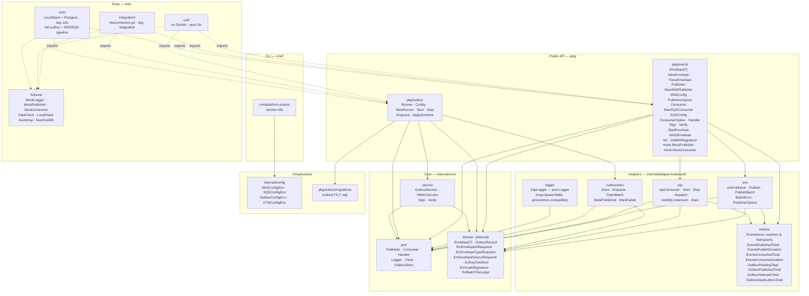
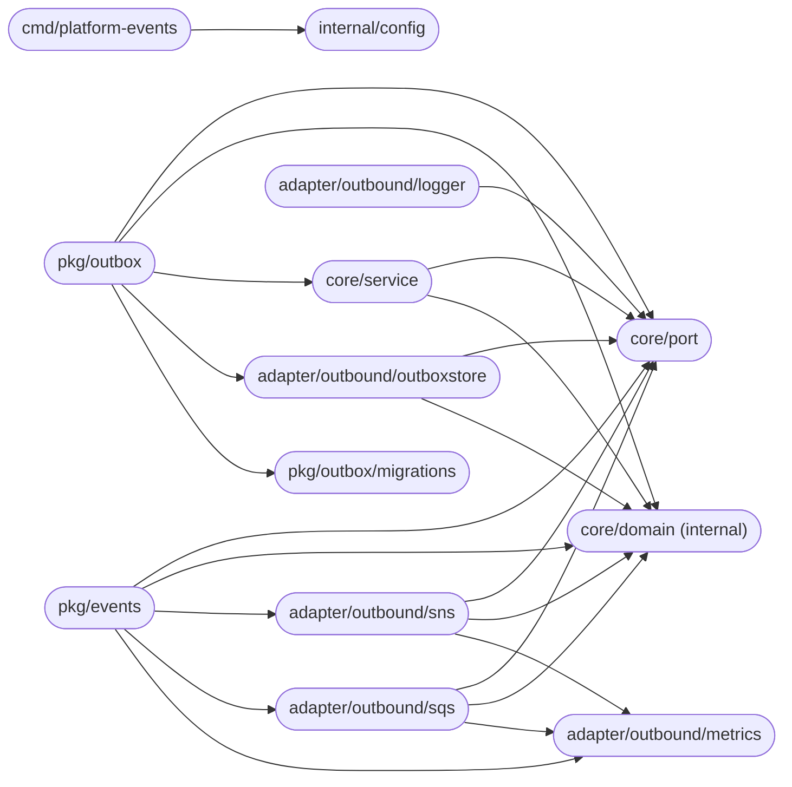
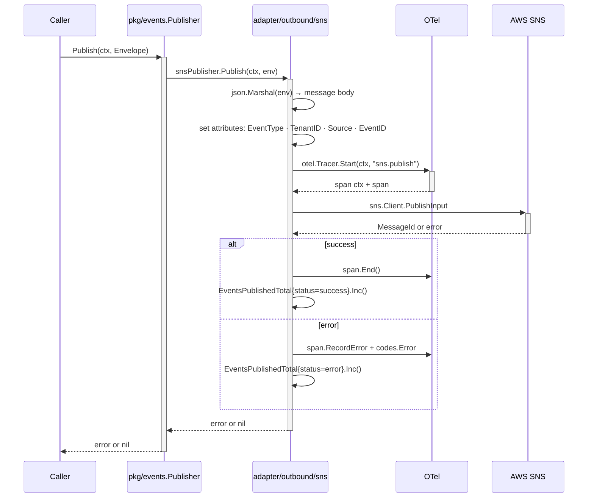
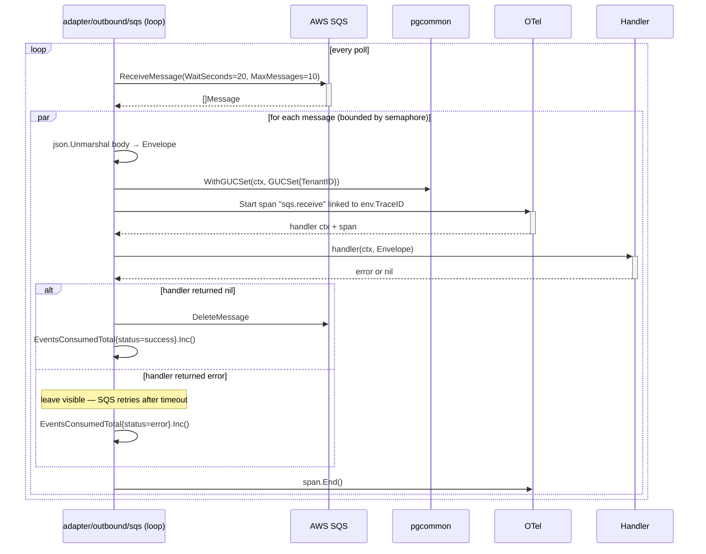
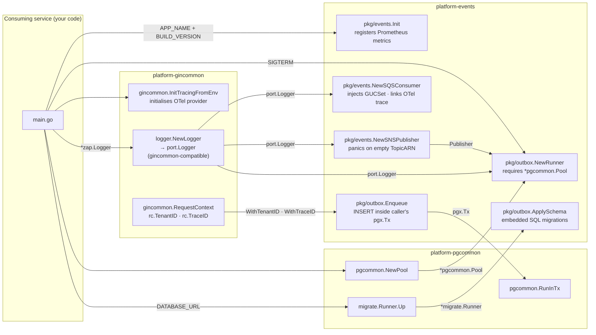
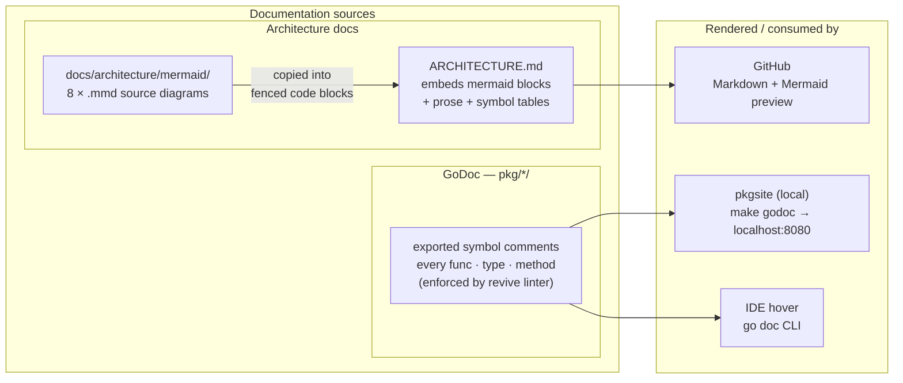

# Architecture

This document describes the internal structure, dependency rules, and runtime data flows of `platform-events`.

> **Design intent:** this library centralises event publishing, consumption, and guaranteed delivery at the messaging boundary — ensuring uniform envelope format, tenant propagation, and observability across all consuming services without requiring each service to reimplement these concerns.

---

## End-to-end event lifecycle

A numbered walkthrough of what happens between a domain mutation and a processed event — useful as a mental model before reading the detailed diagrams.

### Publish path (with outbox)

1. **HTTP handler receives request** — gin middleware extracts `RequestContext` (TenantID, TraceID) from validated gateway headers.
2. **Handler begins business transaction** via `pgcommon.RunInTx`.
3. **Domain entity written** to the database inside the transaction.
4. **`outbox.Enqueue` called** inside the same transaction — inserts a serialised `Envelope` into `outbox_events`. No SNS call happens here.
5. **Transaction commits** — both the domain write and the outbox row are durable. If the transaction rolls back, neither persists.
6. **Outbox runner polls** `outbox_events` — immediately on startup, then every `PollInterval`. Claims a batch with `SELECT … FOR UPDATE SKIP LOCKED WHERE scheduled_at <= NOW()` and extends `scheduled_at` as a claim lease so concurrent runners do not re-claim the same records.
7. **`Publisher.Publish` called** — SNS receives the event, sets `EventType`, `TenantID`, `Source`, and `EventID` as message attributes for filter-policy routing.
8. **Row marked published** (`published_at = NOW()`). On failure, `attempts` is incremented and the claim lease is released (`scheduled_at = NOW()`) for immediate retry; after `MaxAttempts` the row moves to `outbox_dead_letters`.

> **Ordering:** no global ordering is guaranteed. Ordering is only preserved within the same SQS message group (FIFO queues with `WithMessageGroupID`). All other delivery is best-effort ordered.
>
> **Transactional consistency rule:** all domain events must be published via `outbox.Enqueue` inside a `pgcommon.RunInTx` callback. Direct `publisher.Publish` bypasses the transaction boundary and is only appropriate for best-effort, non-transactional notifications.

### Consume path

1. **SQS consumer long-polls** the queue (`ReceiveMessage` with `WaitSeconds=20`).
2. **Message body unmarshalled** into `Envelope[json.RawMessage]`.
3. **Context enriched** — `pgcommon.WithGUCSet(ctx, GUCSet{TenantID: env.TenantID})` injected so all downstream pool calls enforce the event's tenant via RLS.
4. **OTel span started** (`sqs.receive`) linked to the publisher's trace via `Envelope.TraceID`.
5. **Handler called** with the enriched context. If it returns `nil`, the message is deleted. If it returns an error, the message stays visible for retry.
6. **Metrics recorded** — `events_consumed_total`, `events_consume_duration_seconds`.

> **Idempotency requirement:** handlers must be idempotent. SQS delivers messages at least once — a handler may be called more than once for the same `Envelope.ID` due to network retries, visibility timeout expiry, or consumer restarts. Use `Envelope.ID` (UUID v7) as the idempotency key when persisting side effects.

---

## Layer model

The library is organised in concentric Clean Architecture layers. Inner layers have **zero knowledge** of outer layers; dependencies always point inward.

> Source: [`docs/architecture/mermaid/layer-model.mmd`](docs/architecture/mermaid/layer-model.mmd)



**Rule:** `domain` ← `port` ← `service` ← `adapter` ← `pkg`. The `domain` package imports nothing from this module. `port` imports only `domain`. Packages in `pkg/` depend on `core/` but never on `adapter/` directly. Tests (dashed arrows) consume the public API but are not part of the dependency chain.

---

## Package dependency graph

Arrows represent Go `import` relationships (module-internal only).

> Source: [`docs/architecture/mermaid/package-dependencies.mmd`](docs/architecture/mermaid/package-dependencies.mmd)



`core/domain`, `core/port`, and `internal/config` are dependency sinks — they import nothing from this module.

---

## Public API packages

### pkg/events

| Symbol | Description |
|--------|-------------|
| `Envelope[T any]` | Typed event wrapper: `ID` (UUID v7), `Type`, `Source`, `TenantID`, `TraceID`, `CorrelationID`, `Timestamp`, `Payload T` |
| `NewEnvelope[T](type, source, payload, opts...)` | Generates `ID` (UUID v7), sets `Timestamp = time.Now().UTC()`. Options: `WithTenantID`, `WithTraceID`, `WithCorrelationID` |
| `Envelope.JSON()` | Canonical JSON serialisation |
| `ParseEnvelope[T](data)` | Deserialise and validate required fields (`id`, `type`, `source`) |
| `Publisher` | Interface: `Publish(ctx, Envelope[json.RawMessage]) error`; `PublishBatch(ctx, []Envelope[json.RawMessage]) error` |
| `NewSNSPublisher(cfg, opts...)` | Constructs the SNS implementation; panics on empty `TopicARN` |
| `SNSConfig` | `TopicARN` (required), `Region`, `EndpointURL`, `Logger` |
| `PublisherOption` | `WithMessageGroupID(fn)`, `WithMessageDeduplicationID(fn)`, `WithAttributes(map)` |
| `Consumer` | Interface: `Start(ctx) error`; `Stop() error` |
| `Handler` | `func(ctx context.Context, env Envelope[json.RawMessage]) error` |
| `NewSQSConsumer(cfg, handler, opts...)` | Constructs the SQS long-poll loop; returns error on empty `QueueURL` |
| `SQSConfig` | `QueueURL` (required), `Region`, `EndpointURL`, `MaxMessages`, `WaitSeconds`, `Logger` |
| `ConsumerOption` | `WithConcurrency(n)`, `WithVisibilityTimeout(d)`, `WithDeadLetterHandler(fn)`, `WithMaxReceiveCount(n)`, `WithDrainTimeout(d)` |
| `Sign(key, payload)` | Hex-encoded HMAC-SHA256 signature |
| `Verify(key, payload, sig)` | Constant-time comparison; returns `false` on any error |
| `SignEnvelope(key, env)` | Signs canonical JSON of envelope |
| `VerifyEnvelope(key, env, sig)` | Deserialises and verifies; safe for webhook receipt handlers |
| `Init(service, version)` | Registers Prometheus metrics once (`sync.Once`) |
| `InitWithRegisterer(service, version, reg)` | Registers against a custom `prometheus.Registerer` (use in tests) |
| `mock.MockPublisher` | In-memory, thread-safe; `Published()`, `SetError()`, `Reset()` |
| `mock.MockConsumer` | In-memory queue; `Inject(env)` delivers synchronously |

### pkg/outbox

| Symbol | Description |
|--------|-------------|
| `Config` | `Pool *pgcommon.Pool`, `Publisher`, `Logger`, `PollInterval` (5s), `BatchSize` (50), `MaxAttempts` (5), `ClaimLeaseDuration` (10 min — how long a claimed record is hidden from other runners), `PublishConcurrency` (1 — parallel publishes per batch), `PublishTimeout` (10s — per-record), `DrainTimeout` (30s — `Stop()` bound), `StartupJitter` (0 — random pre-first-poll delay to desync replicas) |
| `NewRunner(cfg)` | Constructs the outbox runner; applies defaults; panics if `Publisher` nil or both `Pool` and `Store` nil |
| `Runner.Start(ctx)` | Starts the poll loop (immediate first poll, then per `PollInterval`); exponential backoff (1s→30s) on poll-cycle failure; blocks until `ctx` is cancelled |
| `Runner.Stop()` | Graceful drain; waits up to `DrainTimeout` for the in-flight batch, then returns a non-nil error if it did not finish |
| `Enqueue(ctx, tx pgx.Tx, env)` | Inserts serialised envelope into `outbox_events` within caller's transaction; rejects payloads > 240 KB; warns on empty `TenantID` |
| `ApplySchema(ctx, runner *migrate.Runner)` | Applies embedded migrations (`001_create_outbox_events`, `002_create_outbox_dead_letters`) |

---

## SNS publish flow

> Source: [`docs/architecture/mermaid/sns-publish-flow.mmd`](docs/architecture/mermaid/sns-publish-flow.mmd)



---

## SQS consume flow

> Source: [`docs/architecture/mermaid/sqs-consume-flow.mmd`](docs/architecture/mermaid/sqs-consume-flow.mmd)



---

## Outbox poll cycle

> Source: [`docs/architecture/mermaid/outbox-poll-cycle.mmd`](docs/architecture/mermaid/outbox-poll-cycle.mmd)

```mermaid
flowchart TD
    A([Runner.Start called]) --> P[pollOnce\nimmediate first poll on startup]
    P --> C["SELECT … FOR UPDATE SKIP LOCKED\nWHERE published_at IS NULL\n  AND scheduled_at ≤ NOW()\nORDER BY id  LIMIT BatchSize"]
    C -- 0 rows --> B[wait PollInterval tick]
    B --> C
    C -- rows --> L["UPDATE scheduled_at = NOW() + claimLease\nWHERE id = ANY(ids)\n— claim lease, prevents re-claim by other runners —"]
    L --> D[for each OutboxRecord]
    D --> E[json.Unmarshal Payload → Envelope]
    E -- unmarshal error --> F["MarkFailed attempts++, last_error\nscheduled_at = NOW() (releases lease)\nif attempts ≥ MaxAttempts → dead-letter"]
    F --> D
    E -- ok --> G[Publisher.Publish]
    G -- success --> H[MarkPublished\npublished_at = NOW()]
    H --> D
    G -- error --> I["MarkFailed attempts++, last_error\nscheduled_at = NOW() (releases lease)"]
    I --> J{attempts ≥ MaxAttempts?}
    J -- yes --> K[INSERT outbox_dead_letters\nDELETE outbox_events]
    J -- no  --> D
    K --> D
    D -- done --> B
```

---

## HMAC signing flow

> Source: [`docs/architecture/mermaid/hmac-flow.mmd`](docs/architecture/mermaid/hmac-flow.mmd)


---

## Consuming service wiring

A typical service bootstrap wires `platform-events` alongside `platform-gincommon` and `platform-pgcommon`.

> Source: [`docs/architecture/mermaid/consuming-service-wiring.mmd`](docs/architecture/mermaid/consuming-service-wiring.mmd)



---

## Concurrency model

`sqsConsumer` dispatches messages with a bounded semaphore (`WithConcurrency`). The semaphore limits concurrent handler goroutines; the receive loop is never blocked by slow handlers — it simply does not dispatch new goroutines when the semaphore is full until a slot frees up.

**Example — 10 messages received, `WithConcurrency(3)`:**

```
ReceiveMessage → 10 messages

→ goroutine 1: handle message A  (acquires slot)
→ goroutine 2: handle message B  (acquires slot)
→ goroutine 3: handle message C  (acquires slot)
→ messages D–J: sem ← struct{}{} blocks until a slot is released

When goroutine 1 finishes:
→ message D acquires the freed slot
→ message E remains blocked

… and so on until all 10 are dispatched.
```

**Observable signals:**

| Signal | Metric | Meaning |
|---|---|---|
| Slow handlers | `events_consume_duration_seconds` p99 rising | Reduce concurrency or investigate handler latency |
| Handler errors | `events_consumed_total{status=error}` growing | Messages being retried; check handler logic |
| Outbox backlog | `outbox_pending_total` growing | Publisher slow or SNS throttling; raise `PublishConcurrency` or check `outbox_published_total` |
| Publish failures | `outbox_published_total{status=error}` | Check SNS connectivity and the `outbox_dead_letters` table |
| Dead letters | `outbox_dead_letters_total` rate > 0 | Records exhausted `MaxAttempts` — inspect `outbox_dead_letters` and replay; **primary publish-side alert** |

---

## Key invariants

| Invariant | Where enforced |
|-----------|---------------|
| Envelope ID uniqueness | UUID v7 generated at `NewEnvelope` time |
| At-least-once delivery | Outbox runner retries until `MaxAttempts` |
| No dual-write | `outbox.Enqueue` runs inside the caller's `pgx.Tx`; no SNS call on enqueue |
| Atomic enqueue | If the business transaction rolls back, the outbox row is never committed |
| Tenant isolation (consumer) | `pgcommon.WithGUCSet` injected per message before handler is called |
| Constant-time HMAC | `hmac.Equal` in `service.Verify` — string `==` is never used |
| Key length enforced | `Sign` returns `ErrKeyTooShort` for keys < 32 bytes; empty sig is rejected by `Verify` |
| No SNS/SQS import in domain/port | Enforced by layered package structure |
| TopicARN validated at construction | `NewSNSPublisher` panics on empty `TopicARN` to prevent invalid Prometheus label cardinality |
| Idempotent metrics registration | `Init` is guarded by `sync.Once`; `InitWithRegisterer` bypasses it for test isolation |
| OTel initialised by consuming service | `platform-events` calls `otel.Tracer(...)` — no-op if no provider registered; no double-init |
| Graceful consumer shutdown | `Stop()` waits `DrainTimeout` (30 s) for in-flight handlers before returning |
| Graceful runner shutdown | `Runner.Stop()` waits up to `DrainTimeout` (30 s) for the in-flight batch, then returns a non-nil error; set Helm `terminationGracePeriodSeconds` > `DrainTimeout` |
| Poll-failure backoff | On a failed poll cycle the runner backs off exponentially (1s→30s) instead of retrying every `PollInterval` |
| Parallel publish bounded | `PublishConcurrency` caps concurrent publishes per batch (default 1); per-record `PublishTimeout` (10s) prevents one hung call stalling the batch |
| Shutdown ≠ dead-letter | Records stranded by context cancellation are released with `MaxAttempts+1` so a rolling restart never alone dead-letters a near-max record |
| `last_error` bounded | Error strings stored in `outbox_events`/`outbox_dead_letters` are truncated to 512 chars to prevent table bloat |
| Envelope size bounded | `Enqueue` rejects serialised payloads > 240 KB (under the SNS 256 KB hard limit) |
| `MarkFailed` serialized | The attempts read uses `SELECT … FOR UPDATE` so a lease-expiry re-claim cannot double-increment or dead-letter early |
| SKIP LOCKED for horizontal scale | Multiple outbox runner instances claim disjoint batches; no distributed lock required |
| Dead letters are queryable & observable | `outbox_dead_letters` is a Postgres table (retryable from SQL); `outbox_dead_letters_total` counter enables alerting |
| Batch split at 10 | `PublishBatch` splits silently; partial failures return `BatchError` per message |
| Handlers must be idempotent | SQS delivers at least once; use `Envelope.ID` as the idempotency key for all side effects |
| No global ordering guaranteed | Ordering is preserved only within a FIFO message group (`WithMessageGroupID`); standard queues offer best-effort order |
| Outbox required for transactional events | Direct `publisher.Publish` bypasses the transaction boundary; domain events must go through `outbox.Enqueue` |

---

## Performance characteristics

| Operation | Overhead | Notes |
|---|---|---|
| `NewEnvelope` | < 1 µs | UUID v7 + `time.Now()` + struct init |
| `publisher.Publish` (happy path) | Network RTT to SNS | OTel span + Prometheus counter: < 2 µs on top |
| `outbox.Enqueue` | One `INSERT` in the caller's tx | No SNS call; adds one row to the running transaction |
| Outbox runner poll (empty) | One `SELECT` + `time.Sleep` | Negligible; one connection for the full poll interval |
| Outbox runner poll (full batch) | `ceil(BatchSize / PublishConcurrency) × sns.Publish` | Publishes run `PublishConcurrency`-wide (default 1 = sequential); tune `PublishConcurrency`, `BatchSize`, and `PollInterval` together |
| `sqs.ReceiveMessage` | Network RTT to SQS | Long-poll (20 s) returns when messages arrive or timeout elapses |
| Handler dispatch overhead | < 1 µs | Semaphore acquire + goroutine start |
| `Verify` (HMAC) | < 1 µs | Two HMAC computations + constant-time compare |

**Total overhead on the critical path is dominated by SNS/SQS network latency.** The library adds sub-microsecond overhead for envelope creation, metrics recording, and span creation. The outbox pattern adds one `INSERT` to the business transaction and one `SELECT … FOR UPDATE` per poll cycle; at typical Postgres LAN latencies these are negligible compared to the business logic.

---

## Documentation assets

Every public package ships documentation artefacts alongside its source code.

| Artefact | Location | Purpose |
|----------|----------|---------|
| `doc.go` | `pkg/<name>/doc.go` | Package overview prose rendered by `pkgsite` (`make godoc`) |
| Exported symbol comments | Every `pkg/**/*.go` | Per-symbol godoc enforced by the `revive` linter |

Architecture diagrams live as standalone Mermaid source files under `docs/architecture/mermaid/` and are embedded into this document as fenced code blocks. Each section carries a `> Source:` link to the originating `.mmd` file.

Run `make godoc` to render the full package documentation locally using `pkgsite`:

```
make godoc   # → http://localhost:8080
```

> Source: [`docs/architecture/mermaid/documentation-assets.mmd`](docs/architecture/mermaid/documentation-assets.mmd)



---

This architecture provides a consistent, enforceable boundary for all event-driven interactions — ensuring at-least-once delivery, tenant isolation, and uniform observability without requiring application-level discipline in each consuming service.
