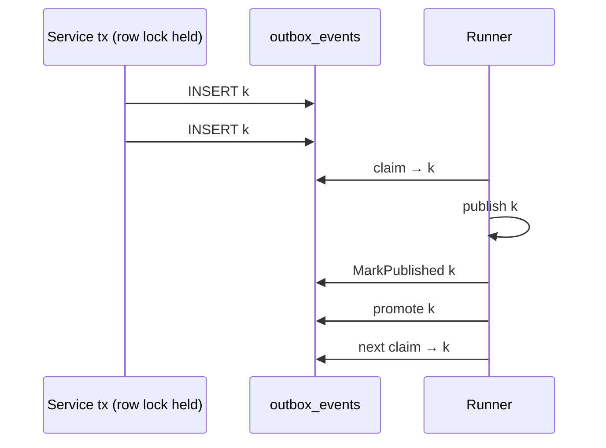

# platform-events — Low-Level Design

## BCBP Platform — Shared Event Library (SNS / SQS / Transactional Outbox / Inbox)

| Field | Value |
|---|---|
| Document type | Low-Level Design (LLD) |
| Library | `platform-events` — shared Go library (never deployed as a service) |
| Go module | `github.com/BCBP-SOLUTIONS-FZC-LLC/platform-events` (`go 1.26.0`, `toolchain go1.26.8`) |
| Status | v1.6.0 + `[Unreleased]` — implemented on branch `feat/observability-standard` |
| Base docs | [`README.md`](../../README.md), [`ARCHITECTURE.md`](../../ARCHITECTURE.md), [`.claude/CLAUDE.md`](../../.claude/CLAUDE.md), [`EVENT_SCHEMA_GOVERNANCE.md`](../../EVENT_SCHEMA_GOVERNANCE.md), [`docs/observability/`](../observability/README.md) |
| Sibling libraries | `platform-pgcommon` v1.4.2 (database, migrations), `platform-gincommon` (tracing init, logger, request context — interface-compatible, not imported) |
| Deployment stage | Library — consumed via `go get`; v1.6.0 not yet tagged; branch unpushed (see §16) |

### Revision history

| Rev | Date | Change |
|---|---|---|
| 1.1 | 2026-10-01 | platform-pgcommon v1.4.1 → v1.4.2 (documentation-only upstream release; no code change here). Added `make docs-check` (diagram drift gate, same script as pgcommon v1.4.2) to `make ci`, the pre-commit hook, `Validate / Quality` and a new `docs.yml` workflow; §14 updated. |
| 1.0 | 2026-10-01 | Initial LLD, reflecting branch `feat/observability-standard` (v1.6.0 + Unreleased). |

### Table of Contents

1. [Document Overview](#1-document-overview)
2. [Responsibilities and Boundaries](#2-responsibilities-and-boundaries)
3. [Module and Package Layout](#3-module-and-package-layout)
4. [Data Model](#4-data-model)
5. [Public API Contract](#5-public-api-contract)
6. [Envelope Wire Format](#6-envelope-wire-format)
7. [Flows](#7-flows)
8. [Failure Handling and Retry Classification](#8-failure-handling-and-retry-classification)
9. [Configuration](#9-configuration)
10. [Observability](#10-observability)
11. [Concurrency and Invariants](#11-concurrency-and-invariants)
12. [Security](#12-security)
13. [Testing Strategy and Coverage](#13-testing-strategy-and-coverage)
14. [CI/CD and Release](#14-cicd-and-release)
15. [Known Limitations and Open Questions](#15-known-limitations-and-open-questions)
16. [Deployment Stage](#16-deployment-stage)

---

## 1. Document Overview

This LLD is the implementation-level specification of `platform-events`: tables and indexes, exact public signatures, the state machines behind publish / consume / outbox / inbox, retry classification, configuration and observability. It complements, and does not replace:

| Document | Role |
|---|---|
| `README.md` | Consumer-facing quick reference: what to import, env vars, gotchas |
| `ARCHITECTURE.md` | Architecture views: layer model, flow diagrams, failure domains, invariants, design decisions |
| `.claude/CLAUDE.md` | Working guide for contributors and coding agents: commands, conventions, extension recipes |
| `EVENT_SCHEMA_GOVERNANCE.md` | Payload schema evolution rules and the event-type registry (owned by producing services) |
| `docs/guides/*.md` | Task guides (publishing, consuming, outbox, codec, testing, operations) |
| `docs/observability/` | Metrics standard, generated metrics registry, runbook |

Where this LLD and the code disagree, the code is authoritative; this document is updated with the change.

---

## 2. Responsibilities and Boundaries

### 2.1 In scope

- `Envelope[T]` — the canonical, versioned inter-service event wire format (§6).
- SNS publisher (`Publish`, `PublishBatch`) with message attributes for filter policies, FIFO support, codec hook, retry classification.
- SQS consumer — long-poll loop, bounded concurrency, visibility extension, dead-letter routing, graceful drain.
- `DLQPublisher` — forwards messages to the source queue's `RedrivePolicy` DLQ; the only sanctioned SQS write path for consuming services.
- Transactional outbox — `Enqueue` / `EnqueueOrdered` inside the caller's transaction; `Runner` delivers asynchronously (at-least-once), with dead-letter table and operator API.
- Inbox — consumer-side deduplication ledger (`Handler`, `Store.Process`).
- HMAC helpers for webhook / cross-service signing.
- Tier 1 `platform_*` metrics per the Enterprise Platform Observability Standard, plus legacy metrics during the compatibility period; reference Prometheus rules, Grafana dashboard and KEDA example.
- Test doubles (`pkg/events/mock`) that reproduce production context and accounting.

### 2.2 Out of scope (owned elsewhere)

| Concern | Owner |
|---|---|
| OpenTelemetry provider / propagator initialisation, `OTEL_*` env | Consuming service via `platform-gincommon` (`InitTracingFromEnv`). The library only calls the global tracer/propagator. |
| Logger construction and configuration | Consuming service; any `port.Logger` (e.g. gincommon's `ZapLogger`) is injected. |
| Database connections, configuration, transactions, migrations runner | `platform-pgcommon` only (`Pool`, `RunInTx`, `ConfigFromEnv`, `MigrationDSNFromEnv`, `migrate.Runner`). |
| Schema-registry clients (e.g. AWS Glue) | Consuming service implements `events.Codec`; the library ships `NoopCodec` and the decode-only `GlueDecodeCodec`, and depends on no registry SDK. |
| SQS SDK usage in services | Forbidden — services use `NewSQSConsumer` and `DLQPublisher`. |
| Payload schemas and event-type registry | Producing services (`EVENT_SCHEMA_GOVERNANCE.md`). |
| Infrastructure (topics, queues, subscriptions, IAM, KMS) | Platform infrastructure; the library documents required permissions. |

---

## 3. Module and Package Layout

### 3.1 Modules

Three Go modules, so consuming services inherit only what the library imports:

| Module | Path | Contents |
|---|---|---|
| Library | `.` | `pkg/`, `internal/`, `cmd/platform-events`, white-box tests in `internal/core/service` |
| Tests | `test/` (`replace …platform-events => ../`) | `unit/`, `integration/`, `e2e/`, `smoke/`, `fixtures/`, `testenv/` |
| Tools | `tools/` | `golangci-lint`, run via `go tool -modfile=tools/go.mod` |

### 3.2 Package tree

```
cmd/platform-events/              reference CLI (prints config; Docker image for Trivy + smoke tests)
internal/
  core/
    domain/                       Envelope[T], OutboxRecord, DeadLetterRecord, DLQFilter, BatchError/Failure,
                                  RetryableError/ErrRetryable, DLQError + kinds, codec payload wrap/unwrap
    port/                         Publisher, Consumer/Handler, OutboxStore, OutboxMetrics, Codec/NoopCodec,
                                  DLQPublisher, DLQAttribution, SourceMessage, Logger, Clock
    service/                      OutboxService (publish cycle, retry/backoff policy), HMAC
  adapter/outbound/
    sns/                          SNS publisher (aws-sdk-go-v2)
    sqs/                          SQS consumer, DLQPublisher, queue-depth sampler, HandlerContext
    outboxstore/                  Postgres outbox store (via pgcommon Pool / RunInTx)
    metrics/                      metrics registry, Tier 1 + legacy collectors, SanitizeEventType
pkg/
  events/                         public API: envelope, publisher, consumer, DLQ, codec, HMAC, metrics init
  events/mock/                    Publisher, Consumer, DLQPublisher test doubles
  outbox/                         Runner, Config, Enqueue/EnqueueOrdered, ApplySchema, dead-letter API
  outbox/migrations/              001–010 (embedded)
  inbox/                          Handler, Store (Process, Prune), ApplySchema
  inbox/migrations/               001 (embedded)
  config/                         env loading (LoadSNS/LoadSQS/LoadOutbox) and wiring helpers
```

### 3.3 Dependency rules (enforced)

- `domain` ← `port` ← `service` ← `adapter` ← `pkg`. `internal/core` never imports `adapter` or the AWS SDK.
- **depguard `pgcommon-only`** (`.golangci.yml`, applies to every file incl. tests and fixtures): denies `github.com/jackc/pgx`, `database/sql`, `github.com/golang-migrate/migrate`. pgx is an indirect dependency through pgcommon only. Test fakes embed `pgcommon.Tx`; a pgx-only type (e.g. `CommandTag`) is inferred via `newStubTx(pgcommon.Tx.Exec)`.
- All transactions go through `pgcommon.RunInTx` (never `conn.Begin`) so pgcommon's GUC injection and per-transaction timeouts apply.

### 3.4 Shared library integration

| Library | Usage |
|---|---|
| `platform-pgcommon` v1.4.2 | `*pgcommon.Pool`, `RunInTx`, `Tx`/`TxOptions`/`Conn`/`ErrNoRows` aliases, `ConfigFromEnv`, `MigrationDSNFromEnv`, `migrate.Runner`, `WithGUCSet` (RLS tenant on the consumer handler context) |
| `platform-gincommon` | Not imported. `port.Logger` (`Debug/Info/Warn/Error(msg, map[string]interface{})`) matches gincommon's `ZapLogger`; `RequestContext` supplies `TenantID` / `TraceID` for `WithTenantID` / `WithTraceID`. |

Note: `migrate.Runner.Logger` is pgcommon's `domain.Logger` (variadic `Field`s), not `port.Logger`.

---

## 4. Data Model

All tables live in the consuming service's database. Schemas are applied by `outbox.ApplySchema` / `inbox.ApplySchema` through pgcommon's `migrate.Runner`, each with its own golang-migrate tracking table.

### 4.1 `outbox_events`

| Column | Type | Notes |
|---|---|---|
| `id` | `UUID` PK | Envelope ID (UUID v7, canonical lowercase — enforced by `Enqueue`) |
| `event_type` | `TEXT NOT NULL` | |
| `payload` | `JSONB NOT NULL` | Whole serialised envelope (`json.RawMessage`, so pgx binds JSON even in PgBouncer simple-protocol mode) |
| `tenant_id` | `TEXT NOT NULL DEFAULT ''` | |
| `trace_id` | `TEXT NOT NULL DEFAULT ''` | |
| `attempts` | `INT NOT NULL DEFAULT 0` | Counted (permanent) failures only |
| `last_error` | `TEXT NOT NULL DEFAULT ''` | Truncated to 512 runes |
| `created_at` | `TIMESTAMPTZ NOT NULL DEFAULT NOW()` | DB time at insert; reset to `NOW()` on dead-letter replay; feeds the oldest-pending-age gauge |
| `scheduled_at` | `TIMESTAMPTZ NOT NULL DEFAULT NOW()` | Next claimable time: lease expiry, retry backoff, or `'infinity'` for an ordered record waiting behind its key's head |
| `published_at` | `TIMESTAMPTZ` | `NULL` = unpublished |
| `ordering_key` | `TEXT` (010) | Set by `EnqueueOrdered`; `NULL` = unordered |
| `ordering_seq` | `BIGINT` (010) | `nextval('outbox_events_ordering_seq')` at INSERT, keyed rows only — INSERT order, not transaction start |

Indexes:

| Index | Definition | Serves |
|---|---|---|
| PK | `(id)` | point updates |
| `idx_outbox_events_pending` (003) | `(scheduled_at, id) WHERE published_at IS NULL` | claim query, pending / leased / blocked counts |
| `idx_outbox_events_published_at` (007) | `(published_at) WHERE published_at IS NOT NULL` | `PrunePublished` |
| `idx_outbox_events_unpublished_created` (009) | `(created_at) WHERE published_at IS NULL` | `OldestPendingAge` (single probe) |
| `idx_outbox_events_ordering` (010) | `(ordering_key, ordering_seq) WHERE published_at IS NULL AND ordering_key IS NOT NULL` | per-key head checks and promotion |

Sequence: `outbox_events_ordering_seq` (010).

### 4.2 `outbox_dead_letters`

| Column | Type | Notes |
|---|---|---|
| `id` | `UUID` PK | |
| `event_type`, `payload`, `tenant_id`, `trace_id` | as in `outbox_events` | |
| `attempts` | `INT NOT NULL` | attempts at dead-lettering |
| `last_error` | `TEXT NOT NULL DEFAULT ''` | |
| `created_at` | `TIMESTAMPTZ NOT NULL DEFAULT NOW()` (006) | |
| `failed_at` | `TIMESTAMPTZ NOT NULL DEFAULT NOW()` | |
| `ordering_key` | `TEXT` (010) | preserved through dead-lettering and replay |

Indexes: `idx_outbox_dead_letters_failed_at (failed_at DESC)` (004), `idx_outbox_dead_letters_created_at (created_at ASC)` (005), `idx_outbox_dead_letters_event_type_tenant_id (event_type, tenant_id)` (008). List, replay and discard all order by `failed_at`, so list-then-replay with the same filter and limit touches the same rows.

### 4.3 `processed_events` (inbox)

| Column | Type | Notes |
|---|---|---|
| `event_id` | `uuid NOT NULL` | |
| `consumer` | `text NOT NULL` | distinct consumers dedup independently |
| `processed_at` | `timestamptz NOT NULL DEFAULT now()` | |

PK `processed_events_pkey (event_id, consumer)`; `idx_processed_events_processed_at (processed_at)` for `Prune`.

### 4.4 Migrations

| Schema | Files | Tracking table |
|---|---|---|
| Outbox | `pkg/outbox/migrations/001`–`010` (`.up` / `.down`) | `outbox_migrations` (`outbox.MigrationsTable`) |
| Inbox | `pkg/inbox/migrations/001` | `inbox_migrations` (`inbox.MigrationsTable`) |

- `ApplySchema` always sets `x-migrations-table` to its own table, replacing any value in the DSN, so library versions never collide with the service's migration versions.
- All up migrations are idempotent (`IF NOT EXISTS`); 009/010 indexes are created without `CONCURRENTLY` (pgcommon runs each file in a transaction) — on a large outbox, create them concurrently by hand first.
- 010's column additions are metadata-only on existing rows (nullable, no default).
- **Rollback (pgcommon v1.4.1):** `ApplySchema` returns `migrate.ErrVersionNotInSource` when the recorded version is newer than the library's embedded migrations (e.g. after rolling a service back to an older image), and `migrate.ErrMigrationDirty` after an interrupted migration. Migrate the schema down first, or run `ApplySchema` as a separate migration job.

---

## 5. Public API Contract

### 5.1 `pkg/events` — envelope

| Symbol | Signature / behaviour |
|---|---|
| `Envelope[T]` | Struct; wire keys in §6 |
| `NewEnvelope[T]` | `(eventType, source string, payload T, opts ...EnvelopeOpt) Envelope[T]` — UUID v7 `ID`, UTC `Timestamp` |
| `EnvelopeOpt` | `WithTenantID`, `WithTraceID`, `WithCorrelationID`, `WithSchemaVersion`, `WithSystemTenant`, `WithSubject`, `WithActor`, `WithIPAddress`, `WithUserAgent`, `WithSchemaID` |
| `ParseEnvelope[T]` | `(data []byte) (Envelope[T], error)` — requires `id`, `type`, `source`, `time` |
| `TraceIDFromContext` | `(ctx) string` — envelope trace ID in a consumer handler |
| `SystemTenantID` | `"system"` |
| Errors | `ErrEnvelopeIDRequired`, `ErrEnvelopeTypeRequired`, `ErrEnvelopeSourceRequired`, `ErrKeyTooShort`, `ErrInvalidSignature` |

### 5.2 `pkg/events` — publisher

| Symbol | Signature / behaviour |
|---|---|
| `Publisher` | `Publish(ctx, Envelope[json.RawMessage]) error`; `PublishBatch(ctx, []Envelope[json.RawMessage]) error` |
| `NewSNSPublisher` | `(cfg SNSConfig, opts ...PublisherOption) (Publisher, error)` — error on empty `TopicARN` |
| `SNSConfig` | `TopicARN` (required), `Region`, `EndpointURL`, `Logger` |
| `PublisherOption` | `WithMessageGroupID(fn)`, `WithMessageDeduplicationID(fn)`, `WithAttributes(map)`, `WithCodec(codec)` |
| `BatchError` / `BatchFailure` | `Failures []BatchFailure{ID, Code, Message, Retryable}` — returned by `PublishBatch` for partial / whole failures |
| `NewPublisherFromPort` | adapts a `port.Publisher` |

`BatchFailure.Retryable` marks a failure that says nothing about the message (the outbox retries it without counting an attempt). Code `TransportError` is also treated as retryable for publishers that predate the field.

### 5.3 `pkg/events` — consumer

| Symbol | Signature / behaviour |
|---|---|
| `Consumer` | `Start(ctx) error` (blocks); `Stop() error` |
| `Handler` | `func(ctx context.Context, env Envelope[json.RawMessage]) error` — `nil` deletes, error leaves visible |
| `NewSQSConsumer` | `(cfg SQSConfig, handler Handler, opts ...ConsumerOption) (Consumer, error)` — error on nil handler, empty `QueueURL`, visibility > 12h |
| `NewSQSConsumerWithClient` | `(cfg, client SQSClientLike, handler, opts...)` — tests |
| `SQSConfig` | `QueueURL` (required), `Region`, `EndpointURL`, `MaxMessages` (1–10, default 10), `WaitSeconds` (default 20), `Logger` |
| `ConsumerOption` | `WithConcurrency(n)`, `WithVisibilityTimeout(d)`, `WithDeadLetterHandler(fn)` (nil ignored), `WithMaxReceiveCount(n)`, `WithDrainTimeout(d)` (default 30s), `WithConsumerCodec(codec)`, `WithDLQForwarding(dlq)`, `WithQueueDepthMetrics(interval)` (min 10s), `WithHandlerTimeout(d)`, `WithMalformedBodyLogging()` |
| `SourceMessageFromContext` | `(ctx) (SourceMessage, bool)` — raw body + attributes as received (forward these, never `env.JSON()`) |

### 5.4 `pkg/events` — DLQ, codec, HMAC, metrics

| Symbol | Signature / behaviour |
|---|---|
| `DLQPublisher` | `SendToDLQ(ctx, sourceQueueURL string, body []byte, attrs map[string]string, reason string) error`; `ResolveDLQ(ctx, sourceQueueURL) (string, error)` |
| `NewSQSDLQPublisher` / `…WithClient` | `(cfg DLQConfig[, client DLQClientLike]) (DLQPublisher, error)` |
| `DLQConfig` | `Region`, `EndpointURL`, `ConsumerName`, `Logger`, `CacheTTL` (0 → 15m, negative → no expiry), `StrictAttributes` |
| `DLQAttr*` | `EventType`, `DLQReason`, `OriginalQueue`, `ConsumerName`, `FailedAt` |
| `DLQError` | `Kind` ∈ `ErrDLQNotConfigured`, `ErrDLQInvalidRedrivePolicy`, `ErrDLQUnresolved`, `ErrDLQSendFailed`, `ErrDLQInvalidMessage`; `SourceQueue`; `Cause` |
| `ErrRetryable` | Sentinel for transient failures (AWS throttling / 5xx / network / timeouts; a codec's registry outage). A custom `Codec` or `Publisher` wraps it with `%w`. |
| `Codec` / `NoopCodec` / `GlueDecodeCodec` | `Encode(ctx, eventType, payload) ([]byte, schemaID string, error)`; `Decode(ctx, schemaID, encoded) (json.RawMessage, error)` |
| `Sign` / `Verify` | `Sign(key, payload []byte) (string, error)` (key ≥ 32 bytes); `Verify(key, payload []byte, sig string) bool` (constant time) |
| `SignEnvelope` / `VerifyEnvelope` | canonical-JSON signing; `VerifyEnvelope` returns `(false, nil)` on mismatch, `(false, err)` on malformed input |
| `InitMetrics` | `(id MetricsIdentity, reg prometheus.Registerer, opts ...MetricsOption) ([]RegistrationWarning, error)` |
| `MetricsOption` | `WithoutLegacyMetrics()`, `WithEventTypeLimit(n)`, `WithEventTypes(types...)` |
| Helpers | `MetricsIdentityFromEnv`, `MetricsIdentityFromLabels`, `MetricsEnvironmentFromEnv`, `MetricsRegistry()` |
| `Init` / `InitWithRegisterer` | Deprecated — legacy metrics only |

### 5.5 `pkg/outbox`

| Symbol | Signature / behaviour |
|---|---|
| `Config` | `Pool`, `Store` (tests), `Publisher`, `Logger`, `PollInterval` (5s), `BatchSize` (50), `MaxAttempts` (5), `ClaimLeaseDuration` (10m), `DrainTimeout` (30s), `PublishConcurrency` (1), `PublishTimeout` (10s), `GaugeInterval` (15s), `StartupJitter` (0), `RetryBackoff` (1s), `MaxRetryBackoff` (5m) |
| `NewRunner` | `(cfg Config) (*Runner, error)` — error if the lease is shorter than `BatchSize×PublishTimeout+1m`; panics on nil `Publisher` or nil `Pool`+`Store` |
| `Runner` | `Start(ctx) error`, `Stop() error`, `Ready() <-chan struct{}`, `ListDeadLetters`, `ReprocessDeadLetters`, `ReprocessDeadLettersWith`, `DiscardDeadLetters`, `PrunePublished` (30s internal DB timeout each) |
| `Enqueue` | `(ctx, tx pgcommon.Tx, env events.Envelope[json.RawMessage]) error` — validates fields, canonical UUID, ≤ 240 KiB serialised |
| `EnqueueOrdered` | `(ctx, tx, env, orderingKey string) error` — key non-empty, valid UTF-8, no NUL, ≤ `MaxOrderingKeyLen` (256) |
| `ApplySchema` | `(ctx, runner *migrate.Runner) error` |
| `DLQFilter` / `DeadLetterRecord` | filter `{EventType, TenantID, FailedBefore}`; record `{ID, EventType, TenantID, TraceID, Attempts, LastError, CreatedAt, FailedAt}` |

### 5.6 `pkg/inbox`

| Symbol | Signature / behaviour |
|---|---|
| `Handler` | `(ledger Ledger, next events.Handler) events.Handler` — best-effort dedup (separate transactions) |
| `Ledger` | `IsProcessed`, `MarkProcessed`, `Consumer` |
| `NewStore` | `(pool *pgcommon.Pool, consumer string) (*Store, error)` |
| `Store.Process` | `(ctx, env, fn func(ctx, tx pgcommon.Tx) error) error` — exactly-once Postgres writes |
| `Store.Prune` | `(ctx, retention, batch int) (int64, error)` — `DefaultPruneBatch` = 5000 |
| `ApplySchema` | `(ctx, runner *migrate.Runner) error` |

### 5.7 `pkg/config`

`LoadSNS()`, `LoadSQS()`, `LoadOutbox()` (each with `Warnings []string` for invalid values), `Validate()` per config, `OutboxConfigEnv.String()` (DSNs masked), `SNSConfigFromEnv`, `SQSConfigFromEnv`, `SQSConsumerOptions`, `RunnerConfigFromEnv(env, pool, publisher, logger) outbox.Config`, `LogWarnings` / `LogWarningsTo(logger, warnings)`. `LoadOTel` / `OTelConfigEnv` are deprecated (tracing config belongs to gincommon).

### 5.8 `pkg/events/mock`

| Double | Fidelity |
|---|---|
| `mock.Publisher` | Validates ID/Type/Source like SNS; `SetError`, `SetBatchError` (partial / `Retryable` failures), `Published`, `Reset` |
| `mock.Consumer` | `Inject(env)` runs the handler with the real handler context (`sqs.HandlerContext`: tenant GUC, trace ID, source message from `env.JSON()`; plus the `explicit` dead-letter attribution); `QueueURL` field / `MockQueueURL` |
| `mock.DLQPublisher` | Same input validation as the SQS publisher; counts `platform_dlq_messages_total` and marks the attribution; `Sent`, `SetError`, `DLQURL` (default `mock://dlq`) |

---

## 6. Envelope Wire Format

Source: `internal/core/domain/envelope.go`. Keys follow CloudEvents naming.

| JSON key | Go field | Presence |
|---|---|---|
| `id` | `ID` | required (UUID v7) |
| `type` | `Type` | required (`<domain>.<entity>.<past-tense-verb>[.v<N>]`) |
| `source` | `Source` | required |
| `specversion` | `SchemaVersion` | optional (omitted = `"1"`) |
| `tenant_id` | `TenantID` | optional |
| `trace_id` | `TraceID` | optional |
| `correlation_id` | `CorrelationID` | optional |
| `subject` | `Subject` | optional (also an SNS attribute) |
| `actor` | `Actor` | optional (audit only, not an attribute) |
| `ip_address` | `IPAddress` | optional |
| `user_agent` | `UserAgent` | optional |
| `dataschema` | `SchemaID` | optional (codec schema ID; set by the publisher when a codec encodes) |
| `time` | `Timestamp` | required (RFC 3339 Nano, UTC) |
| `data` | `Payload` | payload; base64 JSON string when codec-encoded |

SNS message attributes: `EventType`, `TenantID`, `Source`, `EventID`, `Subject` (when set), the W3C propagator headers (`traceparent`, baggage), and `WithAttributes` extras — at most 10. `ordering_key` is a database column only, never on the wire.

---

## 7. Flows

### 7.1 SNS publish

1. Validate ID / Type / Source; run the codec (`WithCodec`) if configured — payload base64-wrapped, `dataschema` set.
2. Build attributes (§6) and inject the trace context.
3. `Publish`: single `sns:Publish`. `PublishBatch`: split into chunks of 10, then each chunk into requests within SNS's 256 KiB total (bodies + attribute names, types, values); an oversized single entry goes alone and fails with SNS's own error.
4. FIFO topics (`.fifo`): `MessageGroupId` from `WithMessageGroupID`; `MessageDeduplicationId` defaults to the envelope ID.
5. Errors are classified (§8): transient → wrapped in `RetryableError` / `BatchFailure.Retryable`; permanent → AWS code kept.

### 7.2 SQS consume

```mermaid
flowchart TD
    R[ReceiveMessage: MaxMessages, or min(MaxMessages, free workers) without a visibility timeout] --> X[start visibility extender per message at receipt]
    X --> W{free worker?}
    W -- waiting past WithHandlerTimeout --> HB[hand back: visibility 0]
    W -- Stop --> HB
    W -- yes --> P[parse envelope]
    P -- not JSON / missing id,type,source --> M[malformed: DLQ forward or delete; log size + sha256]
    P --> D{dataschema set?}
    D -- yes --> DEC[codec decode]
    DEC -- error --> F1[failed decode_error, retry; DLQ forward past threshold]
    D -- no --> T{receive count > WithMaxReceiveCount?}
    DEC --> T
    T -- yes --> DLH[dead-letter handler, then DLQ forward unless already forwarded] --> DEL[delete]
    T -- no --> H[handler] -- nil --> DEL
    H -- error / panic --> F2[failed, retry: message stays visible]
```

- **Visibility extension** from receipt, every `max(VisibilityTimeout/2, 1s)`, while waiting for a worker and during decode, dead-letter handling, DLQ forward and the handler. Without `WithVisibilityTimeout` there is no extension, so receives are sized to free workers.
- **`WithHandlerTimeout(d)`**: one deadline from worker pickup for decode, dead-letter handler and handler contexts and the extension; a message still waiting for a worker when it passes is handed back (visibility 0). Expiries are counted in `platform_message_timeouts_total`.
- **Handler context** (`sqs.HandlerContext`): tenant as pgcommon `GUCSet` (RLS-scoped pool queries), envelope trace ID, lazily built `SourceMessage`, W3C baggage, and a `DLQAttribution` (`explicit`) so a handler's `SendToDLQ` counts once and inbox skips it. The `sqs.receive` span links to the producer's `traceparent`.
- **Dead-letter routing** only with `WithDeadLetterHandler` and/or `WithDLQForwarding`; `WithMaxReceiveCount` defaults to 5 when either is set. Panics in the handler, dead-letter handler or codec are recovered and counted.
- **Shutdown**: `Stop()` cancels receiving, hands back undispatched messages, waits up to `DrainTimeout` for in-flight handlers (whose contexts survive `Stop` but are cancelled at the drain deadline), and returns when `Start` returns. `WithDLQForwarding` resolves the DLQ at `Start`; a missing / invalid `RedrivePolicy` fails `Start`.

### 7.3 Outbox poll cycle

1. **Gauges** (every `GaugeInterval`, or `PollInterval` if longer): pending / leased / blocked counts (capped at 100 000), oldest-pending age, then the waiting-record sweep (`PromoteWaiting`).
2. **Claim** (`RunInTx`, 5s): `SELECT … WHERE published_at IS NULL AND scheduled_at <= NOW() AND (ordering_key IS NULL OR NOT EXISTS earlier-unpublished) ORDER BY scheduled_at, id LIMIT $batch FOR UPDATE SKIP LOCKED`, then lease `scheduled_at = NOW() + ClaimLeaseDuration`.
3. **Publish**: `PublishConcurrency = 1` → `Publisher.PublishBatch`; `> 1` → parallel `Publish` with `PublishTimeout` per record.
4. **Settle each record**:
   - success → `MarkPublished` (then best-effort promotion of the key's next record);
   - transient → `ReleaseLease(id, err, sharedBackoff)` — no attempt counted; the shared backoff advances once per poll cycle and resets on the next success;
   - permanent → `MarkFailed(rec, err, MaxAttempts, backoff(n))` — `attempts++`, `scheduled_at = NOW() + RetryBackoff·2^(n−1)` (capped, equal jitter); at `MaxAttempts` → move to `outbox_dead_letters` (and promote the key's next record) in one transaction;
   - shutdown mid-batch → `ReleaseLease(…, 0)`.
5. **Re-poll** immediately while the last batch published at least one record and hit no transient failure, bounded by `PollInterval` and stopped by `Stop()`; otherwise wait for the next tick. A failed claim backs off 1s → 30s.
6. `Ready()` closes after the first successful (or empty) poll.

### 7.4 Per-key ordering



- Order is `ordering_seq` (drawn at INSERT). Callers take the aggregate's row lock **before** `EnqueueOrdered`, so insert order equals commit order across transactions.
- Promotion: after `MarkPublished` (separate, best-effort transaction — a failure never rolls the mark back) and inside the dead-letter transaction. `PromoteWaiting` (sweep) catches a record enqueued while its head was being published, or a failed promotion.
- The claim query's `NOT EXISTS` guard (cheap: it runs only for due keyed rows) preserves order even if two transactions enqueued without the row lock.
- Replay: replayed keyed records join the back of their key (fresh `ordering_seq`, waiting), then the sweep promotes heads in the same transaction.

### 7.5 Inbox

| | `inbox.Handler(ledger, next)` | `Store.Process(ctx, env, fn)` |
|---|---|---|
| Mechanism | `IsProcessed` → `next` → `MarkProcessed`, each its own transaction | `INSERT … ON CONFLICT DO NOTHING` claim + `fn(ctx, tx)` in one `RunInTx` |
| Guarantee | Best-effort: crash after `next`, failed record, or concurrent copies can rerun `next` | Exactly-once Postgres writes; concurrent copies serialise on the claim |
| Duplicate | ack + `platform_duplicate_messages_total` / `events_inbox_duplicates_total` | returns nil without calling `fn`, counted the same |
| Dead-lettered by handler | not recorded (redrive is processed) | transaction rolled back (redrive is processed) |

---

## 8. Failure Handling and Retry Classification

### 8.1 Publish errors (SNS publisher → outbox)

| Error | Classification | Outbox effect |
|---|---|---|
| SNS codes `Throttled`, `InternalError`, `KMSThrottling`, `Throttling`, `ThrottlingException`, `RequestThrottled`, `ProvisionedThroughputExceeded`, `RequestTimeout`, `ServiceUnavailable`, `InternalFailure` | transient | `ReleaseLease`, shared backoff |
| Any HTTP 5xx or 429 (incl. body-less `UnknownError`) | transient | same |
| No AWS API error (network, DNS, TLS, timeout, credentials) | transient (except smithy `InvalidParamsError` / `SerializationError`) | same |
| Per-entry batch failure with `SenderFault=false` or a transient code | transient | same |
| Codec encode error wrapping `ErrRetryable` | transient | same |
| Any other AWS error (authorization, `NotFound`, `BatchRequestTooLong`, invalid parameter, body-less 4xx …), other codec errors, validation / marshal errors | permanent | `attempts++`, per-record backoff, dead-letter at `MaxAttempts` |
| `context` cancelled by shutdown | — | `ReleaseLease(…, 0)` |

Transient failures never dead-letter: an outage builds a backlog (watch `PlatformEventsOutboxBacklog` and `platform_outbox_oldest_pending_age`).

### 8.2 Consumer outcomes

| Situation | Metric outcome | Message |
|---|---|---|
| Handler returns nil | processed | deleted |
| Handler returns nil after `SendToDLQ` | dead-lettered (`explicit`, counted by the DLQ publisher) | deleted |
| Handler error / panic | failed (`handler_error` / `handler_panic`) + retry | visible again |
| Malformed body (incl. SNS wrapper) | failed `malformed` (+ dead-lettered `malformed` when forwarded) | DLQ forward then delete, or delete |
| Decode failure | failed `decode_error` + retry; past threshold forwarded (`decode_error`) | visible / forwarded |
| Over `WithMaxReceiveCount` | dead-lettered `max_receive_count` | dead-letter handler → DLQ forward → delete |
| Dead-letter handler or forward fails | failed `dead_letter_error` + retry | visible |
| `DeleteMessage` fails | logged, `sqs_delete_errors_total` | redelivered (duplicate) |

`DLQPublisher` errors are `*DLQError`; `ErrRetryable` additionally matches SQS throttling / 5xx / 429 / timeout causes.

---

## 9. Configuration

Loaded by `pkg/config` (invalid values → default + entry in `Warnings`).

| Variable | Default | Maps to |
|---|---|---|
| `AWS_REGION` | `us-east-1` | SNS / SQS region |
| `AWS_ENDPOINT_URL` | — | emulator endpoint (floci `http://localhost:4574`) |
| `SNS_TOPIC_ARN` | — (required) | `SNSConfig.TopicARN` |
| `SQS_QUEUE_URL` | — (required) | `SQSConfig.QueueURL` |
| `SQS_MAX_MESSAGES` | `10` | `MaxMessages` |
| `SQS_WAIT_SECONDS` | `20` | `WaitSeconds` |
| `SQS_VISIBILITY_TIMEOUT` | `30s` | `WithVisibilityTimeout` |
| `SQS_CONCURRENCY` | `1` | `WithConcurrency` |
| `SQS_MAX_RECEIVE_COUNT` | `0` (unset) | `WithMaxReceiveCount` |
| `SQS_QUEUE_DEPTH_INTERVAL` | off | `WithQueueDepthMetrics` |
| `SQS_HANDLER_TIMEOUT` | off | `WithHandlerTimeout` |
| `OUTBOX_POLL_INTERVAL` | `5s` | `Config.PollInterval` |
| `OUTBOX_BATCH_SIZE` | `50` | `BatchSize` |
| `OUTBOX_MAX_ATTEMPTS` | `5` | `MaxAttempts` |
| `OUTBOX_CLAIM_LEASE_DURATION` | `0` → 10m | `ClaimLeaseDuration` |
| `OUTBOX_STARTUP_JITTER` | `0` | `StartupJitter` |
| `OUTBOX_PUBLISH_CONCURRENCY` | `1` | `PublishConcurrency` |
| `OUTBOX_PUBLISH_TIMEOUT` | `10s` | `PublishTimeout` |
| `OUTBOX_DRAIN_TIMEOUT` | `30s` | `DrainTimeout` |
| `OUTBOX_RETRY_BACKOFF` | `1s` | `RetryBackoff` |
| `OUTBOX_MAX_RETRY_BACKOFF` | `5m` | `MaxRetryBackoff` |
| `OUTBOX_GAUGE_INTERVAL` | `15s` | `GaugeInterval` |
| `DATABASE_URL` / `PG_*` | — | `OutboxConfigEnv.DB` via `pgcommon.ConfigFromEnv` |
| `MIGRATION_DATABASE_URL` | `DATABASE_URL` | `MigrationDatabaseURL` via `pgcommon.MigrationDSNFromEnv` |
| `APP_ENV` → `ENVIRONMENT` | `dev` | metrics `environment` label |
| `APP_NAME` | — | metrics `service` via `MetricsIdentityFromEnv` |

`OTEL_*` variables are not read by the library.

---

## 10. Observability

### 10.1 Metrics (Tier 1, `platform_*`)

Registered by `events.InitMetrics` with `{domain, service, environment}` const labels; the registry (`internal/adapter/outbound/metrics/registry.go`) is the source of truth and generates `docs/observability/metrics-registry.md`.

| Status | Metric | Labels |
|---|---|---|
| Canonical | `platform_messages_received_total` | `queue` |
| Canonical | `platform_messages_processed_total` | `queue`, `event_type` |
| Canonical | `platform_messages_failed_total` | `queue`, `event_type`, `reason` |
| Canonical | `platform_retry_total` | `operation`, `event_type` |
| Canonical | `platform_dlq_messages_total` | `operation`, `event_type`, `reason` |
| Proposed | `platform_duplicate_messages_total` | `queue`, `event_type` |
| Proposed | `platform_dependency_request_seconds` | `dependency`, `operation`, `outcome` |
| Proposed | `platform_event_propagation_seconds` | `queue`, `event_type` |
| Proposed | `platform_queue_depth`, `platform_dlq_depth` | `queue` |
| Proposed | `platform_messages_in_flight` | `queue` |
| Proposed | `platform_messages_published_total` | `topic`, `event_type`, `outcome` |
| Proposed | `platform_message_processing_duration_seconds` | `queue`, `event_type` |
| Proposed | `platform_message_timeouts_total` | `queue`, `event_type`, `operation` |
| Proposed | `platform_outbox_pending_events`, `platform_outbox_leased_events` | — |
| Proposed | `platform_outbox_oldest_pending_age` | — (seconds) |
| Proposed | `platform_outbox_ordering_blocked_events` | — |
| Proposed | `platform_outbox_publish_attempts_total` | `event_type`, `outcome` |
| Proposed | `platform_outbox_errors_total` | `operation` |
| Proposed | `platform_outbox_dead_letter_operations_total` | `operation` |
| Proposed | `platform_telemetry_label_overflow_total` | `label` |
| Proposed | `platform_library_info` | `library`, `library_version` |

Label vocabulary: `reason` (failed) ∈ `malformed`, `decode_error`, `handler_error`, `handler_panic`, `dead_letter_error`; `reason` (DLQ) ∈ `malformed`, `decode_error`, `max_receive_count`, `explicit`, `max_attempts`; `operation` (flow) ∈ `consume`, `outbox_publish`; outbox errors ∈ `poll`, `unmarshal`, `mark_published`, `pending_count`, `leased_count`, `oldest_pending`, `blocked_count`; timeouts ∈ `decode`, `dead_letter_handler`, `handler`. `queue` / `topic` are names, never URLs / ARNs. `event_type` is sanitised: ≤ 128 bytes (`__oversized__`), ≤ 200 distinct per process (`__other__`, raise with `WithEventTypeLimit`, pre-register with `WithEventTypes`), invalid UTF-8 repaired, empty → `unknown`.

Legacy (Deprecated, emitted in parallel unless `WithoutLegacyMetrics`): `events_*`, `outbox_*`, `sqs_*`, `platform_events_build_info` — authoritative where the successor is Proposed.

### 10.2 Rules, dashboards, autoscaling

| Artefact | Content |
|---|---|
| `monitoring/prometheus/platform-events.rules.yml` (+ `.test.yml`, promtool) | Recording rules (`platform_events:*`); alerts `ConsumerErrorBudgetBurn`, `ConsumerStalled`, `MalformedMessages`, `MessagesDeadLettered`, `PublishErrors`, `OutboxBacklog`, `OutboxPendingUnknown`, `OutboxPollFailing`, `OutboxDuplicateDeliveryRisk`, `SQSReceiveFailing`, `OversizedEventType`; `OutboxDeliveryStalled` shipped commented out (Proposed metric) |
| `monitoring/grafana/platform-events.json` | Reference dashboard (Proposed panels titled "(Proposed)") |
| `monitoring/kubernetes/keda-scaledobject.example.yaml` | KEDA on `outbox_pending_total` (ignores `-1`, `ignoreNullValues: "false"`) + native SQS scaler |
| `docs/observability/runbook.md` | One section per active alert |

CI gates: `make metrics-lint` (registry parity, naming, vocabulary, rule / dashboard / KEDA checks, inventory drift), `make rules-check` (promtool), `make dashboards-check`. Proposed metrics must not back alerts, SLOs or autoscaling until ratified.

### 10.3 Tracing and logging

Spans `sns.publish`, `sns.publish.batch`, `sqs.receive` (linked to the producer), `sqs.dlq_forward`; global tracer provider only. Logs go through the injected `port.Logger` (nil-safe); malformed bodies log size + SHA-256 only.

---

## 11. Concurrency and Invariants

| Invariant | Mechanism |
|---|---|
| Atomic enqueue | `Enqueue` uses the caller's `pgcommon.Tx`; business write and event commit or roll back together |
| No double claim | `FOR UPDATE SKIP LOCKED` + lease in one transaction; `NewRunner` rejects a lease shorter than the publish budget |
| At-least-once publish | publish before `MarkPublished`; a failed mark leaves the record to re-publish after its lease |
| Transient ≠ dead-letter | `ReleaseLease` never counts an attempt |
| Per-key order | `ordering_seq` + waiting records + promotion + claim guard (§7.4) |
| Dead-letter counted once | `DLQAttribution` in the handler context; the DLQ publisher marks it |
| No message waits unextended | visibility extended from receipt |
| Graceful shutdown | consumer drains up to `DrainTimeout`; runner finishes the batch in flight; undispatched messages handed back |
| Restartable | consumer and runner create fresh per-cycle state; `Ready()` channel survives a pre-`Start` call |
| Bounded cardinality | `SanitizeEventType`, names-not-URLs |

Concurrency: consumer worker pool bounded by `WithConcurrency`; one visibility extender goroutine per received message; outbox runner single poll goroutine with optional `PublishConcurrency` workers; multiple runner replicas share the backlog via `SKIP LOCKED`.

---

## 12. Security

- HMAC: keys ≥ 32 bytes (`ErrKeyTooShort`), constant-time `hmac.Equal`, canonical JSON for envelopes.
- No secrets or payloads in logs: DSNs masked in `OutboxConfigEnv.String()` (URL, query and libpq keyword forms incl. quoted / escaped values); malformed bodies logged as size + SHA-256 unless `WithMalformedBodyLogging`; DLQ publisher logs no bodies.
- Prohibited metric labels: `tenant_id`, `event_id`, `user_id`, `email`, `request_id`, `session_id`, `message_id`, `trace_id`, `span_id`, `correlation_id`, `subject`, `actor`.
- RLS: consumer handlers run with the envelope's tenant as pgcommon `GUCSet`.
- Supply chain: actions and the interop workflow pinned by SHA; images digest-pinned (`make pin-base-images`); release images Cosign keyless-signed with provenance; `govulncheck` in CI.
- Required IAM (documented per component): `sns:Publish`; `sqs:ReceiveMessage`, `DeleteMessage`, `ChangeMessageVisibility`, `GetQueueAttributes` (depth / DLQ resolution), `GetQueueUrl`, `SendMessage` on the DLQ (+ KMS for encrypted DLQs).

---

## 13. Testing Strategy and Coverage

| Suite | Location | Runs against |
|---|---|---|
| White-box | `internal/core/service/*_test.go` (root module) | in-memory stubs |
| Unit | `test/unit/{clock,config,domain,enqueue,envelope,glue,hmac,inbox,metrics,mock,outbox,port,publisher,runner,sns,sqs}` | mocks, fake clock |
| Integration | `test/integration` (`-tags integration`) | one floci container (`floci/floci:2.1.0`, digest-pinned) and one Postgres container per package via testcontainers; fresh database per `NewTestDB`, topics / queues deleted on cleanup |
| E2E | `test/e2e` (`-tags e2e`) | floci + Postgres, publish → consume and outbox end to end |
| Smoke | `test/smoke` (`-tags smoke`) | live AWS (`SMOKE_*`) |
| Rules | `monitoring/prometheus/*.test.yml` | promtool |

`make test-ci` runs root / unit / integration / e2e in parallel with `-race`, merging profiles (`scripts/merge_coverage.py`) over `./internal/...` + `./pkg/...` with `-coverpkg`. Merged coverage: **99.0%**; CI gate 97% (`.github/scripts/coverage-gate.sh`). `make ci` mirrors CI: tidy, mod-verify, fmt-check, vet, lint (incl. tagged files), metrics-lint, rules-check, dashboards-check, test-ci, build.

---

## 14. CI/CD and Release

- **Required job names** (org ruleset on `main`, do not rename): `Validate / Test / test`, `Validate / Quality / quality`, `Build image (cache)`, `Trivy CVE scan`, `Smoke tests`, `PR summary`.
- `ci.yml`: the two reusable gates + image build → Trivy / smoke → cross-language compatibility (interop workflow, pinned SHA) → PR summary (`always()`); push to GHCR (Cosign-signed) on `main`.
- `changelog-check.yml`: changes under `internal/`, `pkg/`, `cmd/` require a `CHANGELOG.md` update.
- `docs.yml`: docs-only changes to `ARCHITECTURE.md` / `docs/architecture/**` (skipped by `ci.yml`) run `make docs-check` — every `docs/architecture/mermaid/*.mmd` embedded byte-identically in `ARCHITECTURE.md`; the same check runs in `Validate / Quality`, `make ci` and the pre-commit hook.
- `release.yml` (`v*` tags / dispatch): same job graph behind a `verify` job — `verify-release-tag.sh` (dispatch only from `main` or the tag; HEAD is the tag; tag reachable from `origin/main`), `verify-changelog-entry.sh` + `changelog-section.sh` (a release candidate may use its base version's section), `release-image-tags.sh` (floating `X.Y` / `X` / `latest` only move forward); `docker/metadata-action` with `flavor: latest=false`; 5-platform CLI binaries with `.sha256`; Cosign verify against `release.yml@<ref>`; GitHub Release notes from the CHANGELOG section. Release scripts mirror platform-pgcommon v1.4.1, the diagram-sync script v1.4.2 (pgcommon's own `release.yml` still lacks `latest=false` — see §15).
- The Git tag is the Go module release (`go get …/platform-events@vX.Y.Z`).

---

## 15. Known Limitations and Open Questions

| # | Item | Status |
|---|---|---|
| L-1 | Proposed metrics (incl. `platform_outbox_oldest_pending_age`, `platform_message_timeouts_total`, `platform_outbox_ordering_blocked_events`, `platform_messages_in_flight`, outbox gauges, dependency latency) cannot back alerts / SLOs / autoscaling until ratified | Awaiting registry ratification |
| L-2 | `PlatformEventsOutboxDeliveryStalled` (oldest pending age > 600s for 10m) is commented out; triage in `docs/observability/README.md` | Enable after L-1 |
| L-3 | Transient publish failures never dead-letter — a long outage only grows the backlog | By design; covered by backlog and oldest-age signals |
| L-4 | Per-key ordering trade-offs: a failing head blocks its key until published or dead-lettered; one record per key per claim (re-poll mitigates); replay joins the back of the key; callers must take the aggregate row lock before `EnqueueOrdered` | Documented |
| L-5 | `inbox.Handler` is best-effort (separate transactions); exactly-once needs `Store.Process` and Postgres writes | Documented |
| L-6 | `PlatformEventsConsumerStalled` suppression uses the service-wide dead-letter rate (`platform_dlq_messages_total` has no `queue` label) | Accepted |
| L-7 | platform-pgcommon's `release.yml` has the `docker/metadata-action` `latest=auto` bug fixed here (`latest=false`) | Upstream fix pending |
| L-8 | Migration `010` changed during development; a dev database that applied an earlier draft needs `migrate down 1` and re-migrating | Note for the PR |
| L-9 | `ApplySchema` at startup refuses an older image after a newer schema (pgcommon v1.4.1 `ErrVersionNotInSource`) | Documented rollback procedure |

---

## 16. Deployment Stage

`platform-events` is a library: nothing is deployed. The reference CLI image exists only for Trivy scanning and smoke tests.

| Item | State (2026-10-01) |
|---|---|
| Latest tag | `v1.5.0` |
| Next release | `v1.6.0` (CHANGELOG `[1.6.0]` + `[Unreleased]`), not yet tagged |
| Branch | `feat/observability-standard`, unpushed; no PR open |
| Dependencies | platform-pgcommon v1.4.2, aws-sdk-go-v2 v1.47.1 (sns v1.47.2, sqs v1.52.1), Go toolchain 1.26.8 |
| Consumers | Platform services pin with `go get github.com/BCBP-SOLUTIONS-FZC-LLC/platform-events@vX.Y.Z` (`GOPRIVATE=github.com/BCBP-SOLUTIONS-FZC-LLC/*`) |
