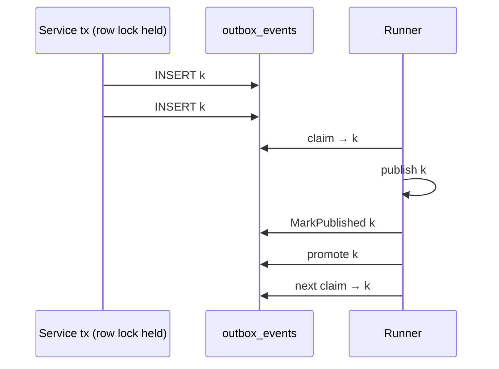

# platform-events — Low-Level Design

## BCBP Platform — Shared Event Library (SNS / SQS / Transactional Outbox / Inbox)

| Field | Value |
|---|---|
| Document type | Low-Level Design (LLD) |
| Library | `platform-events` — shared Go library (never deployed as a service) |
| Go module | `github.com/BCBP-SOLUTIONS-FZC-LLC/platform-events` (`go 1.26.0`, `toolchain go1.26.8`) |
| Status | v1.6.1 — released 2026-10-02 (PR #14) |
| Base documents | [`ARCHITECTURE.md`](../../ARCHITECTURE.md), [`README.md`](../../README.md), [`.claude/CLAUDE.md`](../../.claude/CLAUDE.md), [`EVENT_SCHEMA_GOVERNANCE.md`](../../EVENT_SCHEMA_GOVERNANCE.md), [`docs/observability/`](../observability/README.md) |
| Sibling libraries | `platform-pgcommon` v1.5.1 (database, transactions, migrations), `platform-gincommon` (tracing init, logger, request context — interface-compatible, not imported) |
| Consumers | Platform services (e.g. `iam-org-membership`, whose LLD §7 / §9 / §20 rely on the outbox and consumer contracts defined here) |
| Deployment stage | Library — consumed via `go get …@v1.6.1` (see §13.4) |

### Revision history

| Rev | Date | Change |
|---|---|---|
| 2.9 | 2026-10-02 | v1.6.1 released: CHANGELOG `[Unreleased]` → `[1.6.1]`; status, §13.4, OQ-9 closed. No design change. |
| 2.8 | 2026-10-02 | platform-pgcommon v1.4.3 → v1.5.1 (§3.1, §13.4, §18.1): `Store.Process` callbacks must not end the transaction (`ErrTxEndedInCallback`); a NUL in `tenant_id` / `trace_id` makes an envelope malformed (§7.1, §10.3); `sslmode` warnings reach `OutboxConfigEnv.Warnings` (§12). CI: `changes` job replaces `paths-ignore` (OQ-11 closed), explicit reusable-workflow secrets, per-commit concurrency on `main`, `make ci-scripts-test` (§14). |
| 2.7 | 2026-10-01 | Status alignment: §13.4 deployment stage (v1.6.1 pending on `fix/production-review`; `feat/observability-legacy-removal` waiting on it), OQ-7 closed, OQ-9…OQ-12 (v1.6.1 release, repository ruleset with stale required checks, docs-only PRs never reporting required checks, legacy-metric removal), §14 test inventory (`consumer_fifo_test.go`, `migrations_review_test.go`). No design change. |
| 2.6 | 2026-10-01 | Second review round: FIFO group messages get the running message's handler-timeout budget (re-armed per dispatch), one message per receive without a visibility timeout, a failed delete stops the group (§7.1); SNS drops `baggage` / `tracestate` before failing on the 10-attribute limit (§7.2); `Enqueue` rejects NUL (§10.3); replay inserts first with `ON CONFLICT` and counts skipped rows after commit (§8.6); 003 also rebuilds an INVALID index; `AWS_DEFAULT_REGION` fallback and `SQS_DRAIN_TIMEOUT` (§12); `mock.Consumer` validates and decodes (M-2); `SystemTenantID` does not disable RLS (E-7). |
| 2.5 | 2026-10-01 | Production review of v1.6.0: FIFO source queues processed per message group in order (§7.1); FIFO DLQ dedup ID unique per forward (§10.3); a `dataschema` on a non-string `data` is passed through (§7.3, EVT-5); migration 010 down releases waiting records, 003 rebuilds only when the shape differs, new 011 `(failed_at, id)` dead-letter index (§4, §19.5); replay skips IDs already in `outbox_events` (§8.6); shutdown mid-batch releases at once (§8.4); metrics rollback on legacy failure; extension calls bounded; DSN masking of `sslpassword`. |
| 2.4 | 2026-10-01 | v1.6.0 released: CHANGELOG `[Unreleased]` folded into `[1.6.0]`; status, §13.4 deployment stage, OQ-8 closed, release appendix. No design change. |
| 2.3 | 2026-10-01 | platform-pgcommon v1.4.2 → v1.4.3 (documentation-only upstream release — pgcommon's own LLD and doc corrections; none of the corrected claims are repeated here). No code change. OQ-6 still open: v1.4.3's `release.yml` still has no `latest=false`. |
| 2.2 | 2026-10-01 | Two-way gap audit against the code. Corrected: the layer rule is convention (only depguard is CI-enforced) and depguard skips `test/smoke` (§3.2); `port.Logger` has no `With`/`Named` (§3.3.1); `Enqueue` enforces a canonical UUID, v7 by convention (§4.2); the failure reason when a forward fails depends on the path (§8.7, §9.3); extender bound `WithConcurrency + MaxMessages` (§9.1); connection budget counts `PublishConcurrency` (§13.2); gauges refresh at the first poll after `GaugeInterval` (§8.4, §21.3); extension cadence `max(VT/2, 1s)` (§21.4); the CI `Smoke tests` job checks only the image (§14.4). Added: lifecycle semantics (§5.4, §5.6), `NewPublisherBridge` (O-12), remaining exported symbols (§5.5, §5.7, §5.8), receive-loop backoff and fixed per-call timeouts (§9.1), the bookkeeping budget (§8.4), DLQ send details (§10.3), inbox UUID rule (§7.4), queue-depth sampler and propagation details, label value sets, legacy successors and sunset (§11.2), a log catalogue (§11.4), CI gates and developer targets (§14), the `x-migrations-table` note (§19.4). Code: dead-letter list / replay / discard now order by `failed_at, id`, so a list-then-replay selects the same rows. |
| 2.1 | 2026-10-01 | Accuracy pass against the code: public `DLQConfig` has no `Clock`; the consumer requires `id`/`type`/`source` (only `ParseEnvelope` also requires `time`); constructor errors vs clamped values (§12); all three `NewSNSPublisher` construction errors; envelope sentinels come from `ParseEnvelope` and outbox validation, not the SNS publisher; `ErrInvalidSignature` is reserved; white-box test scope; release appendix (`DLQPublisher` shipped in v1.5.0); gauge cadence max(`GaugeInterval`, `PollInterval`) in §21.3. |
| 2.0 | 2026-10-01 | Restructured to the platform LLD convention (the `iam-org-membership` LLD's 21 sections): relationship table (§1.1), ownership split (§2.3), API IDs (§5), caching design with CACHE-n invariants (§6), event architecture with EVT-n invariants (§7), key flows (§8), FAIL-n / CONS-n / OPS-n invariant registers and a failure-scenario table (§9), security layers (§10), SLO guidance (§11.1), deployment and scaling (§13), data lifecycle (§15), sign-off register (§16), error taxonomy (§17), integration details (§18), migration strategy (§19), operational considerations (§20), performance (§21). No behaviour change. |
| 1.1 | 2026-10-01 | platform-pgcommon v1.4.1 → v1.4.2 (documentation-only upstream release; no code change here). Added `make docs-check` (diagram drift gate, same script as pgcommon v1.4.2) to `make ci`, the pre-commit hook, `Validate / Quality` and a new `docs.yml` workflow. |
| 1.0 | 2026-10-01 | Initial LLD, reflecting branch `feat/observability-standard` (v1.6.0 + Unreleased). |

### Table of Contents

1. [Document Overview](#1-document-overview)
2. [Library Responsibilities and Boundaries](#2-library-responsibilities-and-boundaries)
3. [Architecture and Package Layout](#3-architecture-and-package-layout)
4. [Data Model](#4-data-model)
5. [API Contract](#5-api-contract)
6. [Caching Design](#6-caching-design)
7. [Event Architecture](#7-event-architecture)
8. [Key Flows](#8-key-flows)
9. [Concurrency, Consistency, and Failure Handling](#9-concurrency-consistency-and-failure-handling)
10. [Security](#10-security)
11. [Observability](#11-observability)
12. [Configuration](#12-configuration)
13. [Deployment and Scaling](#13-deployment-and-scaling)
14. [Testing Strategy](#14-testing-strategy)
15. [Data Lifecycle and Compliance](#15-data-lifecycle-and-compliance)
16. [Open Questions and Sign-off Register](#16-open-questions-and-sign-off-register)
17. [Appendix — Error Taxonomy](#17-appendix--error-taxonomy)
18. [Integration Details](#18-integration-details)
19. [Migration Strategy](#19-migration-strategy)
20. [Operational Considerations](#20-operational-considerations)
21. [Performance Considerations](#21-performance-considerations)
- [Appendix — Changes in this release](#appendix--changes-in-this-release)

---

## 1. Document Overview

This document is the low-level design for **`platform-events`**, the shared Go library through which every BCBP platform service publishes and consumes integration events. It is linked into the consuming service's binary; it owns no process, no endpoint and no infrastructure of its own. What it does own is the **event plumbing contract** of the platform: the canonical envelope wire format, the SNS publish path and its retry classification, the SQS consume loop and its dead-letter accounting, the transactional outbox that removes the dual-write problem, the inbox ledger that makes consumer effects exactly-once, and the Tier 1 `platform_*` metrics that every service emits for these concerns.

Refined into an implementable specification, this document gives the exact tables and indexes the library creates in a service's database, the public signatures and their behavioural contracts, the state machines behind publish / consume / outbox / inbox, the invariants that hold across them, configuration, metrics, and the operational procedures a service owner needs. Where this LLD and the code disagree, **the code is authoritative**; the discrepancy is a documentation bug and this document is updated with the change.

**The code is at this design.** Every table, signature, SQL fragment and invariant below was checked against `main` at v1.6.1 at revision 2.9 (merged coverage 98.5%, `make ci` green).

### 1.1 Relationship to the architecture documents

The library has no HLD; `ARCHITECTURE.md` plays that role (layer model, flow diagrams, failure domains, design decisions). This LLD refines it:

| `ARCHITECTURE.md` section | What it specifies | Where this LLD refines it |
|---|---|---|
| Layer model, Package dependency graph | Clean Architecture layers, import rules | §3 |
| Public API packages | `pkg/events`, `pkg/outbox`, `pkg/inbox` surface | §5 |
| Data model | `outbox_events`, `outbox_dead_letters`, `processed_events` | §4 |
| SNS publish flow | Attributes, FIFO, batching, codec | §7.2, §8.1 |
| Write flow and transactional outbox | Enqueue, poll cycle | §8.3, §8.4 |
| SQS consume flow | Long-poll loop, visibility, dead-letter routing | §7.1, §8.2 |
| Failure lifecycle, Failure domains | Producer / consumer failure timelines, DLQ forwarding | §9.3, §17 |
| Observability stack | Metrics, spans, rules | §11 |
| Tenant propagation and RLS | Handler context, GUC injection | §10.1 |
| Concurrency model, Key invariants | `SKIP LOCKED`, idempotency, invariants | §9 |
| Envelope compatibility guarantees | Field stability classes | §7.3 |
| Threat model | STRIDE | §10 |
| Performance characteristics | Overheads | §21 |
| Distribution and service wiring | Consuming service wiring | §13, §18 |

Other documents and their roles:

| Document | Role relative to this LLD |
|---|---|
| `README.md` | Consumer-facing quick reference: what to import, env vars, gotchas |
| `.claude/CLAUDE.md` | Working guide for contributors and coding agents: commands, conventions, extension recipes |
| `EVENT_SCHEMA_GOVERNANCE.md` | Payload schema evolution rules and the cross-service event-type registry (owned by producing services) |
| `docs/guides/*.md` | Task guides: quick start, envelope, publishing, consuming, outbox, codec, HMAC, observability, operations, testing in services |
| `docs/observability/` | Observability standard as applied here, generated metrics registry (`metrics-registry.md`), runbook |
| `CHANGELOG.md` | Release history; `[1.6.0]` describes the state this LLD documents |

---

## 2. Library Responsibilities and Boundaries

### 2.1 In scope

- **`Envelope[T]`** — the canonical, versioned inter-service event wire format (CloudEvents key names, §7.3).
- **SNS publisher** (`Publish`, `PublishBatch`) — message attributes for subscription filter policies, FIFO support, codec hook, size-aware batching, retry classification (§9.3.1).
- **SQS consumer** — long-poll loop, bounded concurrency, visibility extension from receipt, a single per-message deadline, dead-letter routing, panic recovery, graceful drain with hand-back.
- **`DLQPublisher`** — forwards a message to the source queue's `RedrivePolicy` DLQ; the only sanctioned SQS write path for consuming services.
- **Transactional outbox** — `Enqueue` / `EnqueueOrdered` inside the caller's transaction; `Runner` delivers asynchronously (at-least-once), with per-record retry backoff, transient/permanent classification, a dead-letter table and an operator API; optional per-key ordering.
- **Inbox** — consumer-side deduplication ledger (`Handler`, `Store.Process`, `Prune`).
- **Codec hook** — `Codec` interface, `NoopCodec`, decode-only `GlueDecodeCodec`.
- **HMAC helpers** for webhook / cross-service signing.
- **Observability** — Tier 1 `platform_*` metrics per the Enterprise Platform Observability Standard, legacy metrics during the compatibility period, OTel spans on the global provider, reference Prometheus rules, Grafana dashboard and KEDA example.
- **Test doubles** (`pkg/events/mock`) that reproduce the production handler context and metric accounting.
- **Configuration loading** (`pkg/config`) for the env vars in §12.

### 2.2 Out of scope (owned elsewhere)

| Concern | Owner |
|---|---|
| OpenTelemetry provider / propagator initialisation, `OTEL_*` env | Consuming service via `platform-gincommon` (`InitTracingFromEnv`). The library only calls the global tracer / propagator. |
| Logger construction and configuration | Consuming service; any `port.Logger` (e.g. gincommon's `ZapLogger`) is injected. |
| Database connections, configuration, transactions, migration runner | `platform-pgcommon` only (`Pool`, `RunInTx`, `ConfigFromEnv`, `MigrationDSNFromEnv`, `migrate.Runner`). |
| Schema-registry clients (e.g. AWS Glue) | Consuming service implements `events.Codec`; the library depends on no registry SDK. |
| SQS / SNS SDK usage in services | Forbidden — services use `NewSNSPublisher`, `NewSQSConsumer` and `DLQPublisher`. |
| Payload schemas and the event-type registry | Producing services (`EVENT_SCHEMA_GOVERNANCE.md`). |
| Infrastructure (topics, queues, subscriptions, filter policies, redrive policies, IAM, KMS) | Platform infrastructure; the library documents required permissions (§10.4). |
| Business idempotency semantics | Consuming service — the library supplies the key (`Envelope.ID`) and the ledger (§7.4). |
| Scheduling of maintenance (prune, dead-letter review) | Consuming service (CronJob / scheduler) calling the library's API (§15, §20). |

### 2.3 Ownership split — library vs consuming service

| Responsibility | Library | Consuming service |
|---|---|---|
| Atomic event write | Provides `Enqueue(ctx, tx, env)` that writes into the caller's transaction | Opens the transaction with `pgcommon.RunInTx`; performs the business write in it |
| Per-key order | Sequence, waiting rows, promotion, claim guard (§8.5) | Takes the aggregate's row lock **before** `EnqueueOrdered`; derives FIFO `MessageGroupId` from the same key |
| Delivery | Runner: claim, publish, classify, retry, dead-letter | Runs `Runner.Start` in a goroutine; calls `Stop` on shutdown |
| Dead-letter remediation | `ListDeadLetters`, `ReprocessDeadLetters[With]`, `DiscardDeadLetters` | Decides what to replay or discard; schedules review |
| Consume | Receive, parse, decode, dispatch, extend visibility, delete, dead-letter route | Implements the `Handler`; returns `nil` only when the effect is durable |
| Exactly-once effects | `inbox.Store.Process` claim + `fn` in one transaction | Performs its writes through the `tx` passed to `fn` |
| Tenant scoping | Injects the envelope tenant as pgcommon `GUCSet` into the handler context | Defines RLS policies on its tables |
| Metrics | Registers and records collectors | Calls `InitMetrics` once with its identity; scrapes `/metrics` |
| Schema | Embeds and applies migrations through `ApplySchema` | Runs `ApplySchema` at startup or as a migration job (§19) |

---

## 3. Architecture and Package Layout

**Modules.**

Three Go modules, the same layout as platform-pgcommon, so consuming services inherit only what the library itself imports (the library's `go.mod` is 55 lines; testcontainers and the linter's dependency tree are not in it):

| Module | Path | Contents |
|---|---|---|
| Library | `.` | `pkg/`, `internal/`, `cmd/platform-events`, white-box tests in `internal/core/service` |
| Tests | `test/` (`replace …platform-events => ../`) | `unit/`, `integration/`, `e2e/`, `smoke/`, `fixtures/`, `testenv/` |
| Tools | `tools/` | `golangci-lint`, run via `go tool -modfile=tools/go.mod` |

Package tree:

```
cmd/platform-events/              reference CLI (prints config; Docker image for Trivy + smoke tests)
internal/
  core/
    domain/                       Envelope[T], OutboxRecord, DeadLetterRecord, DLQFilter, BatchError/Failure,
                                  RetryableError/ErrRetryable, DLQError + kinds, codec payload wrap/unwrap
    port/                         Publisher, Consumer/Handler, OutboxStore, OutboxMetrics, Codec/NoopCodec,
                                  DLQPublisher, DLQAttribution, SourceMessage, Logger, Clock
    service/                      OutboxService (publish cycle, retry/backoff policy), HMAC
  adapter/outbound/
    sns/                          SNS publisher (aws-sdk-go-v2)
    sqs/                          SQS consumer, DLQPublisher, queue-depth sampler, HandlerContext
    outboxstore/                  Postgres outbox store (via pgcommon Pool / RunInTx)
    metrics/                      metrics registry, Tier 1 + legacy collectors, SanitizeEventType
pkg/
  events/                         public API: envelope, publisher, consumer, DLQ, codec, Glue, HMAC, metrics init
  events/mock/                    Publisher, Consumer, DLQPublisher test doubles
  outbox/                         Runner, Config, Enqueue/EnqueueOrdered, ApplySchema, dead-letter API
  outbox/migrations/              001–011 (embedded)
  inbox/                          Handler, Store (Process, Prune), ApplySchema
  inbox/migrations/               001 (embedded)
  config/                         env loading (LoadSNS/LoadSQS/LoadOutbox) and wiring helpers
```

### 3.1 Shared library dependencies

| Library | Version | Imported | Role |
|---|---|---|---|
| `platform-pgcommon` | v1.5.1 | Yes | All database access, transactions, configuration, migrations, RLS GUC context |
| `platform-gincommon` | — | **No** | Interface compatibility only (`port.Logger`, `RequestContext` fields) |
| `aws-sdk-go-v2` | v1.47.1 (sns v1.47.2, sqs v1.52.1) | Yes | SNS / SQS clients, smithy error types |
| OpenTelemetry Go | — | Yes | Global tracer and propagator (`otel.Tracer`, `otel.GetTextMapPropagator`) |
| Prometheus client_golang | — | Yes | Collectors and registerer |

### 3.2 Dependency rules

- `domain` ← `port` ← `service` ← `adapter` ← `pkg`. `internal/core` never imports `adapter` or the AWS SDK. **Convention, reviewed in PRs — no linter enforces it** (it holds today).
- **depguard `pgcommon-only`** (`.golangci.yml`, CI-enforced; applies to every file incl. tests, fixtures and the CLI, except `test/smoke`, which is not linted): denies `github.com/jackc/pgx`, `database/sql`, `github.com/golang-migrate/migrate`. pgx is an indirect dependency through pgcommon only. Test fakes embed `pgcommon.Tx`; a pgx-only type (e.g. `CommandTag`) is inferred via `newStubTx(pgcommon.Tx.Exec)` (`test/unit/enqueue/enqueue_test.go`).
- All transactions go through `pgcommon.RunInTx` (never `conn.Begin`), so pgcommon's PgBouncer GUC injection and per-transaction `StatementTimeout` / `LockTimeout` always apply.
- `make lint` runs with and without `-tags=integration,e2e`, so tagged test files are held to the same rules.

### 3.3 Shared library integration

#### 3.3.1 `platform-gincommon`

Not imported. `port.Logger` (`Debug/Info/Warn/Error(msg string, fields map[string]interface{})` — nothing else) has the same method set as gincommon's `ZapLogger`, so one logger instance is passed to `SNSConfig.Logger`, `SQSConfig.Logger`, `DLQConfig.Logger` and `outbox.Config.Logger`. An HTTP handler that publishes passes `WithTenantID(rc.TenantID)`, `WithTraceID(rc.TraceID)` from `gincommon.GetRequestContext(c)`. Tracing is initialised by the service with `gincommon.InitTracingFromEnv()`; until then the library's spans are no-ops.

#### 3.3.2 `platform-pgcommon`

| pgcommon symbol | Used for |
|---|---|
| `*pgcommon.Pool` | outbox store, inbox store |
| `pgcommon.RunInTx`, `TxOptions` | claim, settle, dead-letter, replay, inbox `Process` |
| `Pool.WithConn` | single-statement reads / updates (`MarkPublished`, counts, prune) |
| `Tx`, `Conn`, `Rows`, `Row`, `ErrNoRows` aliases | all signatures — the library never names a pgx type |
| `ConfigFromEnv` | `config.LoadOutbox().DB` |
| `MigrationDSNFromEnv` | `config.LoadOutbox().MigrationDatabaseURL` |
| `migrate.Runner` | `outbox.ApplySchema`, `inbox.ApplySchema` (its `Logger` is pgcommon's `domain.Logger` with variadic `Field`s, not `port.Logger`) |
| `WithGUCSet` / `GUCSet{TenantID}` | consumer handler context, so RLS scopes the handler's queries |

#### 3.3.3 AWS SDK

The SNS and SQS adapters accept narrow client interfaces (`SQSClientLike`, `DLQClientLike`, the SNS client interface) so tests inject fakes; optional capabilities (queue-depth sampling's `GetQueueAttributes`) are detected by type assertion so the interfaces did not grow. Errors are inspected through `smithy.APIError` and `smithyhttp.ResponseError` only (§9.3.1).

---

## 4. Data Model

All tables live in the **consuming service's** database. Schemas are applied by `outbox.ApplySchema` / `inbox.ApplySchema` through pgcommon's `migrate.Runner`, each with its own golang-migrate tracking table.

### 4.1 Extensions, sequences and types

- No extension is required (`gen_random_uuid` is not used; IDs come from the envelope).
- Sequence `outbox_events_ordering_seq` (migration 010) — drawn at INSERT for keyed records only.
- `'infinity'::timestamptz` is used as a sentinel `scheduled_at` for a keyed record waiting behind its key's head (§8.5).

### 4.2 Tables

#### `outbox_events`

| Column | Type | Notes |
|---|---|---|
| `id` | `UUID` PK | Envelope ID — canonical lowercase UUID enforced by `Enqueue`; v7 by convention (`NewEnvelope`) |
| `event_type` | `TEXT NOT NULL` | |
| `payload` | `JSONB NOT NULL` | Whole serialised envelope (`json.RawMessage`, so pgx binds JSON even in PgBouncer simple-protocol mode) |
| `tenant_id` | `TEXT NOT NULL DEFAULT ''` | |
| `trace_id` | `TEXT NOT NULL DEFAULT ''` | |
| `attempts` | `INT NOT NULL DEFAULT 0` | Counted (permanent) failures only |
| `last_error` | `TEXT NOT NULL DEFAULT ''` | Truncated to 512 runes |
| `created_at` | `TIMESTAMPTZ NOT NULL DEFAULT NOW()` | DB time at insert; reset to `NOW()` on dead-letter replay; feeds the oldest-pending-age gauge |
| `scheduled_at` | `TIMESTAMPTZ NOT NULL DEFAULT NOW()` | Next claimable time: lease expiry, retry backoff, or `'infinity'` for a waiting keyed record |
| `published_at` | `TIMESTAMPTZ` | `NULL` = unpublished |
| `ordering_key` | `TEXT` (010) | Set by `EnqueueOrdered`; `NULL` = unordered |
| `ordering_seq` | `BIGINT` (010) | `nextval('outbox_events_ordering_seq')` at INSERT, keyed rows only — INSERT order, not transaction start |

Record state is derived from columns, not stored:

| State | Predicate |
|---|---|
| Due | `published_at IS NULL AND scheduled_at <= NOW()` |
| Leased (claimed, in flight) | `published_at IS NULL AND scheduled_at > NOW() AND scheduled_at <> 'infinity'` after a claim |
| Backing off | same predicate as leased, after `MarkFailed` / `ReleaseLease` (indistinguishable in SQL; `attempts` / `last_error` tell them apart) |
| Waiting (ordering) | `published_at IS NULL AND scheduled_at = 'infinity'` |
| Published | `published_at IS NOT NULL` (until pruned) |
| Dead-lettered | row moved to `outbox_dead_letters` |

Insert statement (`outboxstore.InsertRecord`):

```sql
INSERT INTO outbox_events
    (id, event_type, payload, tenant_id, trace_id, created_at, scheduled_at, ordering_key, ordering_seq)
VALUES
    ($1, $2, $3, $4, $5, NOW(),
     CASE WHEN $7 <> '' AND EXISTS (
         SELECT 1 FROM outbox_events p WHERE p.ordering_key = $7 AND p.published_at IS NULL
     ) THEN 'infinity'::timestamptz          -- waits behind its key's head
     ELSE NOW() + make_interval(secs => $6) END,
     NULLIF($7, ''),
     CASE WHEN $7 <> '' THEN nextval('outbox_events_ordering_seq') END)
```

#### `outbox_dead_letters`

| Column | Type | Notes |
|---|---|---|
| `id` | `UUID` PK | |
| `event_type`, `payload`, `tenant_id`, `trace_id` | as in `outbox_events` | |
| `attempts` | `INT NOT NULL` | attempts at dead-lettering |
| `last_error` | `TEXT NOT NULL DEFAULT ''` | |
| `created_at` | `TIMESTAMPTZ NOT NULL DEFAULT NOW()` (006) | |
| `failed_at` | `TIMESTAMPTZ NOT NULL DEFAULT NOW()` | |
| `ordering_key` | `TEXT` (010) | preserved through dead-lettering and replay |

#### `processed_events` (inbox)

| Column | Type | Notes |
|---|---|---|
| `event_id` | `uuid NOT NULL` | `Envelope.ID` |
| `consumer` | `text NOT NULL` | distinct consumers dedup independently |
| `processed_at` | `timestamptz NOT NULL DEFAULT now()` | |

PK `processed_events_pkey (event_id, consumer)`.

### 4.3 Indexes

| Table | Index | Definition | Serves |
|---|---|---|---|
| `outbox_events` | PK | `(id)` | point updates |
| `outbox_events` | `idx_outbox_events_pending` (003) | `(scheduled_at, id) WHERE published_at IS NULL` | claim query, pending / leased / blocked counts, `promoteAllSQL` (walks the `'infinity'` tail) |
| `outbox_events` | `idx_outbox_events_published_at` (007) | `(published_at) WHERE published_at IS NOT NULL` | `PrunePublished` |
| `outbox_events` | `idx_outbox_events_unpublished_created` (009) | `(created_at) WHERE published_at IS NULL` | `OldestPendingAge` (single probe) |
| `outbox_events` | `idx_outbox_events_ordering` (010) | `(ordering_key, ordering_seq) WHERE published_at IS NULL AND ordering_key IS NOT NULL` | per-key head checks, `promoteKeySQL`, the claim guard |
| `outbox_dead_letters` | `idx_outbox_dead_letters_failed_at_id` (011; replaces 004's `(failed_at DESC)`) | `(failed_at, id)` | list / replay / discard ordering, `FailedBefore` filter |
| `outbox_dead_letters` | `idx_outbox_dead_letters_created_at` (005) | `(created_at ASC)` | retention purges |
| `outbox_dead_letters` | `idx_outbox_dead_letters_event_type_tenant_id` (008) | `(event_type, tenant_id)` | `DLQFilter` |
| `processed_events` | `idx_processed_events_processed_at` | `(processed_at)` | `Prune` |

List, replay and discard all order dead letters by `failed_at, id` (a total order), so a list-then-replay or list-then-discard with the same filter and limit selects the same rows, barring rows dead-lettered in between.

### 4.4 Migrations

| Schema | Files | Tracking table |
|---|---|---|
| Outbox | `pkg/outbox/migrations/001`–`011` (`.up` / `.down`) | `outbox_migrations` (`outbox.MigrationsTable`) |
| Inbox | `pkg/inbox/migrations/001` | `inbox_migrations` (`inbox.MigrationsTable`) |

| # | Outbox migration | Effect |
|---|---|---|
| 001 | `create_outbox_events` | `outbox_events` |
| 002 | `create_outbox_dead_letters` | `outbox_dead_letters` |
| 003–008 | indexes and defaults | pending index (003), dead-letter indexes (004, 005, 008), dead-letter defaults (006), prune index (007) |
| 009 | `add_unpublished_created_index` | `idx_outbox_events_unpublished_created` |
| 010 | `add_ordering_key` | sequence, `ordering_key` / `ordering_seq` on `outbox_events`, `ordering_key` on `outbox_dead_letters`, `idx_outbox_events_ordering`; down first makes waiting (`'infinity'`) rows due |
| 011 | `dead_letters_failed_at_id_index` | `idx_outbox_dead_letters_failed_at_id (failed_at, id)` replaces `idx_outbox_dead_letters_failed_at` |

003 rebuilds `idx_outbox_events_pending` only when its definition is not already `(scheduled_at, id) WHERE published_at IS NULL`, so a re-run (tracking-table move, or an index pre-built `CONCURRENTLY`) takes no `ACCESS EXCLUSIVE` lock.

- `ApplySchema` always sets `x-migrations-table` to its own table, replacing any value in the DSN, so library versions never collide with the service's migration versions.
- All up migrations are idempotent (`IF NOT EXISTS`). Indexes are created without `CONCURRENTLY` because pgcommon runs each file in a transaction — on a large outbox, create 009 / 010's indexes concurrently by hand first (§19.3).
- 010's column additions are metadata-only on existing rows (nullable, no default).

### 4.5 Row-level security

The library's tables carry `tenant_id` but **no RLS policy**: the runner reads across tenants by design (one runner per service drains every tenant's events). A service that enables RLS on `outbox_events` must exempt the runner's role. Tenant scoping applies to the **service's** tables inside a consumer handler (§10.1).

---

## 5. API Contract

### 5.1 Conventions

- Constructors return interfaces (`Publisher`, `Consumer`, `DLQPublisher`), never concrete structs, so services inject mocks.
- Construction errors are returned, not panicked — except `NewRunner` with a nil `Publisher` or nil `Pool`+`Store` (programming error).
- Every component that takes a `port.Logger` is nil-safe.
- Errors are matchable with `errors.Is` / `errors.As`: `ErrRetryable`, `*DLQError` + kinds, `*BatchError`, envelope sentinels (§17).
- Options are functional (`With…`); a nil option argument (e.g. `WithDeadLetterHandler(nil)`) is ignored.
- API IDs below (`E-n`, `P-n`, `C-n`, `D-n`, `O-n`, `I-n`, `K-n`, `M-n`) are referenced from the flows and invariants.

### 5.2 Envelope (`pkg/events`)

| ID | Symbol | Signature / behaviour |
|---|---|---|
| E-1 | `Envelope[T]` | Struct; wire keys in §7.3 |
| E-2 | `NewEnvelope[T]` | `(eventType, source string, payload T, opts ...EnvelopeOpt) Envelope[T]` — UUID v7 `ID`, UTC `Timestamp` |
| E-3 | `EnvelopeOpt` | `WithTenantID`, `WithTraceID`, `WithCorrelationID`, `WithSchemaVersion`, `WithSystemTenant`, `WithSubject`, `WithActor`, `WithIPAddress`, `WithUserAgent`, `WithSchemaID` |
| E-4 | `Envelope.JSON` | `() ([]byte, error)` — canonical JSON, payload inline |
| E-5 | `ParseEnvelope[T]` | `(data []byte) (Envelope[T], error)` — requires `id`, `type`, `source`, `time` |
| E-6 | `TraceIDFromContext` | `(ctx) string` — envelope trace ID in a consumer handler |
| E-7 | `SystemTenantID` | `"system"` — injected as the RLS tenant like any other (`app.tenant_id = 'system'`); RLS is not disabled, so global-event handlers need an RLS-bypassing pool or role |

### 5.3 Publisher (`pkg/events`)

| ID | Symbol | Signature / behaviour |
|---|---|---|
| P-1 | `Publisher` | `Publish(ctx, Envelope[json.RawMessage]) error`; `PublishBatch(ctx, []Envelope[json.RawMessage]) error` |
| P-2 | `NewSNSPublisher` | `(cfg SNSConfig, opts ...PublisherOption) (Publisher, error)` — error on an empty `TopicARN`, a non-SNS ARN, or a FIFO (`.fifo`) topic without `WithMessageGroupID` |
| P-3 | `SNSConfig` | `TopicARN` (required), `Region`, `EndpointURL`, `Logger` |
| P-4 | `PublisherOption` | `WithMessageGroupID(fn)`, `WithMessageDeduplicationID(fn)`, `WithAttributes(map)`, `WithCodec(codec)` |
| P-5 | `BatchError` / `BatchFailure` | `Failures []BatchFailure{ID, Code, Message, Retryable}` — returned by `PublishBatch` for partial / whole failures |
| P-6 | `NewPublisherFromPort` | adapts a `port.Publisher` |

`BatchFailure.Retryable` marks a failure that says nothing about the message (the outbox retries it without counting an attempt). Code `TransportError` is also treated as retryable for publishers that predate the field.

### 5.4 Consumer (`pkg/events`)

| ID | Symbol | Signature / behaviour |
|---|---|---|
| C-1 | `Consumer` | `Start(ctx) error` (blocks); `Stop() error` |
| C-2 | `Handler` | `func(ctx context.Context, env Envelope[json.RawMessage]) error` — `nil` deletes, error leaves visible |
| C-3 | `NewSQSConsumer` | `(cfg SQSConfig, handler Handler, opts ...ConsumerOption) (Consumer, error)` — error on nil handler, empty `QueueURL`, visibility > 12h |
| C-4 | `NewSQSConsumerWithClient` | `(cfg, client SQSClientLike, handler, opts...)` — tests |
| C-5 | `SQSConfig` | `QueueURL` (required), `Region`, `EndpointURL`, `MaxMessages` (1–10, default 10), `WaitSeconds` (default 20), `Logger` |
| C-6 | `ConsumerOption` | `WithConcurrency(n)`, `WithVisibilityTimeout(d)`, `WithDeadLetterHandler(fn)`, `WithMaxReceiveCount(n)`, `WithDrainTimeout(d)` (default 30s), `WithConsumerCodec(codec)`, `WithDLQForwarding(dlq)`, `WithQueueDepthMetrics(interval)` (min 10s), `WithHandlerTimeout(d)`, `WithMalformedBodyLogging()` |
| C-7 | `SourceMessageFromContext` | `(ctx) (SourceMessage, bool)` — raw body + attributes as received (forward these, never `env.JSON()`) |
| C-8 | `TraceIDFromContext` | `(ctx) string` — the envelope trace ID injected into the handler ctx |

**Lifecycle (consumer and runner alike):** a second `Start` while running returns an "already running" error; both are restartable after `Stop`; `Stop` is safe before `Start` and more than once, and returns an error when the drain deadline passes (consumer: `DrainTimeout` + 5s housekeeping margin; runner: `DrainTimeout`). `Stop` affects only a `Start` already running — shut down by cancelling the `Start` ctx, then call `Stop` to wait for the drain.

### 5.5 DLQ, codec, HMAC, metrics (`pkg/events`)

| ID | Symbol | Signature / behaviour |
|---|---|---|
| D-1 | `DLQPublisher` | `SendToDLQ(ctx, sourceQueueURL string, body []byte, attrs map[string]string, reason string) error`; `ResolveDLQ(ctx, sourceQueueURL) (string, error)` |
| D-2 | `NewSQSDLQPublisher` / `…WithClient` | `(cfg DLQConfig[, client DLQClientLike]) (DLQPublisher, error)` |
| D-3 | `DLQConfig` | `Region`, `EndpointURL`, `ConsumerName`, `Logger`, `CacheTTL` (0 → 15m, negative → no expiry), `StrictAttributes` |
| D-4 | `DLQAttr*` | `EventType`, `DLQReason`, `OriginalQueue`, `ConsumerName`, `FailedAt` (always override caller attributes of the same name) |
| D-5 | `DLQError` | `Kind` ∈ `ErrDLQNotConfigured`, `ErrDLQInvalidRedrivePolicy`, `ErrDLQUnresolved`, `ErrDLQSendFailed`, `ErrDLQInvalidMessage`; `SourceQueue`; `Cause` |
| D-6 | `ErrRetryable` | Sentinel for transient failures (AWS throttling / 5xx / network / timeouts; a codec's registry outage). A custom `Codec` or `Publisher` wraps it with `%w`. |
| D-7 | `Codec` / `NoopCodec` / `GlueDecodeCodec` | `Encode(ctx, eventType, payload) ([]byte, schemaID string, error)`; `Decode(ctx, schemaID, encoded) (json.RawMessage, error)` |
| D-8 | `Sign` / `Verify` | `Sign(key, payload []byte) (string, error)` (key ≥ 32 bytes); `Verify(key, payload []byte, sig string) bool` (constant time) |
| D-9 | `SignEnvelope` / `VerifyEnvelope` | canonical-JSON signing; `VerifyEnvelope` returns `(false, nil)` on mismatch, `(false, err)` on malformed input |
| D-10 | `InitMetrics` | `(id MetricsIdentity, reg prometheus.Registerer, opts ...MetricsOption) ([]RegistrationWarning, error)` |
| D-11 | `MetricsOption` | `WithoutLegacyMetrics()`, `WithEventTypeLimit(n)`, `WithEventTypes(types...)` |
| D-12 | Metrics helpers | `MetricsIdentityFromEnv`, `MetricsIdentityFromLabels`, `MetricsEnvironmentFromEnv`, `MetricsRegistry()` |
| D-13 | `Init` / `InitWithRegisterer` | Deprecated — legacy metrics only; `InitWithRegisterer` is the test reset |
| D-14 | Registry types | `MetricsRegistryEntry`, `MetricStatusCanonical` / `MetricStatusProposed` / `MetricStatusDeprecated` (returned by `MetricsRegistry()`) |
| D-15 | Sentinels | `ErrEnvelopeIDRequired` / `ErrEnvelopeTypeRequired` / `ErrEnvelopeSourceRequired`, `ErrKeyTooShort`, `ErrInvalidSignature` (reserved) — see §17 |

### 5.6 Outbox (`pkg/outbox`)

| ID | Symbol | Signature / behaviour |
|---|---|---|
| O-1 | `Config` | `Pool`, `Store` (tests), `Publisher`, `Logger`, `PollInterval` (5s), `BatchSize` (50), `MaxAttempts` (5), `ClaimLeaseDuration` (10m), `DrainTimeout` (30s), `PublishConcurrency` (1), `PublishTimeout` (10s), `GaugeInterval` (15s), `StartupJitter` (0), `RetryBackoff` (1s), `MaxRetryBackoff` (5m) |
| O-2 | `NewRunner` | `(cfg Config) (*Runner, error)` — error if the lease is shorter than `BatchSize×PublishTimeout+1m` (30s minimum when `PublishTimeout` is disabled) |
| O-3 | `Runner.Start` / `Stop` / `Ready` | `Start(ctx) error` blocks; `Stop() error` drains; `Ready() <-chan struct{}` closes after the first successful (or empty) poll |
| O-4 | `Enqueue` | `(ctx, tx pgcommon.Tx, env events.Envelope[json.RawMessage]) error` — validates fields, canonical UUID, no NUL (`\u0000`; jsonb cannot store it), ≤ 240 KiB serialised |
| O-5 | `EnqueueOrdered` | `(ctx, tx, env, orderingKey string) error` — key non-empty, valid UTF-8, no NUL, ≤ `MaxOrderingKeyLen` (256) |
| O-6 | `Runner.ListDeadLetters` | `(ctx, filter DLQFilter, limit int) ([]DeadLetterRecord, error)` |
| O-7 | `Runner.ReprocessDeadLetters[With]` | `(ctx[, filter], limit int) (int, error)` — moves rows back to `outbox_events` |
| O-8 | `Runner.DiscardDeadLetters` | `(ctx, filter DLQFilter, limit int) (int64, error)` — permanent delete |
| O-9 | `Runner.PrunePublished` | `(ctx, olderThan time.Duration, limit int) (int64, error)` |
| O-10 | `ApplySchema` | `(ctx, runner *migrate.Runner) error` |
| O-11 | `DLQFilter` / `DeadLetterRecord` | filter `{EventType, TenantID, FailedBefore}`; record `{ID, EventType, TenantID, TraceID, Attempts, LastError, CreatedAt, FailedAt}` |
| O-12 | `NewPublisherBridge` | `(pub events.Publisher) port.Publisher` — the adapter `NewRunner` uses; also records the outbox publish metrics. For wiring a `Config.Store` test double without `NewRunner` |

O-6 … O-9 apply a 30s internal DB timeout each and order by `failed_at, id`. `Start` / `Stop` follow the lifecycle rules in §5.4.

### 5.7 Inbox (`pkg/inbox`)

| ID | Symbol | Signature / behaviour |
|---|---|---|
| I-1 | `Handler` | `(ledger Ledger, next events.Handler) events.Handler` — best-effort dedup (separate transactions) |
| I-2 | `Ledger` | `IsProcessed(ctx, uuid.UUID)`, `MarkProcessed(ctx, uuid.UUID)`, `Consumer()` — implemented by `*Store` |
| I-3 | `NewStore` | `(pool *pgcommon.Pool, consumer string) (*Store, error)` |
| I-4 | `Store.Process` | `(ctx, env, fn func(ctx, tx pgcommon.Tx) error) error` — exactly-once Postgres writes; `fn` must not end `tx` (`pgcommon.ErrTxEndedInCallback`, message retried) |
| I-5 | `Store.Prune` | `(ctx, retention time.Duration, batch int) (int64, error)` — `DefaultPruneBatch` = 5000 |
| I-6 | `ApplySchema` | `(ctx, runner *migrate.Runner) error` |

### 5.8 Configuration (`pkg/config`) and test doubles (`pkg/events/mock`)

| ID | Symbol | Behaviour |
|---|---|---|
| K-1 | `LoadSNS`, `LoadSQS`, `LoadOutbox` | env → config, invalid values → default + entry in `Warnings` |
| K-2 | `Validate()` | per config; required fields |
| K-3 | `OutboxConfigEnv.String()` | DSNs masked (URL, query and libpq keyword forms) |
| K-4 | `SNSConfigFromEnv`, `SQSConfigFromEnv`, `SQSConsumerOptions`, `RunnerConfigFromEnv(env, pool, publisher, logger)` | wiring helpers |
| K-5 | `LogWarnings` / `LogWarningsTo(logger, warnings)` | stderr / structured logger |
| K-6 | `LoadOTel` / `OTelConfigEnv` | Deprecated — tracing config belongs to gincommon |
| M-1 | `mock.Publisher` | Validates ID/Type/Source like SNS; `SetError`, `SetBatchError` (partial / `Retryable` failures), `Published`, `Reset` |
| M-2 | `mock.Consumer` | `SetHandler(h)`, `Start` / `Stop` / `IsRunning` (no polling); `Inject(env)` runs the handler with the real handler context (`sqs.HandlerContext`: tenant GUC, trace ID, source message from `env.JSON()`, plus the `explicit` dead-letter attribution); like production it returns `ErrMalformedEnvelope` without calling the handler when id / type / source is missing, round-trips through JSON, and decodes codec payloads with `Codec` (error when unset); `QueueURL` / `MockQueueURL` |
| M-3 | `mock.DLQPublisher` | Same input validation as the SQS publisher; counts `platform_dlq_messages_total` and marks the attribution; `Sent() []DLQMessage`, `SetError`, `DLQURL` (default `mock://dlq`) |

---

## 6. Caching Design

The library holds no data cache: events, records and payloads are never cached. It keeps four small in-process caches, all bounded and all advisory.

### 6.1 Keys, values, TTLs

| Cache | Owner | Key | Value | TTL / bound |
|---|---|---|---|---|
| DLQ resolution | `DLQPublisher` | source queue URL | DLQ URL + ARN + `resolvedAt` | `DLQConfig.CacheTTL` (0 → 15m; negative → never expires) |
| Event-type admission set | metrics adapter (process-wide) | sanitised `event_type` | presence | no TTL; at most `WithEventTypeLimit` (default 200) entries; `WithEventTypes` pre-seeds |
| Outbox gauges | `Runner` | — | pending / leased / blocked counts, oldest age | refreshed every `max(GaugeInterval, PollInterval)` |
| Source message | handler context | per message | `SourceMessage` built lazily on first `SourceMessageFromContext` | lifetime of the message |

### 6.2 DLQ resolution algorithm

1. `resolve(sourceQueueURL)`: a cached entry younger than `CacheTTL` is returned.
2. Miss → `GetQueueAttributes(RedrivePolicy)` on the source queue → parse `deadLetterTargetArn` → derive the DLQ URL (same account and region, as SQS requires).
3. Only successful resolutions are cached — a queue whose `RedrivePolicy` is added after a failed lookup is picked up on the next call.

### 6.3 Invalidation

- TTL expiry (`CacheTTL`).
- `SendMessage` failing with a non-existent-queue code evicts the source queue's entry and returns `ErrDLQUnresolved`, so the next call re-reads the `RedrivePolicy` (DLQ deleted or retargeted).
- The event-type set is reset only by `InitMetrics` / `InitWithRegisterer`.
- The queue-depth sampler does **not** cache: it re-reads the `RedrivePolicy` on every sample.

### 6.4 Cache failure mode

A resolution failure returns a typed `*DLQError` (`ErrDLQNotConfigured`, `ErrDLQInvalidRedrivePolicy`, `ErrDLQUnresolved`) and nothing is cached; the consumer leaves the message visible (`dead_letter_error`) so SQS retries. A full event-type set maps new values to `__other__` and counts the replacement — metrics degrade in precision, never in correctness. A failed gauge refresh increments `platform_outbox_errors_total{operation}` (`pending_count`, `leased_count`, `blocked_count`, `oldest_pending`); the Tier 1 gauge keeps its last value and the legacy pending gauge reports `-1` ("unknown", `PlatformEventsOutboxPendingUnknown`).

### 6.5 Cache invariants

| # | Invariant |
|---|-----------|
| CACHE-1 | **No event data is cached.** Payloads, envelopes and outbox records are read from the source (SQS message, Postgres row) every time; no cache can serve a stale or cross-tenant event. |
| CACHE-2 | **The DLQ cache holds only successful resolutions** and is evicted on a non-existent-queue send failure, so a mis-configuration is never pinned and a deleted DLQ is re-resolved on the next call. |
| CACHE-3 | **Label caches bound cardinality, not correctness.** The event-type admission set caps distinct `event_type` values per process; overflow maps to `__other__` / `__oversized__` / `unknown` and is counted in `platform_telemetry_label_overflow_total`. |
| CACHE-4 | **Gauges are samples.** Outbox gauges and queue-depth gauges are point-in-time samples refreshed on an interval; counts are capped at `MaxCountedRows` (100 000) so a refresh is bounded on a huge backlog. |
| CACHE-5 | **The source message is per delivery.** `SourceMessageFromContext` returns the raw body and attributes as received for that delivery; it is never shared across messages or rebuilt from the parsed envelope. |

---

## 7. Event Architecture

### 7.1 Inbound — SQS consumer

```mermaid
flowchart TD
    R[ReceiveMessage: MaxMessages, or min(MaxMessages, free workers) without a visibility timeout] --> X[start visibility extender per message at receipt]
    X --> W{free worker?}
    W -- waiting past WithHandlerTimeout --> HB[hand back: visibility 0]
    W -- Stop --> HB
    W -- yes --> P[parse envelope]
    P -- not JSON / missing id,type,source --> M[malformed: DLQ forward or delete; log size + sha256]
    P --> D{dataschema set and data a JSON string?}
    D -- yes --> DEC[codec decode]
    DEC -- error --> F1[failed decode_error, retry; DLQ forward past threshold]
    D -- no --> T{receive count > WithMaxReceiveCount?}
    DEC --> T
    T -- yes --> DLH[dead-letter handler, then DLQ forward unless already forwarded] --> DEL[delete]
    T -- no --> H[handler] -- nil --> DEL
    H -- error / panic --> F2[failed, retry: message stays visible]
```

- **Visibility extension** from receipt, every `max(VisibilityTimeout/2, 1s)`, while waiting for a worker and during decode, dead-letter handling, DLQ forward and the handler. Without `WithVisibilityTimeout` there is no extension, so receives are sized to free workers.
- **`WithHandlerTimeout(d)`**: one deadline from worker pickup for the decode, dead-letter handler and handler contexts and the extension; a message still waiting for a worker when it passes is handed back (visibility 0). Expiries are counted in `platform_message_timeouts_total{operation}`.
- **Handler context** (`sqs.HandlerContext`): tenant as pgcommon `GUCSet` (RLS-scoped pool queries), envelope trace ID, lazily built `SourceMessage`, W3C baggage, and a `DLQAttribution` (`explicit`) so a handler's `SendToDLQ` counts once and inbox skips it. The `sqs.receive` span links to the producer's `traceparent`.
- **Dead-letter routing** only with `WithDeadLetterHandler` and/or `WithDLQForwarding`; `WithMaxReceiveCount` defaults to 5 when either is set. Panics in the handler, dead-letter handler or codec are recovered and counted.
- **Shutdown**: `Stop()` cancels receiving, hands back undispatched messages, waits up to `DrainTimeout` for in-flight handlers (whose contexts survive `Stop` but are cancelled at the drain deadline), and returns when `Start` returns. `WithDLQForwarding` resolves the DLQ at `Start`; a missing / invalid `RedrivePolicy` fails `Start`.
- **SNS wrapper**: a raw SNS notification body (subscription without raw message delivery) is treated as malformed — subscriptions must enable raw message delivery.
- **FIFO queues** (URL ending `.fifo`): receives request `MessageGroupId` and carry a fresh `ReceiveRequestAttemptId`; a batch is split by group and each group is processed by **one** worker in receive order. A message that is not settled (handler error, failed decode or DLQ forward, panic, waited past its deadline) stops its group: the group's later messages in that batch are handed back unprocessed, so SQS redelivers them after it. A failed `DeleteMessage` also stops the group. Other groups run in parallel up to `WithConcurrency`; at most one message per group is in flight per replica. With `WithHandlerTimeout`, a group's later messages wait two timeouts (the running message's processing budget plus their own), re-armed as each message is dispatched, so a busy group is never handed back — only one whose message hangs. Set `WithVisibilityTimeout` on FIFO queues; without it (no extension) a FIFO receive takes one message so none waits unextended. A cut-short group is logged (Warn, `message_group_id`, `released`).
- **Settling**: a message's extension is stopped before `DeleteMessage`, so no extension call races the delete; each extension call is bounded by `min(max(VT/2, 1s), 10s)`.

### 7.2 Outbound — SNS publisher

1. Validate ID / Type / Source; run the codec (`WithCodec`) if configured — payload base64-wrapped, `dataschema` set (the publisher's value wins over `WithSchemaID`).
2. Build attributes (§7.3) and inject the trace context.
3. `Publish`: single `sns:Publish`. `PublishBatch`: split into chunks of 10, then each chunk into requests within SNS's 256 KiB total (bodies + attribute names, types, values); an oversized single entry goes alone and fails with SNS's own error.
4. FIFO topics (`.fifo`): `MessageGroupId` from `WithMessageGroupID` (required); `MessageDeduplicationId` defaults to the envelope ID (content-based deduplication must be disabled on the topic).
5. Errors are classified (§9.3.1): transient → wrapped in `RetryableError` / `BatchFailure.Retryable`; permanent → AWS code kept. The adapter does not retry internally.

### 7.3 Serialization format

Source: `internal/core/domain/envelope.go`. JSON, CloudEvents key names.

| JSON key | Go field | Presence | Stability class |
|---|---|---|---|
| `id` | `ID` | required (UUID v7) | Stable |
| `type` | `Type` | required (`<domain>.<entity>.<past-tense-verb>[.v<N>]`) | Stable |
| `source` | `Source` | required | Stable |
| `time` | `Timestamp` | required (RFC 3339 Nano, UTC) | Stable |
| `specversion` | `SchemaVersion` | optional (omitted = `"1"`) | Contextual |
| `tenant_id` | `TenantID` | optional (`"system"` via `WithSystemTenant`) | Contextual |
| `trace_id` | `TraceID` | optional | Contextual |
| `correlation_id` | `CorrelationID` | optional | Contextual |
| `subject` | `Subject` | optional (also an SNS attribute) | Contextual |
| `actor` | `Actor` | optional (audit only, not an attribute) | Contextual |
| `ip_address` | `IPAddress` | optional (audit only) | Contextual |
| `user_agent` | `UserAgent` | optional (audit only) | Contextual |
| `dataschema` | `SchemaID` | optional (codec schema ID; the consumer's decode signal) | Contextual |
| `data` | `Payload` | payload; base64 JSON string when codec-encoded | Externally governed |

Within `v1.x` the library only adds optional (`omitempty`) fields; it never removes or renames a field, makes an optional field required, or changes the format of `id` / `time` (full rules: `ARCHITECTURE.md` § Envelope compatibility guarantees). Consumers must not use `DisallowUnknownFields`.

**SNS message attributes:** `EventType`, `TenantID`, `Source`, `EventID`, `Subject` (when set), the W3C propagator headers (`traceparent`, `tracestate`, `baggage`), and `WithAttributes` extras — at most 10. Over the limit, `baggage` then `tracestate` are dropped (logged once per publisher) before the publish fails, so the caller's request context cannot make a publish fail. `ordering_key` is a database column only, never on the wire.

**Codec wire format:** `Encode`'s bytes are base64-encoded into a JSON string in `data`, keeping the SNS `Message` UTF-8. `GlueDecodeCodec` strips the 18-byte Glue header (`0x03` version, `0x00` compression, 16-byte schema version UUID); compressed payloads are rejected; `Encode` always fails (decode-only).

### 7.4 Inbox (consumer deduplication)

| | `inbox.Handler(ledger, next)` (I-1) | `Store.Process(ctx, env, fn)` (I-4) |
|---|---|---|
| Mechanism | `IsProcessed` → `next` → `MarkProcessed`, each its own transaction | `INSERT INTO processed_events … ON CONFLICT (event_id, consumer) DO NOTHING` claim + `fn(ctx, tx)` in one `RunInTx` |
| Guarantee | Best-effort: crash after `next`, failed record, or concurrent copies can rerun `next` | Exactly-once Postgres writes; concurrent copies serialise on the claim |
| Duplicate | ack + `platform_duplicate_messages_total` / `events_inbox_duplicates_total` | returns nil without calling `fn`, counted the same |
| Dead-lettered by handler | not recorded (redrive is processed) | transaction rolled back (redrive is processed) |
| Non-UUID envelope ID | error → message retried, then SQS redrive (never processed without dedup) | same |

### 7.5 Event invariants

| # | Invariant |
|---|-----------|
| EVT-1 | **One wire format.** Every event on the platform bus is an `Envelope` serialised by `Envelope.JSON`; `ParseEnvelope` rejects a body missing `id`, `type`, `source` or `time`; the consumer requires `id`, `type` and `source` (a missing `time` is tolerated — it only feeds the propagation metric) and routes anything else to the malformed path. |
| EVT-2 | **The envelope ID is the idempotency key.** It is a canonical lowercase UUID v7, forwarded as `EventID` attribute and FIFO `MessageDeduplicationId`, and is the `processed_events.event_id`. |
| EVT-3 | **At-least-once delivery.** Both the outbox (publish before mark) and SQS can deliver more than once; consumers must be idempotent (§7.4). |
| EVT-4 | **Routing without the body.** `EventType`, `TenantID`, `Source`, `EventID`, `Subject` are message attributes, so filter policies never need the payload; audit fields (`actor`, `ip_address`, `user_agent`) are never attributes. |
| EVT-5 | **`dataschema` with a JSON-string `data` is the decode signal.** The codec wire format is a base64 JSON string; non-empty `dataschema` + string `data` → the consumer codec decodes before any handler sees the message. Empty `dataschema`, or a non-string `data` (an informational tag), → `data` is passed through and no codec runs. |
| EVT-6 | **Decode failures are retried, not deleted.** A registry outage is transient; the message stays visible (`decode_error`) and is forwarded to the DLQ only past the receive threshold. |
| EVT-7 | **Malformed messages never reach a handler.** Unparseable bodies or missing required fields are forwarded (with `WithDLQForwarding`) or deleted, logged as size + SHA-256. |
| EVT-8 | **Forward the raw message.** DLQ forwards (automatic and handler-initiated) carry the body and attributes as received (`SourceMessageFromContext`), never a re-serialised envelope. |
| EVT-9 | **Every delivery ends in exactly one outcome**: processed, failed (+ retry), or dead-lettered; a dead-letter is counted once (`DLQAttribution`). |
| EVT-10 | **Outbox-atomic publishing.** An event enqueued with `Enqueue` commits or rolls back with the caller's business write (CONS-1); nothing is published at insert time. |
| EVT-11 | **Per-key order is opt-in.** Only `EnqueueOrdered` records with the same key are published in sequence; unkeyed records have no ordering guarantee. |
| EVT-12 | **Trace continuity across the bus.** The publisher injects the W3C trace context into attributes; the consumer's `sqs.receive` span links to it and `TraceIDFromContext` returns the envelope trace ID. |

---

## 8. Key Flows

### 8.1 Publish from an HTTP handler (direct)

```go
rc := gincommon.GetRequestContext(c)
data, _ := json.Marshal(payload)
env := events.NewEnvelope[json.RawMessage]("iam.user.created", "platform-iam", data,
    events.WithTenantID(rc.TenantID), events.WithTraceID(rc.TraceID),
    events.WithSchemaVersion("1"), events.WithSubject("users/"+id))
err := publisher.Publish(ctx, env)
```

Use the direct path only when losing the event on a crash is acceptable; otherwise use the outbox (§8.3). `Publish` returns `ErrRetryable`-wrapped errors for transient failures; the caller owns any retry.

### 8.2 Consume with exactly-once effects

```go
store, _ := inbox.NewStore(pool, "billing-consumer")
handler := func(ctx context.Context, env events.Envelope[json.RawMessage]) error {
    return store.Process(ctx, env, func(ctx context.Context, tx pgcommon.Tx) error {
        return repo.ApplyInvoice(ctx, tx, env) // RLS-scoped by the envelope tenant
    })
}
consumer, _ := events.NewSQSConsumer(cfg, handler,
    events.WithConcurrency(8), events.WithVisibilityTimeout(30*time.Second),
    events.WithHandlerTimeout(25*time.Second), events.WithDLQForwarding(dlq))
go consumer.Start(ctx)
```

### 8.3 Enqueue in a business transaction

```go
pgcommon.RunInTx(ctx, pool, pgcommon.TxOptions{}, func(ctx context.Context, tx pgcommon.Tx) error {
    if err := repo.SaveUser(ctx, tx, user); err != nil { return err }
    return outbox.Enqueue(ctx, tx, env)
})
```

`Enqueue` validates (non-empty `ID` / `Type` / `Source`, non-zero `Timestamp`, no NUL bytes, canonical UUID, serialised ≤ 240 KiB) and INSERTs (§4.2). No network call happens.

### 8.4 Outbox poll cycle

1. **Gauges** (at the first poll tick after `GaugeInterval` has elapsed — every ⌈G/P⌉·P, e.g. 20s for G=15s, P=10s; 5s timeout): pending / leased counts (capped at 100 000), the waiting-record sweep (`PromoteWaiting`), then the blocked count and oldest-pending age.
2. **Claim** (`RunInTx`, 5s): `SELECT … WHERE published_at IS NULL AND scheduled_at <= NOW() AND (ordering_key IS NULL OR NOT EXISTS earlier-unpublished) ORDER BY scheduled_at, id LIMIT $batch FOR UPDATE SKIP LOCKED`, then lease `scheduled_at = NOW() + ClaimLeaseDuration` in the same transaction. Records are handed back only after the claim commits.
3. **Publish**: `PublishConcurrency = 1` → `Publisher.PublishBatch`; `> 1` → parallel `Publish` with `PublishTimeout` per record.
4. **Settle each record**:
   - success → `MarkPublished` (then best-effort promotion of the key's next record);
   - transient → `ReleaseLease(id, err, sharedBackoff)` — no attempt counted; the shared backoff advances once per poll cycle and resets on the next success;
   - permanent → `MarkFailed(rec, err, MaxAttempts, backoff(n))` — `attempts++`, `scheduled_at = NOW() + RetryBackoff·2^(n−1)` (capped at `MaxRetryBackoff`, equal jitter); at `MaxAttempts` → move to `outbox_dead_letters` (and promote the key's next record) in one transaction;
   - shutdown mid-batch → `ReleaseLease(…, 0)`.

   Settle writes run on a context detached from `Start`'s, with a budget of the publish budget (`⌈n / PublishConcurrency⌉ × PublishTimeout`, or 5m when `PublishTimeout` is off) + `(n+1) × 500ms`, so a batch published during shutdown is still recorded.
5. **Re-poll** immediately while the last batch published at least one record and hit no transient failure, bounded by `PollInterval` and stopped by `Stop()`; otherwise wait for the next tick. A failed claim backs off 1s → 30s.
6. `Ready()` closes after the first successful (or empty) poll.

### 8.5 Per-key ordering



- Order is `ordering_seq` (drawn at INSERT). Callers take the aggregate's row lock **before** `EnqueueOrdered`, so insert order equals commit order across transactions.
- Promotion: after `MarkPublished` (separate, best-effort transaction — a failure never rolls the mark back) and inside the dead-letter transaction. `PromoteWaiting` (sweep) catches a record enqueued while its head was being published, or a failed promotion.
- Promotion SQL is split in two statements (`promoteKeySQL` — one probe of `idx_outbox_events_ordering`; `promoteAllSQL` — walks the `'infinity'` tail of `idx_outbox_events_pending`) because a cached generic plan of a combined `$1 = '' OR key = $1` form cannot use the ordering index.
- The claim query's `NOT EXISTS` guard (cheap: it runs only for due keyed rows) preserves order even if two transactions enqueued without the row lock.
- Replay: replayed keyed records join the back of their key (fresh `ordering_seq`, waiting), then the sweep promotes heads in the same transaction.

### 8.6 Dead-letter remediation (outbox)

1. `ListDeadLetters(ctx, DLQFilter{EventType, TenantID, FailedBefore}, limit)` — inspect, oldest `failed_at` first.
2. Fix the root cause (topic policy, payload bug, codec).
3. `ReprocessDeadLettersWith(ctx, filter, limit)` — same filter and limit as step 1, so the same rows move back to `outbox_events` (`attempts = 0`, `created_at = NOW()`; keyed rows join the back of their key). Repeat until it returns 0. A dead letter whose ID is already back in `outbox_events` (re-enqueued by the application) is left in place and logged (Warn, with a count) instead of failing the replay; inspect and discard it.
4. `DiscardDeadLetters(ctx, filter, limit)` for records that must never be delivered.

Each call is recorded in `platform_outbox_dead_letter_operations_total{operation}`.

### 8.7 Consumer dead-letter routing (SQS)

| Trigger | Path |
|---|---|
| Malformed body | `WithDLQForwarding` → `SendToDLQ(reason=malformed)` → delete; else delete |
| Decode failure past `WithMaxReceiveCount` | forward (`decode_error`) → delete |
| `ApproximateReceiveCount > WithMaxReceiveCount` | `WithDeadLetterHandler(fn)` (if set) → forward (`max_receive_count`, unless the handler already forwarded) → delete |
| Handler decides | handler calls `dlq.SendToDLQ(…, explicit)` with `SourceMessageFromContext`, returns nil → delete; counted as dead-lettered, not processed |
| Forward fails | message stays visible + retry; the failure keeps the path's reason — `malformed`, `decode_error`, or `dead_letter_error` on the max-receive-count path |

Without `WithDLQForwarding`, SQS's own `RedrivePolicy` moves messages after its `maxReceiveCount`; the library's threshold should be lower than SQS's so the library sees and counts the message first.

### 8.8 Graceful shutdown

```go
ctx, stop := signal.NotifyContext(context.Background(), syscall.SIGTERM, os.Interrupt)
defer stop()
go func() { _ = runner.Start(ctx) }()
go func() { _ = consumer.Start(ctx) }()
<-ctx.Done()
_ = consumer.Stop() // hand back undispatched, drain in-flight ≤ DrainTimeout
_ = runner.Stop()   // finish the batch in flight, release the rest ≤ DrainTimeout
```

The pod's `terminationGracePeriodSeconds` must exceed both drain timeouts. Close the pool only after `runner.Stop()` returns nil: after a drain timeout the batch's settle writes (detached context, §8.4) may still be running, and a closed pool turns its published records into re-publishes.

### 8.9 Startup

1. Logger, tracing (`gincommon.InitTracingFromEnv`), metrics (`events.InitMetrics(identity, registerer)` — log returned warnings).
2. `outbox.ApplySchema` / `inbox.ApplySchema` with `MIGRATION_DATABASE_URL` (or a separate migration job, §19).
3. `config.LoadOutbox()` / `LoadSQS()` → `LogWarningsTo(logger, warnings)`.
4. `pgcommon.NewPool`, `NewSNSPublisher`, `outbox.NewRunner` (fails on a lease shorter than the publish budget), `NewSQSDLQPublisher`, `NewSQSConsumer`.
5. Start runner and consumer; gate readiness on `runner.Ready()`.

---

## 9. Concurrency, Consistency, and Failure Handling

### 9.1 Concurrency model

| Component | Goroutines | Bound |
|---|---|---|
| SQS consumer | 1 receive loop; worker pool | `WithConcurrency` (default 1) |
| Visibility extension | 1 extender per received message, from receipt until settle | `WithConcurrency + MaxMessages` (one receive outstanding; each message takes a worker slot before the next receive) |
| Queue-depth sampler | 1 (opt-in) | `WithQueueDepthMetrics` interval ≥ 10s |
| Outbox runner | 1 poll goroutine | — |
| Outbox publish | `PublishConcurrency` workers when > 1 | `PublishConcurrency` |
| Runner replicas | any number | `FOR UPDATE SKIP LOCKED` — no contention, no distributed lock |

**Fixed timeouts and backoffs** (not configurable):

| Call | Bound |
|---|---|
| `ReceiveMessage` | `WaitSeconds + 5s`; on error back off 1s → 30s (×2 plus 0–50% jitter), reset on success |
| `DeleteMessage` | 10s |
| `ChangeMessageVisibility` | extension: no per-call timeout (cancelled when the extender stops); hand-back (visibility 0): 5s |
| DLQ forward (resolve + `SendMessage`) | `min(30s, VisibilityTimeout/2)`, ≥ 1s (30s without a visibility timeout) |
| `GetQueueAttributes` (depth sampler) | 10s |
| AWS config load in constructors | 10s |
| Outbox claim | 5s; a failed poll backs off 1s → 30s |
| Outbox gauge queries | 5s |
| Outbox DLQ management / prune | 30s |

The extender's state machine (`waiting` → `dispatched` → `released`; `Claim` / `Release` / `SetDeadline`) guarantees a message is extended while it waits for a worker and is released exactly once — by the worker on settle, or by the receive loop on hand-back.

### 9.2 Idempotency strategy

| Layer | Mechanism |
|---|---|
| Enqueue | `outbox_events.id` PK — enqueuing the same envelope twice fails the second transaction |
| Publish | `MarkPublished` is `UPDATE … WHERE id = $1 AND published_at IS NULL`; FIFO dedup ID = envelope ID |
| Consume | `processed_events (event_id, consumer)` PK via `Store.Process` (exactly-once) or `inbox.Handler` (best-effort) |
| Dead-letter accounting | `DLQAttribution` marked `Recorded` by the DLQ publisher; inbox skips recording a dead-lettered message |
| Replay | `ReprocessDeadLetters` moves rows in one statement (`DELETE … RETURNING` → `INSERT`) inside one transaction |

### 9.3 Failure scenarios

#### 9.3.1 Publish errors (SNS publisher → outbox)

| Error | Classification | Outbox effect |
|---|---|---|
| SNS codes `Throttled`, `InternalError`, `KMSThrottling`, `Throttling`, `ThrottlingException`, `RequestThrottled`, `ProvisionedThroughputExceeded`, `RequestTimeout`, `ServiceUnavailable`, `InternalFailure` | transient | `ReleaseLease`, shared backoff |
| Any HTTP 5xx or 429 (incl. body-less `UnknownError`) | transient | same |
| No AWS API error (network, DNS, TLS, timeout, credentials) | transient (except smithy `InvalidParamsError` / `SerializationError`) | same |
| Per-entry batch failure with `SenderFault=false` or a transient code | transient | same |
| Codec encode error wrapping `ErrRetryable` | transient | same |
| Any other AWS error (authorization, `NotFound`, `BatchRequestTooLong`, invalid parameter, body-less 4xx …), other codec errors, validation / marshal errors | permanent | `attempts++`, per-record backoff, dead-letter at `MaxAttempts` |
| `context` cancelled by shutdown | — | `ReleaseLease(…, 0)` |

#### 9.3.2 Consumer outcomes

| Situation | Metric outcome | Message |
|---|---|---|
| Handler returns nil | processed | deleted |
| Handler returns nil after `SendToDLQ` | dead-lettered (`explicit`, counted by the DLQ publisher) | deleted |
| Handler error / panic | failed (`handler_error` / `handler_panic`) + retry | visible again |
| Malformed body (incl. SNS wrapper) | failed `malformed` (+ dead-lettered `malformed` when forwarded) | DLQ forward then delete, or delete |
| Decode failure | failed `decode_error` + retry; past threshold forwarded (`decode_error`) | visible / forwarded |
| Over `WithMaxReceiveCount` | dead-lettered `max_receive_count` | dead-letter handler → DLQ forward → delete |
| Dead-letter handler or forward fails (max-receive-count path) | failed `dead_letter_error` + retry | visible |
| Forward fails (malformed / decode path) | failed `malformed` / `decode_error` + retry | visible |
| Handler exceeds `WithHandlerTimeout` | context cancelled; `platform_message_timeouts_total{operation=handler}`; outcome per the handler's return | per outcome |
| `DeleteMessage` fails | logged, `sqs_delete_errors_total` | redelivered (duplicate) |

#### 9.3.3 Scenario register

| Scenario | Detection | Recovery |
|---|---|---|
| Runner crashes after SNS publish, before `MarkPublished` | Lease expires (`ClaimLeaseDuration`) | Record re-claimed and re-published; consumer inbox dedups (FAIL-3) |
| `MarkPublished` fails | Logged, `platform_outbox_errors_total{operation=mark_published}`; `PlatformEventsOutboxDuplicateDeliveryRisk` | Same as above |
| SNS throttling / 5xx outage | `platform_outbox_publish_attempts_total{outcome}`, backlog and oldest-age gauges, `PlatformEventsOutboxBacklog` | `ReleaseLease` with shared backoff; no attempts burned; drains when SNS recovers |
| Permanent publish error (e.g. topic policy) | `PlatformEventsPublishErrors`, `PlatformEventsMessagesDeadLettered` | Dead-letter after `MaxAttempts`; fix, then replay (§8.6) |
| Postgres unavailable during claim | `platform_outbox_errors_total{operation=poll}`, `PlatformEventsOutboxPollFailing` | Claim backoff 1s → 30s; no records lost |
| Postgres unavailable during count | Gauge refresh error; legacy pending gauge `-1`, `PlatformEventsOutboxPendingUnknown` | Next refresh |
| Head of an ordered key fails repeatedly | `platform_outbox_ordering_blocked_events` | Key waits until published or dead-lettered; then the next record is promoted |
| Promotion after publish fails | Logged | `PromoteWaiting` sweep on the next gauge refresh |
| Consumer handler hangs | `platform_message_timeouts_total`, `platform_messages_in_flight` | `WithHandlerTimeout` cancels; visibility extension stops at the deadline; SQS redelivers |
| Schema registry outage (decode) | `platform_messages_failed_total{reason=decode_error}` | Message stays visible; retried by SQS; forwarded past threshold |
| DLQ deleted / `RedrivePolicy` removed | `*DLQError` (`ErrDLQUnresolved` / `ErrDLQNotConfigured`); `Start` fails when forwarding is configured | Cache evicted; fix infra; message stays visible meanwhile |
| SQS receive failing | `PlatformEventsSQSReceiveFailing` | Receive loop backs off and retries |
| Consumer pod killed mid-handler | — | Visibility timeout lapses; SQS redelivers; inbox dedups |
| Producer floods distinct event types | `platform_telemetry_label_overflow_total`, `PlatformEventsOversizedEventType` | Overflow mapped to `__other__` / `__oversized__` |

**Failure invariants:**

| # | Invariant |
|---|-----------|
| FAIL-1 | **Transient failures never dead-letter.** `ReleaseLease` never counts an attempt; only permanent failures advance `attempts` toward `MaxAttempts`. An outage grows the backlog, visible through `PlatformEventsOutboxBacklog` and `platform_outbox_oldest_pending_age`. |
| FAIL-2 | **A failed mark never loses an event.** Publish happens before `MarkPublished`; a failed or lost mark leaves the record to re-publish after its lease (duplicate, never loss). |
| FAIL-3 | **Publication may repeat; effects are exactly-once at the consumer** when the consumer uses `Store.Process` (EVT-3). |
| FAIL-4 | **No double claim inside a lease.** Claim and lease are one committed transaction under `SKIP LOCKED`; `NewRunner` rejects a lease shorter than `BatchSize×PublishTimeout+1m`. |
| FAIL-5 | **A poisoned message cannot starve a queue.** Malformed bodies leave immediately; over-threshold messages are dead-lettered; panics are recovered. |
| FAIL-6 | **A dependency failure leaves the message visible.** Decode, dead-letter handler and DLQ-forward failures keep the message for SQS retry rather than deleting it. |
| FAIL-7 | **Shutdown hands work back.** Undispatched consumer messages are released (visibility 0); outbox records not yet published are released with no backoff. |
| FAIL-8 | **Maintenance is safe to re-run.** `PrunePublished`, `Store.Prune`, `PromoteWaiting`, `ReprocessDeadLetters` and `DiscardDeadLetters` are bounded by `limit` and idempotent on repeat. |

### 9.4 Consistency guarantees

- **Write → event:** `Enqueue` writes into the caller's `pgcommon.Tx`; the business row and the `outbox_events` row commit or roll back together.
- **Publish → mark:** at-least-once; the window between them is the duplicate-delivery window.
- **Dead-letter move:** `INSERT INTO outbox_dead_letters` + `DELETE FROM outbox_events` + key promotion in one transaction.
- **Inbox:** the `processed_events` claim and the handler's writes share one transaction (`Store.Process`).

**Consistency invariants:**

| # | Invariant |
|---|-----------|
| CONS-1 | **Write + event are atomic.** No event without its state change; no committed state change without its event (EVT-10). |
| CONS-2 | **Per-key publish order equals enqueue order** for `EnqueueOrdered` records whose producers hold the aggregate row lock; the claim guard keeps order even without it. |
| CONS-3 | **Dead-lettering is atomic** with the removal from `outbox_events` and the promotion of the key's next record. |
| CONS-4 | **Replay is atomic and selective.** `ReprocessDeadLettersWith` moves exactly the rows `ListDeadLetters` returns for the same filter and limit. |
| CONS-5 | **Inbox claim and effect are atomic** in `Store.Process`; a rolled-back handler leaves no claim, so the redelivery is processed. |
| CONS-6 | **A dead-letter is counted once** across consumer, DLQ publisher and inbox (`DLQAttribution`). |

### 9.5 Operational invariants

| # | Invariant |
|---|-----------|
| OPS-1 | **Outbox dead letters require human action** — nothing replays them automatically (§8.6, §20.2). |
| OPS-2 | **Proposed metrics never back alerts, SLOs or autoscaling** until ratified; `make metrics-lint` enforces it on rules, dashboards and KEDA manifests. |
| OPS-3 | **Restartable components.** Consumer and runner create fresh per-cycle state on `Start`; a `Ready()` channel obtained before `Start` still fires. |
| OPS-4 | **Bounded cardinality.** `queue` / `topic` are names, never URLs / ARNs; `event_type` is sanitised (CACHE-3); prohibited labels are rejected by `make metrics-lint`. |

---

## 10. Security

### 10.1 Tenant isolation

| Layer | Mechanism |
|---|---|
| Envelope | `tenant_id` set by the producer from `RequestContext`; `"system"` (`WithSystemTenant`) for platform events — never empty for tenant data |
| Routing | `TenantID` message attribute for subscription filter policies |
| Consumer handler | Envelope tenant injected as pgcommon `GUCSet{TenantID}`; the service's RLS policies scope every pool query in the handler |
| Metrics | `tenant_id` is a prohibited label |

### 10.2 Transport and network

All AWS calls use the SDK's TLS endpoints; `EndpointURL` / `AWS_ENDPOINT_URL` is for emulators (floci) only. VPC endpoints, topic / queue resource policies (`aws:SourceArn`), and KMS key policies are platform infrastructure.

### 10.3 Input validation

- `Enqueue`: required fields, canonical UUID, no NUL bytes, ≤ 240 KiB; `EnqueueOrdered`: key ≤ 256 bytes, valid UTF-8, no NUL.
- Consumer: a body must be JSON with `id`, `type` and `source`, and its `tenant_id` / `trace_id` must not contain NUL (they become the handler's pgcommon GUC set, which rejects it) (`ParseEnvelope` additionally requires `time`); malformed bodies never reach handlers; the codec is gated on `dataschema`.
- `DLQPublisher`: rejects invalid input before any AWS call (`ErrDLQInvalidMessage`: empty body / reason, characters SQS disallows, invalid attribute names, body + attributes > 1 MiB); `DLQReason` truncated to 1024 bytes; empty-valued caller attributes dropped; diagnostic attributes always override caller values; more than SQS's 10 attributes → caller attributes kept in priority order `TenantID`, `EventID`, `Source`, `Subject`, `traceparent`, `tracestate`, `baggage`, then lexical, the rest dropped and logged — or rejected under `StrictAttributes`. `EventType` comes from the body when it parses as an envelope, else `attrs["EventType"]`, else `unknown`. A FIFO DLQ gets `MessageGroupId` = the envelope ID (SHA-256 of the body when there is no valid ID) and a `MessageDeduplicationId` unique per `SendToDLQ` call — a content-derived one made SQS drop a second forward of the same event within 5 minutes (two source queues sharing a DLQ, a redrive that fails again) while reporting success, so the source message was deleted and the dead-letter lost.
- HMAC: keys ≥ 32 bytes (`ErrKeyTooShort`), constant-time `hmac.Equal`, `Verify` returns false on any decode error, canonical JSON for envelopes.

### 10.4 Authorization (IAM permissions)

| Component | Actions |
|---|---|
| SNS publisher | `sns:Publish` (+ `kms:GenerateDataKey`, `kms:Decrypt` for encrypted topics) |
| SQS consumer | `sqs:ReceiveMessage`, `sqs:DeleteMessage`, `sqs:ChangeMessageVisibility`; `sqs:GetQueueAttributes` for DLQ resolution and depth sampling — the latter on the source queue **and** the DLQ |
| DLQ publisher | `sqs:GetQueueAttributes` on the source queue, `sqs:GetQueueUrl`, `sqs:SendMessage` on the DLQ (+ KMS for encrypted DLQs) |
| Outbox / inbox | DML on the library tables; DDL only for the migration role (`MIGRATION_DATABASE_URL`) |

### 10.5 Secrets, logging and supply chain

- No secrets or payloads in logs: DSNs masked in `OutboxConfigEnv.String()` (URL, query and libpq keyword forms incl. quoted / escaped values); malformed bodies logged as size + SHA-256 unless `WithMalformedBodyLogging` (first 512 bytes); the DLQ publisher logs no bodies; `last_error` truncated to 512 runes.
- Prohibited metric labels: `tenant_id`, `event_id`, `user_id`, `email`, `request_id`, `session_id`, `message_id`, `trace_id`, `span_id`, `correlation_id`, `subject`, `actor`.
- Supply chain: GitHub Actions and the interop workflow pinned by SHA; images digest-pinned (`.docker-digests`, `make pin-base-images`); release images Cosign keyless-signed with provenance; `govulncheck` (`make vuln-check`) and Trivy in CI; the reference image is distroless `nonroot`.
- STRIDE threat model: `ARCHITECTURE.md` § Threat model.

---

## 11. Observability

### 11.1 SLO guidance

The library ships no SLO of its own; services define them on the Canonical metrics. Recommended shapes:

| SLI | Expression basis | Notes |
|---|---|---|
| Consumer success ratio | `platform_messages_processed_total` / `platform_messages_received_total` per `queue` | `PlatformEventsConsumerErrorBudgetBurn` implements a multi-window burn alert |
| Dead-letter rate | `platform_dlq_messages_total` | Should be ~0; any sustained rate pages |
| Outbox freshness | `platform_outbox_oldest_pending_age` | **Proposed** — not an SLO until ratified; use legacy `outbox_pending_total` meanwhile |
| End-to-end propagation | `platform_event_propagation_seconds` | **Proposed**; first receipt only |

### 11.2 Prometheus metrics

Registered by `events.InitMetrics` with `{domain, service, environment}` const labels; the registry (`internal/adapter/outbound/metrics/registry.go`) is the source of truth and generates `docs/observability/metrics-registry.md` (`make metrics-doc`).

| Status | Metric | Type | Labels |
|---|---|---|---|
| Canonical | `platform_messages_received_total` | Counter | `queue` |
| Canonical | `platform_messages_processed_total` | Counter | `queue`, `event_type` |
| Canonical | `platform_messages_failed_total` | Counter | `queue`, `event_type`, `reason` |
| Canonical | `platform_retry_total` | Counter | `operation`, `event_type` |
| Canonical | `platform_dlq_messages_total` | Counter | `operation`, `event_type`, `reason` |
| Proposed | `platform_duplicate_messages_total` | Counter | `queue`, `event_type` |
| Proposed | `platform_dependency_request_seconds` | Histogram | `dependency`, `operation`, `outcome` |
| Proposed | `platform_event_propagation_seconds` | Histogram | `queue`, `event_type` |
| Proposed | `platform_queue_depth`, `platform_dlq_depth` | Gauge | `queue` |
| Proposed | `platform_messages_in_flight` | Gauge | `queue` |
| Proposed | `platform_messages_published_total` | Counter | `topic`, `event_type`, `outcome` |
| Proposed | `platform_message_processing_duration_seconds` | Histogram | `queue`, `event_type` |
| Proposed | `platform_message_timeouts_total` | Counter | `queue`, `event_type`, `operation` |
| Proposed | `platform_outbox_pending_events`, `platform_outbox_leased_events` | Gauge | — |
| Proposed | `platform_outbox_oldest_pending_age` | Gauge | — (seconds) |
| Proposed | `platform_outbox_ordering_blocked_events` | Gauge | — |
| Proposed | `platform_outbox_publish_attempts_total` | Counter | `event_type`, `outcome` |
| Proposed | `platform_outbox_errors_total` | Counter | `operation` |
| Proposed | `platform_outbox_dead_letter_operations_total` | Counter | `operation` |
| Proposed | `platform_telemetry_label_overflow_total` | Counter | `label` |
| Proposed | `platform_library_info` | Gauge | `library`, `library_version` |

Label vocabulary: `reason` (failed) ∈ `malformed`, `decode_error`, `handler_error`, `handler_panic`, `dead_letter_error`; `reason` (DLQ) ∈ `malformed`, `decode_error`, `max_receive_count`, `explicit`, `max_attempts`; `operation` (flow) ∈ `consume`, `outbox_publish`; outbox errors ∈ `poll`, `unmarshal`, `mark_published`, `pending_count`, `leased_count`, `oldest_pending`, `blocked_count`; timeouts ∈ `decode`, `dead_letter_handler`, `handler`; dead-letter operations ∈ `reprocess`, `discard`; `outcome` ∈ `success`, `error`; `dependency` ∈ `sns` (`publish`, `publish_batch`), `sqs` (`receive_message`, `delete_message`, `change_message_visibility`, `send_message`, `get_queue_attributes`, `get_queue_url`), `codec` (`encode`, `decode`). `event_type` is sanitised: ≤ 128 bytes (`__oversized__`), ≤ 200 distinct per process (`__other__`; raise with `WithEventTypeLimit`, pre-register with `WithEventTypes`), invalid UTF-8 repaired, empty → `unknown`.

Registration is fail-soft: a `platform_*` collector the registerer refuses (e.g. an IAM service already owns `platform_retry_total` with other labels) is disabled and reported as a `RegistrationWarning`; invalid identity or a legacy registration failure is an error and changes nothing.

Legacy (Deprecated, emitted in parallel unless `WithoutLegacyMetrics`): `events_*`, `outbox_*`, `sqs_*`, `platform_events_build_info` — authoritative where the successor is Proposed. Every legacy metric has a Tier 1 successor (table in `docs/observability/metrics-registry.md` § Deprecated, e.g. `outbox_pending_total` → `platform_outbox_pending_events`, `outbox_{poll,unmarshal,mark_published}_errors_total` → `platform_outbox_errors_total`, `events_codec_*` / `sqs_*_errors_total` → `platform_dependency_request_seconds`). Sunset: not before the first release ≥ 2027-04-01, and only after every consumer has migrated dashboards, alerts, rules, SLOs and HPA.

Signal details: the depth sampler reads `ApproximateNumberOfMessages` only (in-flight messages are not counted; use `platform_messages_in_flight`), logs a failing queue once until it recovers (then one Info), and is disabled with a Warn when `InitMetrics` has not run or the client lacks `GetQueueAttributes`. Propagation clamps negative clock skew to 0 and skips envelopes with a zero `time`.

**Rules, dashboards, autoscaling:**

| Artefact | Content |
|---|---|
| `monitoring/prometheus/platform-events.rules.yml` (+ `.test.yml`, promtool) | Recording rules (`platform_events:*`); alerts `ConsumerErrorBudgetBurn`, `ConsumerStalled`, `MalformedMessages`, `MessagesDeadLettered`, `PublishErrors`, `OutboxBacklog`, `OutboxPendingUnknown`, `OutboxPollFailing`, `OutboxDuplicateDeliveryRisk`, `SQSReceiveFailing`, `OversizedEventType` (all prefixed `PlatformEvents`); `OutboxDeliveryStalled` shipped commented out (Proposed metric) |
| `monitoring/grafana/platform-events.json` | Reference dashboard (Proposed panels titled "(Proposed)", legacy "(legacy)") |
| `monitoring/kubernetes/keda-scaledobject.example.yaml` | KEDA on `outbox_pending_total` (ignores `-1`, `ignoreNullValues: "false"`) + native SQS scaler |
| `docs/observability/runbook.md` | One section per active alert |

### 11.3 OpenTelemetry tracing

| Span | Attributes |
|---|---|
| `sns.publish`, `sns.publish.batch` | `messaging.system=aws_sns`, `messaging.destination`, `messaging.message_id` |
| `sqs.receive` | `messaging.system=aws_sqs`, `messaging.destination`, `messaging.message_id`, `messaging.operation=process`; linked to the producer's `traceparent` |
| `sqs.dlq_forward` | DLQ forward |

Global tracer provider and propagator only; no-op until the service initialises them.

### 11.4 Structured logs

All logs go through the injected `port.Logger` (nil → silent). Notable fields: `queue`, `message_id`, `event_type`, `body_sha256` (malformed), `source_queue` / `dlq_url` / `dlq_arn` (DLQ). Payloads are never logged; `config.LogWarningsTo` logs configuration fall-backs at startup.

| Component | Message (abridged) | Level |
|---|---|---|
| outbox | failed to mark published — may be re-delivered | Error |
| outbox | poll cycle failed; panic recovered | Error |
| outbox | promoted ordered records left waiting | Info |
| outbox | failed to promote waiting ordered records; gauge count / age query failed | Warn |
| outboxstore | MarkPublished matched no rows (lease lost) | Warn |
| sqs | receive message failed; message body is not a valid event envelope; codec decode failed | Error |
| sqs | message waited past the handler timeout — released; handler timeout passed — no longer extending | Warn |
| sqs | failed to extend message visibility; drain timeout exceeded | Warn |
| sqs | could not resolve DLQ at startup; dropped message attributes over the SQS limit | Warn |
| sqs | queue depth sample failed (once until recovery) / recovered | Warn / Info |
| sns | `WithAttributes` key conflicts with a reserved attribute | Warn |

---

## 12. Configuration

Loaded by `pkg/config` (invalid values → default + entry in `Warnings`).

| Variable | Default | Maps to |
|---|---|---|
| `AWS_REGION` → `AWS_DEFAULT_REGION` | `us-east-1` | SNS / SQS region |
| `AWS_ENDPOINT_URL` | — | emulator endpoint (floci `http://localhost:4574`) |
| `SNS_TOPIC_ARN` | — (required) | `SNSConfig.TopicARN` |
| `SQS_QUEUE_URL` | — (required) | `SQSConfig.QueueURL` |
| `SQS_MAX_MESSAGES` | `10` | `MaxMessages` (1–10) |
| `SQS_WAIT_SECONDS` | `20` | `WaitSeconds` |
| `SQS_VISIBILITY_TIMEOUT` | `30s` | `WithVisibilityTimeout` |
| `SQS_CONCURRENCY` | `1` | `WithConcurrency` |
| `SQS_MAX_RECEIVE_COUNT` | `0` (unset) | `WithMaxReceiveCount` |
| `SQS_QUEUE_DEPTH_INTERVAL` | off | `WithQueueDepthMetrics` (min 10s) |
| `SQS_HANDLER_TIMEOUT` | off | `WithHandlerTimeout` |
| `SQS_DRAIN_TIMEOUT` | 30s | `WithDrainTimeout` |
| `OUTBOX_POLL_INTERVAL` | `5s` | `Config.PollInterval` |
| `OUTBOX_BATCH_SIZE` | `50` | `BatchSize` |
| `OUTBOX_MAX_ATTEMPTS` | `5` | `MaxAttempts` |
| `OUTBOX_CLAIM_LEASE_DURATION` | `0` → 10m | `ClaimLeaseDuration` |
| `OUTBOX_STARTUP_JITTER` | `0` | `StartupJitter` |
| `OUTBOX_PUBLISH_CONCURRENCY` | `1` | `PublishConcurrency` |
| `OUTBOX_PUBLISH_TIMEOUT` | `10s` | `PublishTimeout` |
| `OUTBOX_DRAIN_TIMEOUT` | `30s` | `DrainTimeout` |
| `OUTBOX_RETRY_BACKOFF` | `1s` | `RetryBackoff` |
| `OUTBOX_MAX_RETRY_BACKOFF` | `5m` | `MaxRetryBackoff` |
| `OUTBOX_GAUGE_INTERVAL` | `15s` | `GaugeInterval` |
| `DATABASE_URL` / `PG_*` | — | `OutboxConfigEnv.DB` via `pgcommon.ConfigFromEnv` |
| `MIGRATION_DATABASE_URL` | `DATABASE_URL` | `MigrationDatabaseURL` via `pgcommon.MigrationDSNFromEnv` |
| `APP_ENV` → `ENVIRONMENT` | `dev` | metrics `environment` label |
| `APP_NAME` | — | metrics `service` via `MetricsIdentityFromEnv` |
| `BUILD_VERSION` | `dev` | reference CLI version |
| `SMOKE_SNS_TOPIC_ARN`, `SMOKE_SQS_QUEUE_URL` | — | smoke tests only |

`OTEL_*` variables and log settings are not read by the library.

Constructor errors: empty `QueueURL` or nil handler; visibility timeout > 12h; `ClaimLeaseDuration` < `BatchSize×PublishTimeout+1m` (< 30s with `PublishTimeout` disabled). Clamped instead: `MaxMessages` outside 1–10 → 10 (warned when set); `WaitSeconds` unset → 20 and above 20 → 20; a queue-depth interval under 10s → 10s.

---

## 13. Deployment and Scaling

`platform-events` is a library: nothing is deployed. This section specifies how a consuming service deploys the components it links.

### 13.1 Kubernetes resources (in the consuming service)

| Resource | Guidance |
|---|---|
| Deployment (API + runner) | Runner in the same pod as the producing API, or a dedicated `outbox-relay` Deployment; any replica count (`SKIP LOCKED`); set `OUTBOX_STARTUP_JITTER` so replicas do not poll in lockstep |
| Deployment (consumer) | One `Consumer` per queue; scale replicas on SQS depth (KEDA native SQS scaler) |
| `terminationGracePeriodSeconds` | > `max(SQS DrainTimeout, OUTBOX_DRAIN_TIMEOUT)` + preStop delay |
| Readiness | Gate on `runner.Ready()` |
| Migration Job | `ApplySchema` with the DDL role before rolling out a new library version (§19) |
| CronJobs | `PrunePublished`, `inbox Store.Prune`, dead-letter review / retention (§15) |
| HPA / KEDA | Example `monitoring/kubernetes/keda-scaledobject.example.yaml`; scale on legacy `outbox_pending_total` (not on Proposed metrics, OPS-2) |

### 13.2 Scaling characteristics

- **Outbox throughput** per runner ≈ `BatchSize` per poll, re-polling immediately while batches publish; raise `PublishConcurrency` for per-record parallelism or add replicas.
- **Consumer throughput** ≈ `WithConcurrency × replicas / handler latency`; receives are sized to free workers when no visibility timeout is set.
- **Connection budget**: the runner uses one connection for claim / gauge operations and up to `PublishConcurrency` at once for settles (parallel `Publish` workers); inbox `Process` holds one per in-flight handler — size `PG_MAX_CONNS` ≥ consumer concurrency + `PublishConcurrency` + 1.

### 13.3 Reference CLI image

`cmd/platform-events` prints configuration and validates env (`-strict` exits non-zero on missing required vars). Its image (`golang:1.26.8-alpine` builder → `gcr.io/distroless/static-debian13:nonroot`, both digest-pinned; entrypoint `/platform-events -strict`) exists only so CI can Trivy-scan and smoke-test the compiled binary; it is pushed to GHCR, Cosign-signed, and never deployed.

### 13.4 Deployment stage

| Item | State (2026-10-01) |
|---|---|
| Latest tag | `v1.6.1` (CHANGELOG `[1.6.1]`; previous `v1.6.0`, `v1.5.0`) |
| Source | PR #12 (`feat/observability-standard`) and release PR #13 merged to `main`; tag `v1.6.0` on `e11be6b`, GitHub Release published |
| v1.6.1 | Two production-review rounds (FIFO per-group consumer, DLQ dedup, migrations 003 / 010-down / 011, replay hardening, SNS trace attributes, CI hardening) and platform-pgcommon v1.5.1 — PR #14 |
| Pending branch | `feat/observability-legacy-removal` (`d33cf9b`, "emit only Tier 1 platform_* metrics") — a breaking change; rebase on `fix/production-review` once merged |
| Dependencies | platform-pgcommon v1.5.1, aws-sdk-go-v2 v1.47.1 (sns v1.47.2, sqs v1.52.1), Go toolchain 1.26.8 |
| Consumers | Platform services pin with `go get github.com/BCBP-SOLUTIONS-FZC-LLC/platform-events@vX.Y.Z` (`GOPRIVATE=github.com/BCBP-SOLUTIONS-FZC-LLC/*`) |

---

## 14. Testing Strategy

`make test-ci` runs root / unit / integration / e2e in parallel with `-race`, merging profiles (`scripts/merge_coverage.py`) over `./internal/...` + `./pkg/...` with `-coverpkg`. Merged coverage: **98.5%**; CI gate 97% (`.github/scripts/coverage-gate.sh`). `make ci` mirrors CI: tidy, mod-verify, toolchain-check, ci-scripts-test, fmt-check, vet, lint (incl. tagged files), docs-check, metrics-lint, rules-check, dashboards-check, test-ci, build. `ci.yml` always runs: its `changes` job (`.github/scripts/detect-changes.sh`, regression-tested by `make ci-scripts-test`) decides docs-only, and the jobs behind required checks are skipped by `if:` (reusable validate workflows take a `skip` input), so a docs-only PR's required checks report success; secrets are passed to reusable workflows explicitly. `Validate / Quality` additionally runs an HTML-entity check, the RLS-6 grep, `make ci-scripts-test`, `make toolchain-check` (the Go toolchain identical in the three `go.mod` files and the Dockerfile), `make vuln-check` and the Dockerfile digest-pinning check. Both validate jobs delete the private-module token right after `go mod download`, before any PR code runs; only push runs write the registry build cache the signed images are built from; `changelog-check.yml` requires a `CHANGELOG.md` entry for PRs touching `internal/`, `pkg/` or `cmd/`; `release.yml` also builds CLI binaries for 5 platforms. Developer targets: `setup`, `install-hooks`, `test-unit` / `test-int` / `test-e2e` / `test-smoke`, `cover` / `cover-func`, `docker-up` / `docker-down`, `pin-base-images`.

### 14.1 Unit tests

| Location | Covers |
|---|---|
| `internal/core/service/*_test.go` (root module, white-box) | Outbox service retry / backoff policy, transient classification, canonical-ID matching |
| `test/unit/{clock,config,domain,enqueue,envelope,glue,hmac,inbox,metrics,mock,outbox,port,publisher,runner,sns,sqs}` | Each package against mocks and a fake clock; SNS error classification table and trace-attribute shedding; consumer state machine (extension, deadlines, hand-back, panics) and FIFO group semantics (`consumer_fifo_test.go`: order, failure / failed-delete hold, handler-timeout budget, receive size, `dataschema` pass-through); metrics conformance (`standard_test.go` `exerciseAll`) |

### 14.2 Integration tests (testcontainers-go)

`test/integration` (`-tags integration`): one floci container (`floci/floci:2.1.0`, digest-pinned) and one Postgres container per package (`TestMain`); a fresh database per `NewTestDB`, topics / queues deleted on cleanup. Files: `sns_test.go`, `sqs_test.go`, `codec_test.go`, `dlq_test.go`, `outbox_test.go`, `outbox_ordering_test.go`, `outboxstore_test.go`, `outboxstore_errors_test.go`, `store_error_paths_test.go`, `inbox_test.go`, `inbox_process_test.go`, `migrations_review_test.go` (migration 003 rebuild rules incl. an INVALID index, 010 down / up, 011, replay with an ID already in `outbox_events`, `MarkFailed` on a published record). `-short` skips them without Docker.

### 14.3 Contract tests

- **Cross-language compatibility** (`platform-interop-tests` reusable workflow, pinned SHA) — this branch's envelope against the other platform languages' producers / consumers.
- **Metrics contract** — `make metrics-lint` (registry parity, naming, vocabulary, required labels, rule / dashboard / KEDA checks, inventory drift).
- **Rules** — `make rules-check` (promtool unit tests in `monitoring/prometheus/*.test.yml`).
- **Docs** — `make docs-check` (every `docs/architecture/mermaid/*.mmd` byte-identical in `ARCHITECTURE.md`).

### 14.4 E2E / smoke tests

| Suite | Runs against |
|---|---|
| `test/e2e` (`-tags e2e`) | floci + Postgres: publish → consume, outbox end to end |
| `test/smoke` (`-tags smoke`, `make test-smoke`) | live AWS (`SMOKE_*`); never run in CI |
| CI `Smoke tests` job (`.github/scripts/smoke-tests.sh`) | the built CLI image: size ≤ 50 MB and a non-zero exit under `-strict` without config |

### 14.5 Canonical behaviour cases

| # | Case | Expected |
|---|---|---|
| T-1 | Enqueue rolled back with the business tx | No `outbox_events` row |
| T-2 | SNS throttles every publish | `attempts` unchanged; backlog grows; drains on recovery |
| T-3 | Permanent publish error × `MaxAttempts` | Row in `outbox_dead_letters`, `platform_dlq_messages_total{reason=max_attempts}` |
| T-4 | Two keyed records, head fails | Second waits at `'infinity'`; promoted after head publishes / dead-letters |
| T-5 | Two runners on one table | Each record published once per lease |
| T-6 | Malformed body with forwarding | Forwarded raw, deleted, counted once |
| T-7 | Handler calls `SendToDLQ` and returns nil | Dead-lettered (`explicit`), not processed, inbox not recorded |
| T-8 | Duplicate delivery to `Store.Process` | `fn` runs once |
| T-9 | Handler exceeds `WithHandlerTimeout` | Context cancelled, timeout counted, message redelivered |
| T-10 | `Stop` with messages waiting for workers | Handed back with visibility 0 |

---

## 15. Data Lifecycle and Compliance

### 15.1 Retention

| Data | Growth | Retention mechanism |
|---|---|---|
| `outbox_events` (published) | One row per event | `Runner.PrunePublished(ctx, olderThan, limit)` from a CronJob (batched `DELETE … WHERE id IN (SELECT … LIMIT $2)`, index 007) |
| `outbox_dead_letters` | Only permanent failures | No TTL. Review, replay or `DiscardDeadLetters`; or a periodic purge on `created_at` (index 005) |
| `processed_events` | One row per consumed event per consumer | `Store.Prune(ctx, retention, batch)`; retention must exceed the longest possible redelivery window (SQS retention + DLQ redrive) |
| SQS DLQ messages | Consumer failures | SQS `MessageRetentionPeriod` (max 14 days) — redrive or archive before expiry |

### 15.2 PII and data ownership

- The library stores and transports envelopes verbatim; payload content is owned by the producing service. Avoid PII in payloads and attributes; audit fields (`actor`, `ip_address`, `user_agent`) are personal data where they identify a person.
- Erasure: an envelope in `outbox_events` / `outbox_dead_letters` is the service's data; deleting a subject's data includes deleting or redacting matching rows (`payload` JSONB) before publish, and published events downstream are the consumers' responsibility.
- Logs never contain payloads (§10.5); metrics never contain identifiers (§11.2).

### 15.3 Audit

`outbox_dead_letters.last_error`, `attempts`, `failed_at`; DLQ attributes `DLQReason`, `OriginalQueue`, `ConsumerName`, `FailedAt`; envelope `source`, `actor`, `trace_id`, `correlation_id`.

---

## 16. Open Questions and Sign-off Register

| # | Open question / decision | Owner | Status |
|---|---|---|---|
| OQ-1 | Ratify the Proposed metrics (incl. `platform_outbox_oldest_pending_age`, `platform_message_timeouts_total`, `platform_outbox_ordering_blocked_events`, `platform_messages_in_flight`, outbox gauges, dependency latency); until then they cannot back alerts / SLOs / autoscaling | Observability standard owners | Open |
| OQ-2 | Enable `PlatformEventsOutboxDeliveryStalled` (oldest pending age > 600s for 10m), shipped commented out; triage in `docs/observability/README.md` | Library owners | Blocked on OQ-1 |
| OQ-3 | A separate `timeout` reason on Canonical `platform_messages_failed_total` — rejected for now; timeouts are counted in the new Proposed `platform_message_timeouts_total{operation}` and failures keep `decode_error` / `dead_letter_error` / `handler_error` | Observability standard owners | Decided (new metric) |
| OQ-4 | Strict-ordering mode (blocking a key across dead-letters) — not supported; the `StrictOrdering` flag was removed; a dead-lettered head releases its key | Library owners | Decided |
| OQ-5 | `PlatformEventsConsumerStalled` suppression uses the service-wide dead-letter rate (`platform_dlq_messages_total` has no `queue` label) | Observability standard owners | Accepted |
| OQ-6 | platform-pgcommon's `release.yml` uses `docker/metadata-action` `latest=auto` (fixed here with `latest=false`) | pgcommon owners | Upstream fix pending (still no `flavor: latest=false` in v1.5.1) |
| OQ-7 | Migration `010` changed during development; a dev database that applied an earlier draft needs `migrate down 1` and re-migrating | Release owner | Closed — noted in PR #12, shipped in v1.6.0 |
| OQ-8 | Release `v1.6.0`: push the branch, open the PR, tag after merge; update §13.4 | Release owner | Closed — tagged `v1.6.0` |
| OQ-9 | Release `v1.6.1` from `fix/production-review` (push, PR, tag after merge; update §13.4) | Release owner | Closed — tagged `v1.6.1` |
| OQ-10 | Repository ruleset `17023503` ("protect-main-branch") still requires the old check names `Test` / `Build` / `lint` / `vet` / `coverage`, which no workflow emits — every PR needs a bypass merge; the org ruleset already requires the current jobs | Repository admins | Open — drop the stale required checks |
| OQ-11 | `ci.yml` `paths-ignore` skipped the whole pipeline for docs-only PRs, so the org-required checks never reported and such PRs could not merge without a bypass | Library owners | Closed — `changes` job + `detect-changes.sh` (from platform-pgcommon v1.5.1) skip jobs by `if:`, so skipped required checks report success |
| OQ-12 | Remove the legacy `events_*` / `outbox_*` / `sqs_*` metrics (branch `feat/observability-legacy-removal`) — breaking; needs the Proposed successors ratified (OQ-1) and consumers migrated (sunset ≥ 2027-04-01) | Observability standard owners | Blocked on OQ-1 |

**Known limitations (accepted by design):**

| # | Limitation |
|---|---|
| L-1 | Transient publish failures never dead-letter — a long outage only grows the backlog (FAIL-1); covered by backlog and oldest-age signals. |
| L-2 | Per-key ordering trade-offs: a failing head blocks its key until published or dead-lettered; one record per key per claim (re-poll mitigates); replay joins the back of the key; callers must take the aggregate row lock before `EnqueueOrdered`. |
| L-3 | `inbox.Handler` is best-effort (separate transactions); exactly-once needs `Store.Process` and Postgres writes. |
| L-4 | `ApplySchema` at startup refuses an older image after a newer schema (`ErrVersionNotInSource`, §19.5). |
| L-5 | Raw message delivery must be enabled on SNS → SQS subscriptions; SNS-wrapped bodies are malformed. |
| L-6 | The `PromoteWaiting` sweep costs one index probe per waiting (`'infinity'`) row. A key whose head keeps failing can build a large waiting backlog, slowing each sweep (5 s timeout; a failed sweep is retried at the next refresh). A per-key head scan would be O(keys with unpublished rows) instead — cheaper for a hot key, dearer in the common case of many keys and no waiting rows — so it is not done; watch `platform_outbox_ordering_blocked_events`. |
| L-7 | `inbox.Store.Prune` filters by `consumer` and `processed_at`; the shipped index is `(processed_at)`. Several consumers with different retentions sharing `processed_events` re-scan each other's old rows — add `(consumer, processed_at)` `CONCURRENTLY` by hand on a large table (a migration would lock inserts while it builds). |

---

## 17. Appendix — Error Taxonomy

| Error | Package | Returned by | Meaning / caller action |
|---|---|---|---|
| `ErrEnvelopeIDRequired`, `ErrEnvelopeTypeRequired`, `ErrEnvelopeSourceRequired` | `events` | `ParseEnvelope`, outbox service validation (`Enqueue`) | Malformed envelope — permanent. The SNS publisher reports missing fields with its own (unwrapped) error, which does not match these sentinels with `errors.Is` |
| `ErrKeyTooShort` | `events` | `Sign`, `SignEnvelope` | HMAC key < 32 bytes — configuration bug |
| `ErrInvalidSignature` | `events` | Reserved — not currently returned (`Verify` / `VerifyEnvelope` report a mismatch as `false`) | Use it for your own signature-check errors if wanted |
| `ErrRetryable` (via `RetryableError`) | `events` (domain) | `Publish`, `PublishBatch`, codecs, `DLQPublisher` | Transient — retry later; the outbox releases without counting |
| `*BatchError` / `BatchFailure{Retryable}` | `events` | `PublishBatch` | Per-entry failures; retry only failed entries |
| `*DLQError{Kind: ErrDLQNotConfigured}` | `events` | `ResolveDLQ`, `SendToDLQ`, consumer `Start` | Source queue has no `RedrivePolicy` |
| `*DLQError{Kind: ErrDLQInvalidRedrivePolicy}` | `events` | same | `RedrivePolicy` unparseable |
| `*DLQError{Kind: ErrDLQUnresolved}` | `events` | same | DLQ lookup failed or DLQ missing (cache evicted) |
| `*DLQError{Kind: ErrDLQSendFailed}` | `events` | `SendToDLQ` | `SendMessage` failed; `errors.Is(err, ErrRetryable)` for throttling / 5xx / 429 / timeouts |
| `*DLQError{Kind: ErrDLQInvalidMessage}` | `events` | `SendToDLQ` | Invalid input or SQS rejected the message — permanent |
| `NewSNSPublisher` / `NewSQSConsumer` / `NewRunner` errors | `events`, `outbox` | constructors | Configuration invalid (empty ARN / URL, nil handler, visibility > 12h, lease too short) |
| `Enqueue` / `EnqueueOrdered` validation errors | `outbox` | enqueue | Caller bug (`outbox:` prefix) — returned inside the caller's transaction |
| `migrate.ErrVersionNotInSource` | pgcommon | `ApplySchema` | Schema newer than this library version — migrate down or upgrade (§19.5) |
| `migrate.ErrMigrationDirty` | pgcommon | `ApplySchema` | Interrupted migration — fix and force the version |
| `pgcommon.ErrNoRows` | pgcommon | store internals | Not surfaced to callers |

Consumer failure reasons and DLQ reasons are listed in §11.2; outbox error operations in §11.2.

---

## 18. Integration Details

### 18.1 Integration with `platform-pgcommon`

Every database call goes through `*pgcommon.Pool` (`RunInTx`, `WithConn`); `ApplySchema` passes the embedded migration FS to `migrate.Runner` with the library's own migrations table. Upgrades of pgcommon are adopted per release (v1.4.1: `ErrVersionNotInSource` / `ErrMigrationDirty`; v1.4.2: docs only, diagram-sync script reused; v1.4.3: docs only — its LLD `docs/lld/platform-lld-pgcommon.md`; v1.5.1: `RunInTx` returns `ErrTxEndedInCallback` when the callback ends its own transaction — relevant to `inbox.Store.Process` callbacks; `GUCSet.Validate` rejects NUL / invalid UTF-8 (`ErrInvalidGUCValue`) — the consumer now treats an envelope whose `tenant_id` / `trace_id` contains NUL as malformed; `ConfigFromEnv` warns on a `DATABASE_URL` without `sslmode`, forwarded into `OutboxConfigEnv.Warnings`; CI parity: the `changes` job, explicit reusable-workflow secrets, per-commit concurrency on `main`).

### 18.2 Integration with `platform-gincommon`

Interface-compatible, not imported: shared `Logger` method set; `RequestContext.TenantID` / `TraceID` feed `WithTenantID` / `WithTraceID`; `InitTracingFromEnv` installs the providers the library uses; `MetricsIdentityFromLabels` accepts gincommon's metric labels.

### 18.3 Integration with AWS SNS

Standard and FIFO topics; `Publish` / `PublishBatch`; message attributes for filter policies; 256 KiB request limit honoured by size-aware batching; KMS-encrypted topics supported via IAM.

### 18.4 Integration with AWS SQS

Long-poll `ReceiveMessage` with `ApproximateReceiveCount` and all message attributes; `ChangeMessageVisibility` for extension and hand-back; `DeleteMessage` on success; `GetQueueAttributes` for depth and `RedrivePolicy`; `SendMessage` to the DLQ.

### 18.5 Integration with AWS Glue Schema Registry

Through the `Codec` hook only. Producers implement `Encode` with their registry client; consumers can use `GlueDecodeCodec` (no registry call, no AWS permission) for uncompressed Glue-framed payloads.

### 18.6 Integration with Prometheus, Grafana and KEDA

Collectors on the service's registerer; reference rules, dashboard and KEDA manifest under `monitoring/`, all validated by `make metrics-lint` / `rules-check` / `dashboards-check`.

### 18.7 Integration with consuming services

| Dependency | Direction | Contract |
|---|---|---|
| Producing service | service → library | `Enqueue` / `EnqueueOrdered` in `RunInTx`; `Runner` lifecycle |
| Consuming service | library → service | `Handler` contract (§5.4); `Store.Process` for exactly-once |
| Event-type registry | service-owned | `EVENT_SCHEMA_GOVERNANCE.md` |
| Version pin | service → library | `go get …/platform-events@vX.Y.Z`; `GOPRIVATE` |

### 18.8 Cross-service dependency table

| Dependency | Failure effect on the library | Degradation |
|---|---|---|
| Postgres | Enqueue fails (caller's tx fails); runner cannot claim | Claim backoff; no loss |
| SNS | Publish fails | Transient → backlog; permanent → dead-letter |
| SQS | Receive / delete / extend fail | Retry; duplicates possible |
| Schema registry (service codec) | Encode / decode fail | Retryable when wrapped in `ErrRetryable`; message stays visible |
| OTel collector | — | Spans dropped by the provider; no effect on delivery |
| Prometheus | — | Scrape gaps only |

---

## 19. Migration Strategy

### 19.1 Library upgrades

Consumers bump the module version, run `ApplySchema` (new migrations), and read the CHANGELOG section. Minor releases are backward compatible (`v1.x` rules, §7.3); behaviour changes are listed under `Changed` in the CHANGELOG.

### 19.2 Schema governance

The library's migrations are versioned separately in `outbox_migrations` / `inbox_migrations`, so they never collide with service migrations; services may run them in the same migration step.

### 19.3 Rolling upgrades

- Migrations are additive and idempotent; an older library image keeps working against a newer schema **if `ApplySchema` is not run by that image** (see §19.5).
- On a large outbox, create 009 / 010's indexes with `CREATE INDEX CONCURRENTLY … IF NOT EXISTS` by hand before deploying; the migration's `IF NOT EXISTS` then no-ops.
- 010 adds nullable columns (metadata-only) and a sequence; no table rewrite.

### 19.4 Historical upgrade notes

`ARCHITECTURE.md` § Migration 003 — production upgrade runbook covers the pending-index migration for tables that predate it. `CHANGELOG.md` `[1.6.0]` → Upgrade notes: a service that passed its own `x-migrations-table` re-runs outbox migrations `001`–`010` into `outbox_migrations` once (all idempotent; since 1.6.1, 003 skips the index rebuild when the index already has its target shape).

### 19.5 Rollback

`ApplySchema` returns `migrate.ErrVersionNotInSource` when the recorded version is newer than the library's embedded migrations (e.g. after rolling a service back to an older image), and `migrate.ErrMigrationDirty` after an interrupted migration. Either migrate the schema down first (`.down.sql`; 010 down first makes ordered records still waiting at `'infinity'` due — the older claim query would never select them — then drops the ordering columns, index and sequence), or run `ApplySchema` as a separate migration Job so application pods never apply schema at startup.

---

## 20. Operational Considerations

### 20.1 Outbox health

Watch `PlatformEventsOutboxBacklog`, `PlatformEventsOutboxPollFailing`, `PlatformEventsOutboxPendingUnknown`, `PlatformEventsOutboxDuplicateDeliveryRisk`; Proposed `platform_outbox_oldest_pending_age` and `platform_outbox_ordering_blocked_events` on the dashboard. A growing backlog with no dead-letters means a transient outage (FAIL-1); a growing blocked count means a failing head of an ordered key.

### 20.2 Dead-letter handling

Outbox: §8.6, alert `PlatformEventsMessagesDeadLettered{operation="outbox_publish"}`. Consumer DLQ: inspect with the SQS console / redrive API after fixing the handler; messages carry `DLQReason`, `OriginalQueue`, `ConsumerName`, `FailedAt`.

### 20.3 Consumer health

`PlatformEventsConsumerErrorBudgetBurn`, `PlatformEventsConsumerStalled`, `PlatformEventsMalformedMessages`, `PlatformEventsSQSReceiveFailing`; `platform_messages_in_flight` and `platform_message_timeouts_total` for saturation and hangs.

### 20.4 Maintenance jobs

| Job | Call | Suggested cadence |
|---|---|---|
| Prune published outbox rows | `runner.PrunePublished(ctx, 7*24*time.Hour, 5000)` until 0 | hourly |
| Prune inbox ledger | `store.Prune(ctx, retention, inbox.DefaultPruneBatch)` | daily |
| Dead-letter review | `ListDeadLetters` → replay / discard | on alert; weekly sweep |

### 20.5 Degradation matrix

| Dependency down | Producer | Consumer |
|---|---|---|
| Postgres | Business writes fail (same tx) | Inbox `Process` fails → retry |
| SNS | Backlog grows; no data loss | — |
| SQS | — | No receives; messages wait in SQS |
| Registry | Encode retried (if `ErrRetryable`) | Decode retried; then DLQ |

Runbook: `docs/observability/runbook.md` (one section per alert); operations guide: `docs/guides/operations.md`.

---

## 21. Performance Considerations

### 21.1 Hot paths

| Operation | Overhead | Notes |
|---|---|---|
| `NewEnvelope` | < 1 µs | UUID v7 + `time.Now()` |
| `outbox.Enqueue` | one `INSERT` in the caller's tx | keyed: plus one index probe and a `nextval` |
| `Publish` | SNS RTT | span + counters < 2 µs on top |
| Outbox poll (full batch) | `ceil(BatchSize/10)` `PublishBatch` calls at `PublishConcurrency=1`; `BatchSize` parallel `Publish` calls bounded by `PublishConcurrency` otherwise | also split by 256 KiB |
| Handler dispatch | < 1 µs | semaphore + goroutine |
| `Verify` | < 1 µs | two HMACs + constant-time compare |

### 21.2 Claim query

Served by `idx_outbox_events_pending (scheduled_at, id) WHERE published_at IS NULL`: an index range scan over due rows, `LIMIT $batch`, `SKIP LOCKED`. Waiting keyed rows sit at `'infinity'` and are never scanned; the `NOT EXISTS` guard runs only for due keyed rows (one probe of `idx_outbox_events_ordering`). Hot keys therefore cost O(1) per claim, not O(waiting rows).

### 21.3 Gauges and counts

Counts are `COUNT(*)` over a `LIMIT MaxCountedRows` (100 000) subquery, so a refresh is bounded; `OldestPendingAge` is a single probe of index 009; refreshes run at the first poll tick after `GaugeInterval` has elapsed (every ⌈G/P⌉·P) — not on every poll.

### 21.4 Consumer

Visibility extension calls are per message every `max(VisibilityTimeout/2, 1s)`; receives are batched (≤ 10). Long-poll receive latency includes the wait — exclude `receive_message` from latency views.

### 21.5 Tuning

Raise `BatchSize` for throughput, `PublishConcurrency` for per-record latency, lower `PollInterval` for freshness (re-poll already removes idle waits under load); keep `ClaimLeaseDuration ≥ BatchSize×PublishTimeout+1m`.

---

## Appendix — Changes in this release

Summary of the v1.6.0 changes (and the v1.6.1 production-review fixes, row 10) this LLD reflects (full list in `CHANGELOG.md`):

| # | Change | Sections |
|---|---|---|
| 1 | Tier 1 `platform_*` metrics, registry, generated inventory, rules / dashboard / KEDA lint | §11 |
| 2 | Transient vs permanent publish classification (`ErrRetryable`, `BatchFailure.Retryable`, 5xx / 429, codec) — transient never dead-letters | §9.3.1 |
| 3 | Per-record retry backoff (`RetryBackoff`, `MaxRetryBackoff`), shared transient backoff per poll cycle, immediate re-poll | §8.4 |
| 4 | Per-key ordering (`EnqueueOrdered`, migration 010, waiting rows, promotion, sweep) | §4, §8.5 |
| 5 | Consumer rework: extension from receipt, single handler deadline, hand-back on `Stop`, malformed hashing, panic recovery | §7.1 |
| 6 | `WithDLQForwarding`, `DLQAttribution` (dead-letters counted once), `SourceMessageFromContext` (`DLQPublisher` itself shipped in v1.5.0) | §5.5, §8.7 |
| 7 | Inbox `Store.Process` (exactly-once) and dead-letter awareness | §7.4 |
| 8 | New Proposed metrics: `platform_messages_in_flight`, `platform_outbox_oldest_pending_age`, `platform_outbox_ordering_blocked_events`, `platform_message_timeouts_total` | §11.2 |
| 9 | platform-pgcommon v1.5.1; release scripts parity; `latest=false`; `make docs-check` | §14, §16 |
| 10 | v1.6.1: FIFO per-group consumer ordering (handler-timeout budget per group, receive 1 without VT, failed delete stops the group); SNS trace-attribute shedding; `Enqueue` NUL rejection; replay `ON CONFLICT`; `AWS_DEFAULT_REGION`; `SQS_DRAIN_TIMEOUT`; production-faithful `mock.Consumer`; FIFO DLQ dedup; `dataschema` pass-through; migrations 003 / 010-down / 011; replay collision skip; shutdown batch release; CI cache and token hardening; `make toolchain-check` | §4, §7.1, §8.6, §10.3, §14, §19.5 |
